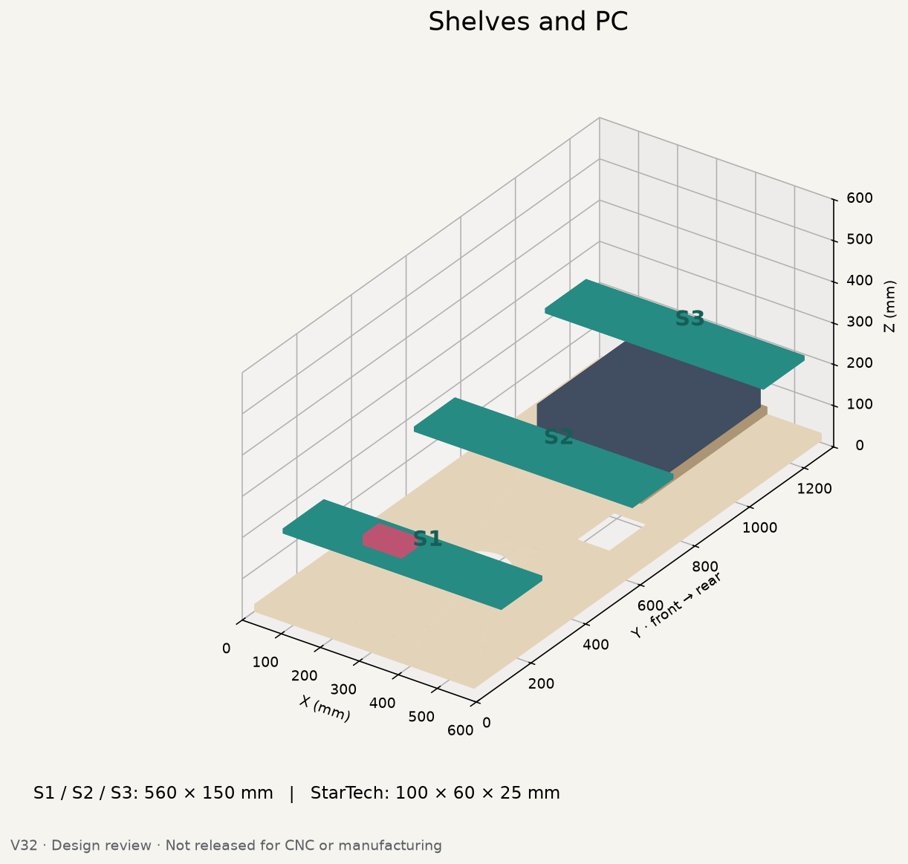
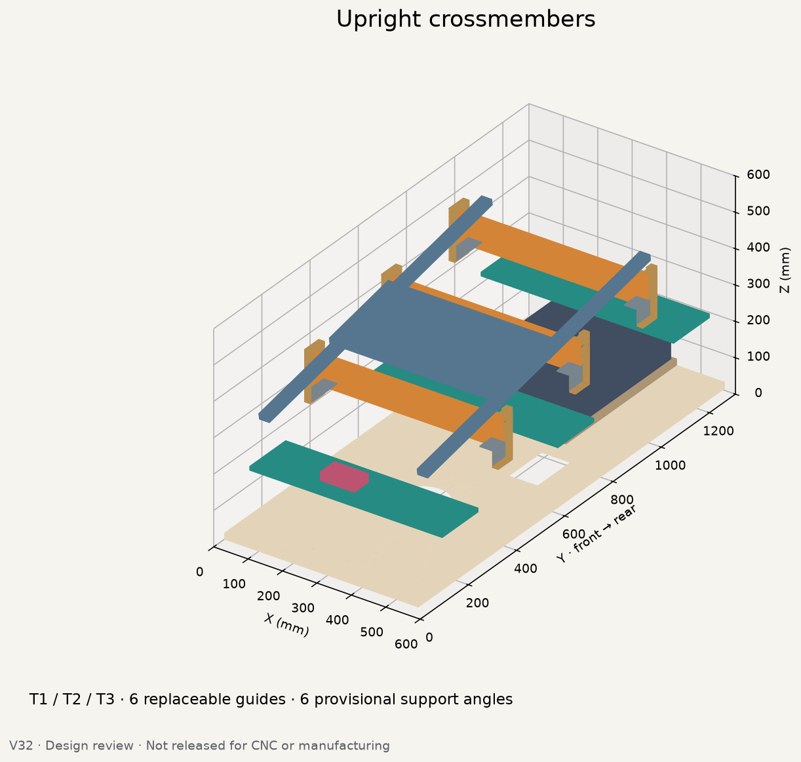
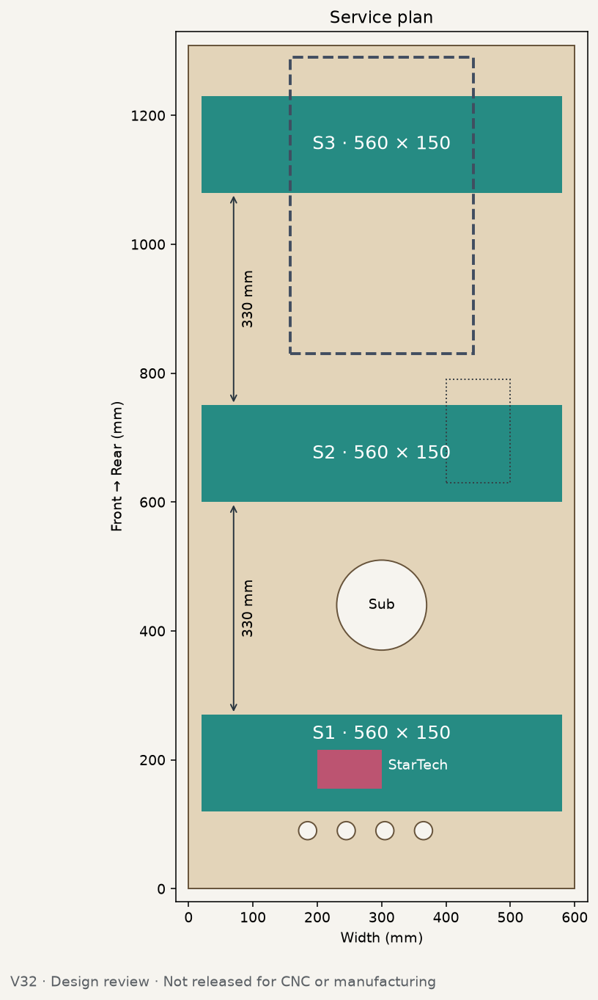
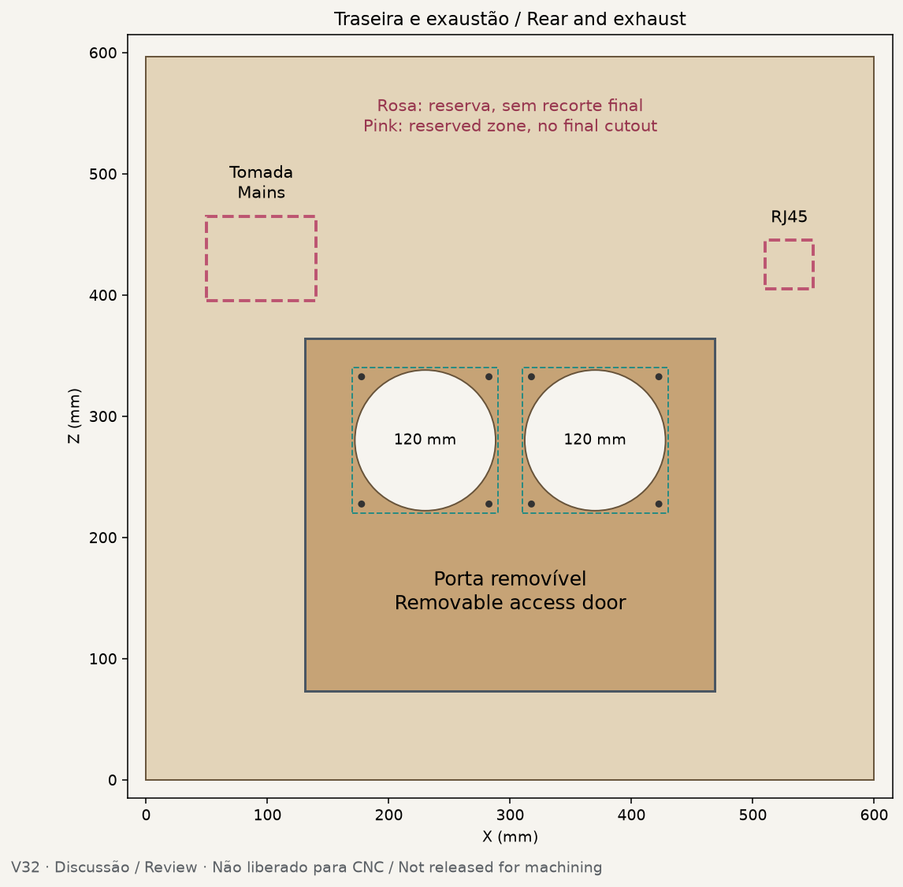
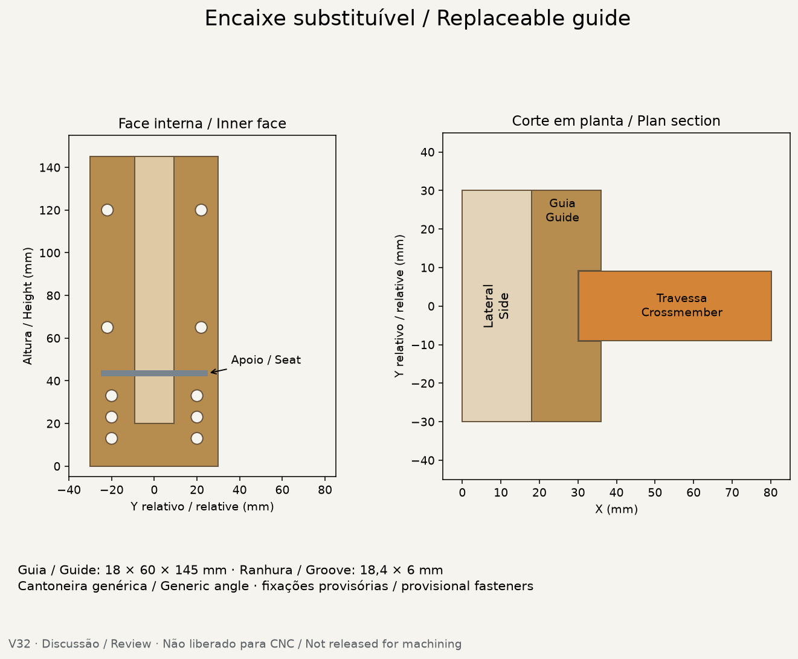
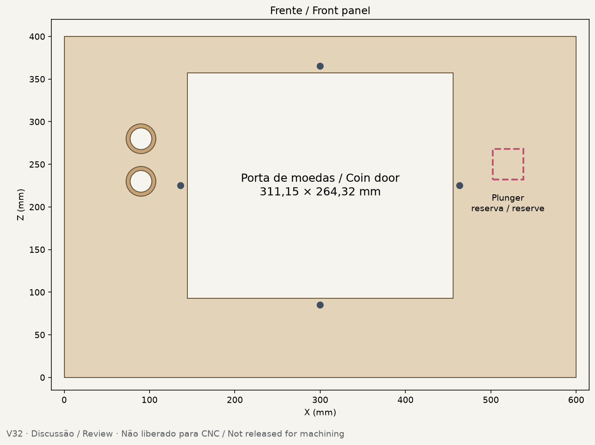

> CURRENT V35.1: [standard-widebody report](docs/STANDARD_WIDEBODY_V351.md) · [32 CAD views](exports/generated/widebody-v351/index.html) · [offline viewer](exports/generated/viewer-v32/index.html). **628.65mm body**, commercial lockdown/receiver, optional siderails; unchanged780mm backbox. **66 wood /60 CNC /6 solid /45 families**; wood62.361kg nominal; preliminary2×18mm +1×12mm. Purchased hardware, physical qualification and CNC remain **BLOCKED**.

> Historical V33.8: [solid front landings, service and modularity](docs/SERVICE_PRODUCTIZATION_V338.md). SW02 replaces six landing laminations; all other geometry remains protected. **104 wood pieces / 98 CNC plywood / 6 solid blocks / 61 families**. Captive M6 tool retention remains. Plywood: **18 / 12 mm only**. Primary raised-playfield support, physical qualification and CNC remain **BLOCKED**. [Offline viewer](exports/generated/viewer-v32/index.html).

> Historical V33.7 baseline: [two plywood families and compact removable user module](docs/TWO_STOCK_USER_MODULE_V337.md). Nominal plywood stock is **18 / 12 mm only**. A 160×116 mm removable 12 mm plate accepts the owner 5-button + dual USB reference or a 6-button alternative. Hardware bores, physical qualification and CNC release remain **BLOCKED**. Protected V33.6.3 playfield supports and other accepted architecture remain unchanged. [Offline viewer](exports/generated/viewer-v32/index.html).

# Virtual Pinball Cabinet

> Historical V32 mechanism reference (width superseded by CURRENT V35.1): 600 mm source cabinet; Ø32 wooden dowel with open plywood cradles, no gas struts or steel props; low fixed PCBase, no drawer; external removable skating devices only, no integrated/retractable wheels. Accepted notch/fan stage: HEAD 8074880. Hinge/matrix positioning study: [accepted reference](docs/MATRIX_HINGE_STUDY_V32.md).

> Current matrix follow-on: [removable cassette and explicit service sequence](docs/MATRIX_CASSETTE_V32.md). Fold verification remains BLOCKED; no accepted cabinet or hinge redesign.

> Prior audit at eeab1a7: [matrix-route tolerance and backbox diagnosis](docs/MATRIX_ROUTE_BACKBOX_AUDIT_V32.md). The accepted matrix route remains unchanged at 1.112788 mm clearance. That audit identified the old backbox-floor collision at 0°.

> Current floor integration: [backbox floor / glass-channel correction](docs/BACKBOX_FLOOR_V32.md). A straight front trim gives 5.084878 mm channel clearance and preserves 100% of rear-shelf bearing area. Upright wood passes; actual-wood folding remains BLOCKED by floor/shelf/side interference at 1°. Viewer and all other accepted V32 geometry remain unchanged.

> Latest backbox profile study: [210/200/190/180 mm comparison and stop report](docs/BACKBOX_PROFILE_V32.md). No profile selected: 210–190 fail upright channels; 180 triggers the owner's below-190 stop. Fixed bearing/reference-axis kinematics also initially drive the floor into the shelf. Accepted floor and all cabinet systems remain unchanged.
[New development: fixed shelf heights, support drilling and leg corner planning](docs/SUPPORT_LEG_CNC_V32.md). The supplied printable leg jig is archived with attribution; its measured57mm pitch differs from the linked58mm template. Hardware and CNC release remain open.

## Current review entry point

Review the `feat/cabinet-review-v32` branch. The owner-approved shelf layout is frozen at Y120/565/865 with 295/150 mm clear gaps and four top-release screws per shelf. Start with the [before/after plan](exports/generated/side-panel-v32/09-shelf-spacing.png), [current shelf explanation](docs/SIMPLE_SHELVES_V32.md), and [current shelf CAD](exports/generated/side-panel-v32/simple-shelves-proposal.FCStd). The older cabinet overview below is the preserved baseline, not the revised shelf scene.

The [freeze record](config/shelf_layout_freeze_v32.json) and [93-check report](exports/generated/side-panel-v32/simple-shelves-validation.json) accompany the [assumed-axis display opening screen](exports/generated/side-panel-v32/shelf-service-pose-screen.json). Review support anchorage, actual hinge/props/harness, load/vibration behavior and manufacturing tolerances; none is certified by the packaging checks. The historical PC architecture discussion remains in the [panel closure sequence](docs/PANEL_CLOSURE_V32.md); CURRENT V32 uses the accepted low fixed PCBase.

The [plain-text source index](library/references/links.txt) gives external-reference context. Third-party originals, backups/caches and protected legacy working CAD are not part of this published review. Render-input geometry JSON for the baseline cabinet and separate joinery proposal is included; the joinery proposal remains unadopted.

**[OPEN THE CURRENT GALLERY →](docs/RENDERS.md)** · [Galeria em português](docs/pt-BR/RENDERS.md)

**English** · [Português (Brasil)](README.pt-BR.md)

> **Current design review: V32 — physical sessions remain PAUSED and CNC/manufacturing is NOT released.** The architecture direction is consolidated for owner review, but final fixings, measured hardware interfaces, structural/load validation, thermal validation, stock/tooling allowances and proof tests remain open.

Parametric CNC-ready virtual pinball cabinet based on Williams WPC visual proportions, with deliberate future-proofing for replaceable electronics.

## New here?

You should be able to decide quickly whether you want to contribute, review, build later, or simply follow the project.

1. **[View the current renders](docs/RENDERS.md)** — fastest visual overview.
2. **[Read the documentation index](docs/README.md)** — current vs historical material.
3. **[Open the V32 technical review](exports/generated/cabinet-v32/README.md)** — geometry, dimensions, files and unresolved gates.
4. **[Learn the permanent part codes](docs/PART_CODES.md)** — stable identities such as T1/T2/T3 and S1/S2/S3.
5. **[Read how to contribute](CONTRIBUTING.md)** — design proposals, measurements, tests, fabrication feedback and documentation are all useful.

Watching the repository without contributing is also welcome; the render page and current-review package are intended to make progress easy to follow.

**Quick links:** [Renders](docs/RENDERS.md) · [Documentation](docs/README.md) · [Part codes](docs/PART_CODES.md) · [Current joinery proposal](docs/CABINET_JOINERY_PROPOSAL.md) · [V32 package](exports/generated/cabinet-v32/README.md) · [Repository cleanup plan](docs/REPOSITORY_CLEANUP.md)

## Current V32 review

The current published review is maintained on **`feat/cabinet-review-v32`**. It consolidates V29–V31 into a conventional 600 mm cabinet layout with three narrow transverse shelves, three removable upright crossmembers, replaceable guides, a low open-case PC base and dual 120 mm rear exhaust fans.

**Validation snapshot:** 45 valid solids; no positive-volume intersection above 0.01 mm³. This validates CAD packaging/interference only — it is not structural certification or manufacturing approval.

Full bilingual review, dimensions, remaining blockers and downloadable CAD/STEP files: **[V32 review package](exports/generated/cabinet-v32/README.md)**.

### V32 visual review

| Interior | Crossmembers | Plan |
|---|---|---|
| [](exports/generated/cabinet-v32/01-interior.png) | [](exports/generated/cabinet-v32/02-travessas.png) | [](exports/generated/cabinet-v32/03-planta.png) |

| Rear | Replaceable guide | Front |
|---|---|---|
| [](exports/generated/cabinet-v32/04-traseira.png) | [](exports/generated/cabinet-v32/05-encaixe.png) | [](exports/generated/cabinet-v32/06-frente.png) |

The previous V27/V28 validation material remains preserved as engineering history and evidence. It must not be read as a manufacturing release for V32.

## Where help is useful now

A contributor can add value without taking ownership of the whole cabinet. Current useful areas include:

- **CNC / joinery:** review the proposed captured lower-cabinet joints, cutter-radius strategy, tolerance coupons and assembly sequence.
- **Mechanical design:** fastening/retention for T1–T3 guides/supports, shelves and the rear service door; monitor service/support mechanics; Williams leg/backbox interfaces.
- **Measurements / prototyping:** measured hardware patterns, actual plywood thickness, fit coupons, dry-fit evidence and load/rigidity observations.
- **Thermal / packaging:** PC, fan guards, wiring, PSU/CSD envelopes and airflow/clearance review.
- **FreeCAD / Python tooling:** integrate the V32/V33 review generator into a clean validated build path that can replace the retained pre-V32 pipeline.
- **Documentation:** English-first technical editing, PT-BR mirrors, diagrams, assembly explanations and link/consistency checks.

If none of these match your skills or available time, following the [render page](docs/RENDERS.md) is enough to keep up with progress.


## Open-source hardware

This project is released under the **CERN Open Hardware Licence Version 2 — Strongly Reciprocal (CERN-OHL-S-2.0)**.

Official project / Source Location:

**https://github.com/advpeterrobinson-hash/vpin-cabinet**

Commercial use is allowed. If you convey modified Covered Source or Products based on it, the applicable Complete Source and modifications must remain available under CERN-OHL-S-2.0, and the project Notices / Source Location must be preserved.

In short: **you may build and sell products based on the design, but conveyed improvements may not be turned into a closed proprietary fork.**

See [LICENSE](LICENSE), [NOTICE.md](NOTICE.md), the [open-source policy](docs/OPEN_SOURCE_POLICY.md), the [licensing FAQ](docs/LICENSING_FAQ.md), and [CONTRIBUTING.md](CONTRIBUTING.md).

The licence is intentionally **commercial-friendly but strongly reciprocal**: selling cabinets, kits, fabrication, installation, or support is allowed; when modified Covered Source or Products based on it are conveyed, the applicable Complete Source must stay available under the same reciprocal licence. "Free" here means the design/source remains freely available under the licence — it does **not** require physical products or services to be sold for zero price.

The official upstream project link is part of the project Notice and should remain with redistributed designs/products:

**https://github.com/advpeterrobinson-hash/vpin-cabinet**

## Active development branch

The latest owner-facing design review is maintained on **`feat/cabinet-review-v32`**. The default `main` branch remains intentionally unchanged while V32 is reviewed. Contributors should use the V32 package above for the current cabinet concept and treat older V25–V28 material as historical engineering context unless explicitly referenced by the V32 review.


## Current product goal

The final download should behave like a **precision flat-pack kit**, not like a woodworking plan that still needs layout work.

The CNC/fabrication vendors should deliver parts with the geometry-critical work already done: profiles, captured joints, service apertures, cable/vent openings, part IDs, and — once the physical hardware is frozen — the exact hinge, slide, bracket, insert and through-hole locations.

The home builder should mainly:

1. identify the labeled parts;
2. dry-fit;
3. glue specified joints;
4. bolt/screw hardware into CNC-located holes;
5. sand/paint/finish/apply graphics;
6. install electronics and harnesses;
7. run the documented proof/safety checks.

Freehand structural layout is not the normal release workflow.

See [active BOM guidance](bom/README.md), `docs/SIMPLIFICATION_V25.md` and `bom/HARDWARE_FREEZE_V25.csv`.

## Active design

- **600 mm** main cabinet, WPC-inspired proportions
- **780 mm** folding backbox
- nominal 18 mm structural plywood; final CNC values follow measured stock
- model-agnostic 42/43-inch 4K high-refresh playfield display envelope
- predominantly CNC-plywood playfield cradle with local steel pivot interfaces
- manual playfield lift with two simple captive, positively pinned prop rods
- two narrow removable electronics carriers and filtered bottom intake
- classic pinball legs + levelers with compact measured steel brackets
- external removable PinSkates-style mobility; no built-in casters
- dedicated **rear CPU service hatch**
- one **285 x 460 x 18 mm** case-sized CPU shelf on two full-extension slides
- open PC case bolts directly to that shelf
- routine RAM/SSD/GPU/cable service from the rear with the playfield closed
- custom/local-fabricated 600 mm lockdown bar and siderails
- local tempered playfield glass after proof-fit
- adjustable backglass/DMD carrier
- reserved SSF / DOF / future electronics zones
- separate touch-safe mains enclosure and segregated routing

## Rear CPU service

The active PC-service architecture is intentionally simple:

`stand behind machine -> open rear hatch -> release one retainer -> pull CPU shelf rearward -> service PC -> push shelf in -> lock retainer -> close hatch`

The reference open case is approximately **440 x 265 x 128 mm**, rotated so 265 mm is across the cabinet and 440 mm is fore-aft. The shelf is approximately **285 x 460 mm** and travels about **450 mm rearward**. Final slide spacing and all mounting holes follow the measured physical slide pair and PC case.

## CNC / hardware freeze

All geometry-controlling purchased parts are tracked in `bom/HARDWARE_FREEZE_V25.csv` as one of:

- `MEASURE_BEFORE_CNC`
- `DIMENSIONED_LOCAL_FAB`
- `ADAPTER_ONLY`
- `NO_CNC_DEPENDENCY`

A production release is blocked until every `MEASURE_BEFORE_CNC` item that controls permanent wood/metal geometry is frozen and the prototype dry-fit/proof tests pass.

## Current local review workflow

```bash
make review-v32
```

This regenerates V32, reopens the FCStd to check 45 valid solids, intersections and bilingual metadata, compares every solid with the committed geometry, then regenerates six English previews. An unexpected geometry change stops the route for review. See [local validation and cleanup](docs/V32_LOCAL_AUDIT.md).

`make doctor`, `make validate`, `make build-current` and `make open-master` remain **PRE-V32 transition tools**. They do not validate the V32 architecture and are preserved until replacement coverage is validated. Their current known failures are documented in the audit. The old [engineering baseline](docs/ACTIVE_ENGINEERING.md), [part register](bom/ACTIVE_PARTS.csv) and [hardware gates](bom/HARDWARE_FREEZE_V25.csv) retain engineering evidence.

## Structure-first procurement

Woodworking, classic legs, backbox hardware, playfield mechanics, rear CPU service hardware, lockdown/siderails, glazing and display fit must reach the **STRUCTURE READY** gate before the coordinated electronics/DOF purchase begins.

The exact playfield display is selected late from the Brazil market rather than hard-coded into permanent woodworking.

Primary planning documents:

- `docs/BUILD_PHASES.md`
- `docs/STRUCTURE_BUILD_MANUAL.md`
- `docs/SIMPLIFICATION_V25.md`
- `bom/HARDWARE_FREEZE_V25.csv`
- `docs/PLAYFIELD_MECHANICS_V18.md`
- `docs/REAR_CPU_SHELF_V24.md`
- `docs/BACKBOX_HINGE_SHOPPING.md`

## Safety baseline

The rear PC hatch may expose PC low-voltage hardware, but must never expose bare mains terminals. Mains distribution remains in a separate touch-safe enclosure. Isolate cabinet power before RAM/GPU/SSD/harness service.

CURRENT V32 carries the display on a flat plywood base with the accepted Ø32 wood dowel, four straps and two open plywood cradles; no captive steel props or gas struts are part of this current mechanism. The earlier prop references are historical.

## Status

**V32 design review published; manufacturing remains blocked.**

The V32 package contains the current owner-facing CAD, STEP export, six review images, bilingual parts list, source scripts and validation output. The architecture direction is defined, but machining is not released.

Open items include complete fastening/retention details, monitor service hardware and loaded support validation, Williams leg and backbox hardware patterns, final plunger/electrical/RJ45/fan/subwoofer openings, PSU/CSD/cable/thermal envelopes, final joinery/glass/lockdown interfaces, measured stock thickness, cutter radii, machining allowances and sheet layout.

Current review package: [`exports/generated/cabinet-v32/README.md`](exports/generated/cabinet-v32/README.md). Historical V27/V28 validation and simplification evidence remains available under `docs/` and `bom/` for traceability.

## Contributing

Contributions are welcome from builders, CNC operators, mechanical designers, electricians, software developers, testers, and documentation writers.

- Start with [CONTRIBUTING.md](CONTRIBUTING.md).
- Read [GOVERNANCE.md](GOVERNANCE.md) for how engineering decisions are accepted.
- Use the GitHub issue templates for bugs, design proposals, manufacturing feedback, and hardware measurements.
- Use [SUPPORT.md](SUPPORT.md) for help and project-support boundaries.
- Report security or serious safety concerns through [SECURITY.md](SECURITY.md).
- Follow the [Code of Conduct](CODE_OF_CONDUCT.md).
- For reuse, forks, and commercial derivatives, read the [licensing FAQ](docs/LICENSING_FAQ.md).

Useful improvements are encouraged to come back upstream as pull requests, but the legal reciprocal obligations are governed by [LICENSE](LICENSE), not by whether a fork submits a PR.
