# Roteiro do manual de montagem — V33.2

**ROTEIRO — LIBERAÇÃO DE FABRICAÇÃO BLOQUEADA. Permanecem pendências de ferragens, cupom e validação física.**

[Manual interativo e CAD offline](../exports/generated/viewer-v32/index.html?manual=00&lang=pt-BR)

As quantidades abaixo são totais de referência globais/da etapa; etapas repetidas não consomem outro kit. Quantidades desconhecidas permanecem abertas. Uma amostra na bandeja não é uma posição instalada.

## 00 — Antes de começar

**WAITING_FOR_COUPON** · Depende de: —

Peças (cada instância ×1): —

| ID | Ferragem | Quantidade no projeto | Status |
|---|---|---|---|

### 00.1 — Confirme as pendências de preparação

Leia o perfil do fornecedor e identifique o lote de produção. Não corte chapas completas antes da aprovação da espessura real, folga do cupom e interfaces das ferragens.

**Orientação:** X esquerda→direita; Y frente→trás; Z para cima. Siga a ficha FACE A e o vetor de orientação instalada de cada peça.
**Faces:** FACE A: usinagem CNC / referência acabada de profundidade. FACE B: SEM CNC; acesso manual somente quando explicitado na ficha.
**Ferramentas:** Grampos, esquadro e instrumentos de medição; ponta/broca selecionada e limitador somente para as ferragens/acabamentos listados.

**Verificação:** Registre o lote medido, resultado do cupom e ferragens escolhidas; valores não resolvidos permanecem PENDENTES.

**PENDÊNCIA:** Somente roteiro. Libere o estado da etapa e pendências físicas de ferragens/material/cupom e de carga/acabamento aplicáveis antes de executar.

[CAD do próximo estado: JOGO](../exports/generated/viewer-v32/index.html?manual=00&step=00.1&state=PLAY&lang=pt-BR)

### 00.2 — Prepare as ferramentas comuns

Prepare grampos, esquadro, trena, furadeira/parafusadeira, limitador de profundidade, pontas selecionadas e guias angulares validadas. As medidas das pontas dependem das ferragens compradas. Não improvise furos angulares precisos à mão livre.

**Orientação:** X esquerda→direita; Y frente→trás; Z para cima. Siga a ficha FACE A e o vetor de orientação instalada de cada peça.
**Faces:** FACE A: usinagem CNC / referência acabada de profundidade. FACE B: SEM CNC; acesso manual somente quando explicitado na ficha.
**Ferramentas:** Grampos, esquadro e instrumentos de medição; ponta/broca selecionada e limitador somente para as ferragens/acabamentos listados.

**Verificação:** Uma guia e um procedimento de acabamento validados devem existir antes de cada operação manual afetada.

**PENDÊNCIA:** Somente roteiro. Libere o estado da etapa e pendências físicas de ferragens/material/cupom e de carga/acabamento aplicáveis antes de executar.

[CAD do próximo estado: JOGO](../exports/generated/viewer-v32/index.html?manual=00&step=00.2&state=PLAY&lang=pt-BR)

## 01 — Identifique as peças do kit

**WAITING_FOR_COUPON** · Depende de: 00

Peças (cada instância ×1): —

| ID | Ferragem | Quantidade no projeto | Status |
|---|---|---|---|

### 01.1 — Confira os IDs de fabricação e as faces

Confira cada família M e instância P com o registro de 130 peças. Use as fichas de orientação: FACE A é a referência acabada de usinagem; FACE B não recebe CNC. Mantenha as peças espelhadas identificadas.

**Orientação:** X esquerda→direita; Y frente→trás; Z para cima. Siga a ficha FACE A e o vetor de orientação instalada de cada peça.
**Faces:** FACE A: usinagem CNC / referência acabada de profundidade. FACE B: SEM CNC; acesso manual somente quando explicitado na ficha.
**Ferramentas:** Grampos, esquadro e instrumentos de medição; ponta/broca selecionada e limitador somente para as ferragens/acabamentos listados.

**Verificação:** Conte 130 peças em 66 famílias. Não confunda as 93 montagens instaladas com a quantidade de peças cortadas.

**PENDÊNCIA:** Somente roteiro. Libere o estado da etapa e pendências físicas de ferragens/material/cupom e de carga/acabamento aplicáveis antes de executar.

[CAD do próximo estado: EXPLODIDA DETALHADA](../exports/generated/viewer-v32/index.html?manual=01&step=01.1&state=EXPLODED%20DETAILED&lang=pt-BR)

### 01.2 — Confira o CNC e o acabamento do montador

Use a ficha de preparação de cada peça. Confira primeiro o contorno e os rebaixos da FACE A; depois execute somente a furação, escareamento ou acabamento manual de cantos/chanfros listado, após liberar suas pendências. As profundidades se referem à FACE A acabada, inclusive após redução de espessura.

**Orientação:** X esquerda→direita; Y frente→trás; Z para cima. Siga a ficha FACE A e o vetor de orientação instalada de cada peça.
**Faces:** FACE A: usinagem CNC / referência acabada de profundidade. FACE B: SEM CNC; acesso manual somente quando explicitado na ficha.
**Ferramentas:** Grampos, esquadro e instrumentos de medição; ponta/broca selecionada e limitador somente para as ferragens/acabamentos listados.

**Verificação:** Nunca solicite uma segunda face CNC. Teste os encaixes sem forçar juntas dependentes da espessura; a aprovação física do cupom é obrigatória.

**PENDÊNCIA:** Somente roteiro. Libere o estado da etapa e pendências físicas de ferragens/material/cupom e de carga/acabamento aplicáveis antes de executar.

[CAD do próximo estado: EXPLODIDA DETALHADA](../exports/generated/viewer-v32/index.html?manual=01&step=01.2&state=EXPLODED%20DETAILED&lang=pt-BR)

## 02 — Caixa principal

**PROVISIONAL_HARDWARE** · Depende de: 01

Peças (cada instância ×1): P001-Main (M001), P002-Main (M002), P003-Main (M003), P004-Main (M004)

| ID | Ferragem | Quantidade no projeto | Status |
|---|---|---|---|
| F06 | Fixadores das juntas da caixa, fundo e sarrafos | INDEFINIDA — não estimar | PURCHASE_BEFORE_CNC |
| G01 | Adesivo para juntas de compensado | INDEFINIDA — não estimar | PURCHASE_BEFORE_ASSEMBLY |

### 02.1 — Monte laterais e extremidades a seco

Oriente SideL/SideR a partir da posição do jogador, frente em Y0. Monte frente e traseira a seco na estrutura integral das laterais. Mantenha a caixa apoiada, com os grampos ainda permitindo o esquadrejamento.

**Orientação:** X esquerda→direita; Y frente→trás; Z para cima. Siga a ficha FACE A e o vetor de orientação instalada de cada peça.
**Faces:** FACE A: usinagem CNC / referência acabada de profundidade. FACE B: SEM CNC; acesso manual somente quando explicitado na ficha.
**Ferramentas:** Grampos, esquadro e instrumentos de medição; ponta/broca selecionada e limitador somente para as ferragens/acabamentos listados.

**Verificação:** VERIFICAÇÃO DO ESQUADRO: compare diagonais e assentamento em uma referência plana. Nenhuma tolerância numérica foi liberada.

**PENDÊNCIA:** Somente roteiro. Libere o estado da etapa e pendências físicas de ferragens/material/cupom e de carga/acabamento aplicáveis antes de executar.

[CAD do próximo estado: EXPLODIDA GERAL](../exports/generated/viewer-v32/index.html?manual=02&step=02.1&state=EXPLODED%20OVERVIEW&lang=pt-BR)

### 02.2 — Valide as juntas permanentes da caixa

Use o plano aprovado de colagem/fixação quando disponível. F06 e o consumo de adesivo G01 continuam indefinidos; este roteiro não inventa espaçamento de parafusos. Mantenha as faces das juntas sem acabamento até validar a colagem.

**Orientação:** X esquerda→direita; Y frente→trás; Z para cima. Siga a ficha FACE A e o vetor de orientação instalada de cada peça.
**Faces:** FACE A: usinagem CNC / referência acabada de profundidade. FACE B: SEM CNC; acesso manual somente quando explicitado na ficha.
**Ferramentas:** Grampos, esquadro e instrumentos de medição; ponta/broca selecionada e limitador somente para as ferragens/acabamentos listados.

**Verificação:** PENDÊNCIA: não faça a montagem permanente antes de concluir o plano das juntas e a validação do material/colagem.

**PENDÊNCIA:** Somente roteiro. Libere o estado da etapa e pendências físicas de ferragens/material/cupom e de carga/acabamento aplicáveis antes de executar.

[CAD do próximo estado: EXPLODIDA GERAL](../exports/generated/viewer-v32/index.html?manual=02&step=02.2&state=EXPLODED%20OVERVIEW&lang=pt-BR)

## 03 — Fundo e apoios estruturais

**PROVISIONAL_HARDWARE** · Depende de: 02

Peças (cada instância ×1): P005-Main (M005), P006-Main (M006), P007-Main (M006), P028-Main (M018)

| ID | Ferragem | Quantidade no projeto | Status |
|---|---|---|---|

### 03.1 — Assente o fundo, sarrafos e prateleira traseira

Encaixe o fundo e seus sarrafos nos ressaltos correspondentes. Instale BBBase como prateleira de apoio vertical do backbox; preserve a passagem genérica de cabos e o material dos receptores das travas.

**Orientação:** X esquerda→direita; Y frente→trás; Z para cima. Siga a ficha FACE A e o vetor de orientação instalada de cada peça.
**Faces:** FACE A: usinagem CNC / referência acabada de profundidade. FACE B: SEM CNC; acesso manual somente quando explicitado na ficha.
**Ferramentas:** Grampos, esquadro e instrumentos de medição; ponta/broca selecionada e limitador somente para as ferragens/acabamentos listados.

**Verificação:** Confirme o apoio contínuo do fundo e as faces amplas de apoio da prateleira. Não use parafusos para alinhar uma caixa deformada.

**PENDÊNCIA:** Somente roteiro. Libere o estado da etapa e pendências físicas de ferragens/material/cupom e de carga/acabamento aplicáveis antes de executar.

[CAD do próximo estado: INSPECIONAR INTERIOR](../exports/generated/viewer-v32/index.html?manual=03&step=03.1&state=INTERIOR%20INSPECTION&lang=pt-BR)

## 04 — Prateleiras, travessas e PCBase

**PROVISIONAL_HARDWARE** · Depende de: 03

Peças (cada instância ×1): P009-Main (M008), P010-Main (M008), P011-Main (M009), P012-Main (M010), P013-Main (M011), P014-Main (M010), P015-Main (M011), P016-Main (M012), P017-Main (M013), P018-Main (M014), P019-Main (M014), P020-Main (M014), P021-Main (M015), P022-Main (M016), P023-Main (M015), P024-Main (M016), P025-Main (M015), P026-Main (M016), P027-Main (M017)

| ID | Ferragem | Quantidade no projeto | Status |
|---|---|---|---|
| F03 | Parafuso M5 de liberação superior da prateleira | 12 | PURCHASE_BEFORE_CNC |
| W01 | Arruela M5, reserva atual Ø12 ×1 | 12 | PURCHASE_BEFORE_ASSEMBLY |
| I01 | Inserto roscado M5 da prateleira | 12 | PURCHASE_BEFORE_CNC |
| F04 | Parafuso de madeira do apoio fixo de prateleira | 12 | PURCHASE_BEFORE_CNC |
| W02 | Arruela para folga Ø4, Ø9 ×1 | 12 | PURCHASE_BEFORE_ASSEMBLY |
| B02 | Cantoneira comercial de apoio, reserva 40 ×40 ×50 ×3 | 6 | PURCHASE_BEFORE_CNC |
| F05 | Parafusos das guias das travessas | 24 | PURCHASE_BEFORE_CNC |
| F52 | Parafusos M5 das cantoneiras das travessas | 12 | PURCHASE_BEFORE_CNC |
| I14 | Conjunto de rosca cativa das cantoneiras | 12 | PURCHASE_BEFORE_CNC |
| F07 | Fixadores M5 escareados da PCBase ao fundo | 4 | PURCHASE_BEFORE_CNC |
| I02 | Porcas M5 dos fixadores da PCBase | 4 | PURCHASE_BEFORE_ASSEMBLY |
| W03 | Arruelas inferiores M5 da PCBase | 4 | PURCHASE_BEFORE_ASSEMBLY |

### 04.1 — Instale guias e apoios das prateleiras

Identifique S1–S3 e T1–T3 com seus apoios/guias correspondentes. Use as interfaces reais de montagem; F05/F52/I14 são ferragens do catálogo, não autorização para adivinhar furos sem posição definida.

**Orientação:** X esquerda→direita; Y frente→trás; Z para cima. Siga a ficha FACE A e o vetor de orientação instalada de cada peça.
**Faces:** FACE A: usinagem CNC / referência acabada de profundidade. FACE B: SEM CNC; acesso manual somente quando explicitado na ficha.
**Ferramentas:** Grampos, esquadro e instrumentos de medição; ponta/broca selecionada e limitador somente para as ferragens/acabamentos listados.

**Verificação:** VERIFICAÇÃO DA ALTURA: confirme o alinhamento dos apoios esquerdo/direito e a retirada das prateleiras/travessas sem forçar.

**PENDÊNCIA:** Somente roteiro. Libere o estado da etapa e pendências físicas de ferragens/material/cupom e de carga/acabamento aplicáveis antes de executar.

[CAD do próximo estado: EXPLODIDA DETALHADA](../exports/generated/viewer-v32/index.html?manual=04&step=04.1&state=EXPLODED%20DETAILED&lang=pt-BR)

### 04.2 — Fixe as placas removíveis

Instale as ferragens de aperto das prateleiras e ancoragens niveladas da PCBase somente após confirmar suas camadas. PCBase é a placa baixa aceita, não uma gaveta. As cargas eletrônicas são adições opcionais futuras.

**Orientação:** X esquerda→direita; Y frente→trás; Z para cima. Siga a ficha FACE A e o vetor de orientação instalada de cada peça.
**Faces:** FACE A: usinagem CNC / referência acabada de profundidade. FACE B: SEM CNC; acesso manual somente quando explicitado na ficha.
**Ferramentas:** Grampos, esquadro e instrumentos de medição; ponta/broca selecionada e limitador somente para as ferragens/acabamentos listados.

**Verificação:** Confira a retenção positiva e a remoção para manutenção; não crie travamentos nas zonas SSF das laterais.

**PENDÊNCIA:** Somente roteiro. Libere o estado da etapa e pendências físicas de ferragens/material/cupom e de carga/acabamento aplicáveis antes de executar.

[CAD do próximo estado: EXPLODIDA DETALHADA](../exports/generated/viewer-v32/index.html?manual=04&step=04.2&state=EXPLODED%20DETAILED&lang=pt-BR)

## 05 — Apoios do pivô de madeira do playfield

**PROVISIONAL_HARDWARE** · Depende de: 03, 04

Peças (cada instância ×1): P035-Main (M026), P036-Main (M027)

| ID | Ferragem | Quantidade no projeto | Status |
|---|---|---|---|
| F01 | Parafuso de madeira do apoio do pivô | 6 | PURCHASE_BEFORE_CNC |

### 05.1 — Instale os dois berços abertos

Posicione cada berço de 18 mm diretamente no fundo e junto à lateral. Preserve o alívio aberto do pivô e as seis coordenadas F01. Os parafusos retêm contra tombamento/separação; a carga vertical se apoia no fundo.

**Orientação:** X esquerda→direita; Y frente→trás; Z para cima. Siga a ficha FACE A e o vetor de orientação instalada de cada peça.
**Faces:** FACE A: usinagem CNC / referência acabada de profundidade. FACE B: SEM CNC; acesso manual somente quando explicitado na ficha.
**Ferramentas:** Grampos, esquadro e instrumentos de medição; ponta/broca selecionada e limitador somente para as ferragens/acabamentos listados.

**Verificação:** VERIFICAÇÃO DOS BERÇOS: os dois assentos compartilham o eixo aceito e os pés se apoiam continuamente. Não calce nem reposicione o eixo sem nova revisão.

**PENDÊNCIA:** Somente roteiro. Libere o estado da etapa e pendências físicas de ferragens/material/cupom e de carga/acabamento aplicáveis antes de executar.

[CAD do próximo estado: EXPLODIDA DETALHADA](../exports/generated/viewer-v32/index.html?manual=05&step=05.1&state=EXPLODED%20DETAILED&lang=pt-BR)

## 06 — Base do playfield, cavilha e abraçadeiras

**PROVISIONAL_HARDWARE** · Depende de: 05

Peças (cada instância ×1): P034-Main (M025)

| ID | Ferragem | Quantidade no projeto | Status |
|---|---|---|---|
| F02 | Parafuso da abraçadeira do eixo de madeira | 8 | PURCHASE_BEFORE_CNC |
| H01 | Cavilha/eixo de madeira do playfield | 1 | PURCHASE_BEFORE_CNC |
| B01 | Abraçadeira comercial para eixo de madeira Ø32 | 4 | PURCHASE_BEFORE_CNC |

### 06.1 — Prenda a cavilha de madeira

Prenda a cavilha de madeira Ø32 com quatro abraçadeiras comerciais B01 e oito parafusos F02 na base do playfield. Preserve a interface aceita do adaptador substituível. Não use eixo metálico nem rolamentos.

**Orientação:** X esquerda→direita; Y frente→trás; Z para cima. Siga a ficha FACE A e o vetor de orientação instalada de cada peça.
**Faces:** FACE A: usinagem CNC / referência acabada de profundidade. FACE B: SEM CNC; acesso manual somente quando explicitado na ficha.
**Ferramentas:** Grampos, esquadro e instrumentos de medição; ponta/broca selecionada e limitador somente para as ferragens/acabamentos listados.

**Verificação:** Confira assentamento das abraçadeiras, engate dos parafusos e ausência de rachaduras após validar as abraçadeiras/material.

**PENDÊNCIA:** Somente roteiro. Libere o estado da etapa e pendências físicas de ferragens/material/cupom e de carga/acabamento aplicáveis antes de executar.

[CAD do próximo estado: RETIRADA DO PLAYFIELD](../exports/generated/viewer-v32/index.html?manual=06&step=06.1&state=PLAYFIELD%20LIFT-OUT&lang=pt-BR)

### 06.2 — Confira o assentamento e a retirada

Abaixe as duas pontas da cavilha nos assentos abertos. Com vidro principal e matriz removidos, demonstre a retirada vertical aceita de 48 mm. A montagem completa sai junta; os berços fixos permanecem.

**Orientação:** X esquerda→direita; Y frente→trás; Z para cima. Siga a ficha FACE A e o vetor de orientação instalada de cada peça.
**Faces:** FACE A: usinagem CNC / referência acabada de profundidade. FACE B: SEM CNC; acesso manual somente quando explicitado na ficha.
**Ferramentas:** Grampos, esquadro e instrumentos de medição; ponta/broca selecionada e limitador somente para as ferragens/acabamentos listados.

**Verificação:** VERIFICAÇÃO DA RETIRADA: sem travamento, com apoio aproximadamente semicircular preservado. A posição de serviço de 50° é uma vista geométrica; não trabalhe sob a montagem levantada sem apoio. A validação de apoio/carga permanece pendente.

**PENDÊNCIA:** Somente roteiro. Libere o estado da etapa e pendências físicas de ferragens/material/cupom e de carga/acabamento aplicáveis antes de executar.

[CAD do próximo estado: RETIRADA DO PLAYFIELD](../exports/generated/viewer-v32/index.html?manual=06&step=06.2&state=PLAYFIELD%20LIFT-OUT&lang=pt-BR)

## 07 — Serviços traseiros e ventoinhas principais

**PROVISIONAL_HARDWARE** · Depende de: 03

Peças (cada instância ×1): P008-Main (M007), P037-Main (M028), P038-Main (M028)

| ID | Ferragem | Quantidade no projeto | Status |
|---|---|---|---|
| H02 | Dobradiça da porta traseira principal | 2 | PURCHASE_BEFORE_CNC |
| H03 | Fechadura de lingueta com chave da porta principal | 1 | PURCHASE_BEFORE_CNC |
| B03 | Contra-fecho da porta traseira principal | 1 | PURCHASE_BEFORE_CNC |
| H04 | Puxador da porta traseira principal | 1 | PURCHASE_BEFORE_CNC |
| F08 | Parafuso M4 ×20 do puxador | 2 | PURCHASE_BEFORE_CNC |
| F09 | Parafusos das dobradiças traseiras principais | 8 | PURCHASE_BEFORE_CNC |
| F53 | Parafusos do contra-fecho traseiro principal | 1 * selected_keeper.mounting_hole_count - included_fasteners | PURCHASE_BEFORE_CNC |
| G02 | Feltro de contato da porta traseira | INDEFINIDA — não estimar | OPTIONAL |
| H05 | Conjunto limitador opcional da porta principal | 1 | OPTIONAL |
| H06 | Ferrolho opcional da porta principal | 1 | OPTIONAL |
| F10 | Parafuso M4 ×55 da ventoinha traseira principal | 8 | PURCHASE_BEFORE_CNC |
| I03 | Porca M4 da ventoinha | 16 | OPTIONAL |
| F11 | Parafuso M4 ×50 da ventoinha do fundo | 8 | PURCHASE_BEFORE_CNC |
| F12 | Parafuso M4 ×16 do filtro do fundo | 8 | PURCHASE_BEFORE_CNC |
| I04 | Inserto cego M4 do filtro do fundo | 8 | PURCHASE_BEFORE_CNC |
| H07 | Ventoinha opcional 120 mm da caixa/fundo | 4 | PURCHASE_BEFORE_CNC |
| B04 | Grade de proteção 120 mm da ventoinha traseira | 4 | OPTIONAL |
| B05 | Grade inferior da entrada de ar do fundo | 2 | PURCHASE_BEFORE_CNC |
| B06 | Grade superior da ventoinha do fundo | 2 | OPTIONAL |
| F13 | Parafusos curtos da grade inferior do filtro | 8 | PURCHASE_BEFORE_CNC |
| G03 | Mídia filtrante substituível do fundo | 2 | PURCHASE_BEFORE_ASSEMBLY |

### 07.1 — Instale as ferragens da porta traseira

Instale a porta traseira principal, suas duas dobradiças, contra-fecho e fechadura com as ferragens selecionadas. Essas dobradiças são distintas das dobradiças contínuas do backbox. Mantenha as quantidades dependentes das ferragens como fórmulas.

**Orientação:** X esquerda→direita; Y frente→trás; Z para cima. Siga a ficha FACE A e o vetor de orientação instalada de cada peça.
**Faces:** FACE A: usinagem CNC / referência acabada de profundidade. FACE B: SEM CNC; acesso manual somente quando explicitado na ficha.
**Ferramentas:** Grampos, esquadro e instrumentos de medição; ponta/broca selecionada e limitador somente para as ferragens/acabamentos listados.

**Verificação:** VERIFICAÇÃO DA PORTA TRASEIRA: confira abertura, engate do fecho e acesso com ferramenta comum sem forçar a porta nivelada.

**PENDÊNCIA:** Somente roteiro. Libere o estado da etapa e pendências físicas de ferragens/material/cupom e de carga/acabamento aplicáveis antes de executar.

[CAD do próximo estado: INSPECIONAR INTERIOR](../exports/generated/viewer-v32/index.html?manual=07&step=07.1&state=INTERIOR%20INSPECTION&lang=pt-BR)

### 07.2 — Prepare as estações opcionais de ventoinha/filtro

Monte as molduras removíveis de filtro e grades selecionadas. As ventoinhas são opcionais; os comprimentos M4 dependem das camadas reais da estação. Não instale fixadores soltos em uma abertura sem uso nem suponha um comprimento único para todas as estações.

**Orientação:** X esquerda→direita; Y frente→trás; Z para cima. Siga a ficha FACE A e o vetor de orientação instalada de cada peça.
**Faces:** FACE A: usinagem CNC / referência acabada de profundidade. FACE B: SEM CNC; acesso manual somente quando explicitado na ficha.
**Ferramentas:** Grampos, esquadro e instrumentos de medição; ponta/broca selecionada e limitador somente para as ferragens/acabamentos listados.

**Verificação:** Os filtros devem permanecer acessíveis; não é necessário comprar ventoinhas ou eletrônica para compreender o kit mecânico.

**PENDÊNCIA:** Somente roteiro. Libere o estado da etapa e pendências físicas de ferragens/material/cupom e de carga/acabamento aplicáveis antes de executar.

[CAD do próximo estado: INSPECIONAR INTERIOR](../exports/generated/viewer-v32/index.html?manual=07&step=07.2&state=INTERIOR%20INSPECTION&lang=pt-BR)

## 08 — Estrutura do backbox

**PROVISIONAL_HARDWARE** · Depende de: 03

Peças (cada instância ×1): P042-Main (M031), P043-Main (M032), P044-Main (M033), P045-Main (M034), P046-Main (M035), P047-Main (M036)

| ID | Ferragem | Quantidade no projeto | Status |
|---|---|---|---|
| F16 | Parafusos das juntas da caixa superior | INDEFINIDA — não estimar | PURCHASE_BEFORE_CNC |
| F54 | Parafusos da junta lateral/piso superior | 6 | PURCHASE_BEFORE_CNC |

### 08.1 — Monte a estrutura do backbox

Monte as laterais com profundidade inferior de 210 mm, fundo reto em Y1146, topo e quadro traseiro fixo. A projeção das laterais à frente do fundo é intencional. Preserve a integridade estrutural com ambas as portas abertas.

**Orientação:** X esquerda→direita; Y frente→trás; Z para cima. Siga a ficha FACE A e o vetor de orientação instalada de cada peça.
**Faces:** FACE A: usinagem CNC / referência acabada de profundidade. FACE B: SEM CNC; acesso manual somente quando explicitado na ficha.
**Ferramentas:** Grampos, esquadro e instrumentos de medição; ponta/broca selecionada e limitador somente para as ferragens/acabamentos listados.

**Verificação:** Confirme o engate fundo/lateral e o esquadro do quadro traseiro. O plano de juntas F16 e a validação da colagem continuam PENDENTES.

**PENDÊNCIA:** Somente roteiro. Libere o estado da etapa e pendências físicas de ferragens/material/cupom e de carga/acabamento aplicáveis antes de executar.

[CAD do próximo estado: EXPLODIDA DETALHADA](../exports/generated/viewer-v32/index.html?manual=08&step=08.1&state=EXPLODED%20DETAILED&lang=pt-BR)

## 09 — Ferragens WPC e travas verticais

**WAITING_FOR_PHYSICAL_MEASUREMENT** · Depende de: 05, 08

Peças (cada instância ×1): P088-Main (M064), P089-Main (M065), P090-Main (M064), P091-Main (M065)

| ID | Ferragem | Quantidade no projeto | Status |
|---|---|---|---|
| H08 | WPC 01-9011-L esquerda | 1 | PURCHASE_BEFORE_CNC |
| H09 | WPC 01-9011-R direita | 1 | PURCHASE_BEFORE_CNC |
| H10 | WPC 02-4352 bucha | 2 | PURCHASE_BEFORE_CNC |
| F14 | WPC 4322-01139-12B parafuso do pivô | 2 | PURCHASE_BEFORE_CNC |
| F15 | Fixadores WPC no piso da caixa superior | 6 | PURCHASE_BEFORE_CNC |
| W06 | Conjunto de arruelas e porcas WPC | sum(required_stack_items_for_2_pivots_and_6_floor_bolts) - matching_items_in_purchased_kits | PURCHASE_BEFORE_CNC |
| B16 | Chapa de apoio dos fixadores WPC no piso | 2 | PURCHASE_BEFORE_CNC |
| H11 | Manípulo cativo M8 ×40 da trava vertical | 2 | PURCHASE_BEFORE_CNC |
| W07 | Arruela cativa de carga da trava vertical | 2 | PURCHASE_BEFORE_CNC |
| I05 | Receptor roscado metálico M8 da prateleira traseira | 2 | PURCHASE_BEFORE_CNC |
| I06 | Inserto metálico M8 para guardar o manípulo | 2 | PURCHASE_BEFORE_CNC |
| F17 | Parafuso escareado dos blocos de estacionamento | 4 | PURCHASE_BEFORE_CNC |
| H12 | Cabo mecânico de retenção do manípulo, 200 mm | 2 | PURCHASE_BEFORE_ASSEMBLY |
| W08 | Anel de retenção da arruela cativa | 2 | PURCHASE_BEFORE_ASSEMBLY |
| H13 | Anel giratório de proteção contra perda | 2 | PURCHASE_BEFORE_ASSEMBLY |
| B07 | Presilha positiva da sobra do cabo de retenção | 2 | PURCHASE_BEFORE_ASSEMBLY |
| B08 | Ancoragem do cabo no bloco de estacionamento | 2 | PURCHASE_BEFORE_CNC |

### 09.1 — Meça e instale a família WPC

Meça 01-9011-L/R, 02-4352 e 4322-01139-12B antes de qualquer furação final. O eixo de referência é Y1066.8/Z508; ele não é um padrão de furação liberado. Não substitua roscas imperiais por métricas nas ferragens compradas.

**Orientação:** X esquerda→direita; Y frente→trás; Z para cima. Siga a ficha FACE A e o vetor de orientação instalada de cada peça.
**Faces:** FACE A: usinagem CNC / referência acabada de profundidade. FACE B: SEM CNC; acesso manual somente quando explicitado na ficha.
**Ferramentas:** Grampos, esquadro e instrumentos de medição; ponta/broca selecionada e limitador somente para as ferragens/acabamentos listados.

**Verificação:** PENDÊNCIA: aguarde a medição e validação das dobras, furos do fundo, bucha e conjunto completo do parafuso.

**PENDÊNCIA:** Somente roteiro. Libere o estado da etapa e pendências físicas de ferragens/material/cupom e de carga/acabamento aplicáveis antes de executar.

[CAD do próximo estado: BACKBOX DESTRAVADO](../exports/generated/viewer-v32/index.html?manual=09&step=09.1&state=BACKBOX%20UNLOCKED&lang=pt-BR)

### 09.2 — Instale duas travas cativas operadas por trás

Mantenha H11 ×2 em L X130/Y1260 e R X470/Y1260 com receptores metálicos apoiados na prateleira, retenção contra perda, tirantes e alojamentos de estacionamento. Os detalhes exatos dos manípulos/receptores continuam provisórios.

**Orientação:** X esquerda→direita; Y frente→trás; Z para cima. Siga a ficha FACE A e o vetor de orientação instalada de cada peça.
**Faces:** FACE A: usinagem CNC / referência acabada de profundidade. FACE B: SEM CNC; acesso manual somente quando explicitado na ficha.
**Ferramentas:** Grampos, esquadro e instrumentos de medição; ponta/broca selecionada e limitador somente para as ferragens/acabamentos listados.

**Verificação:** VERIFICAÇÃO DAS TRAVAS: o fundo se apoia amplamente na prateleira; os dois apertos independentes engatam e podem ser soltos/guardados pelas portas traseiras abertas com o cassete instalado.

**PENDÊNCIA:** Somente roteiro. Libere o estado da etapa e pendências físicas de ferragens/material/cupom e de carga/acabamento aplicáveis antes de executar.

[CAD do próximo estado: BACKBOX DESTRAVADO](../exports/generated/viewer-v32/index.html?manual=09&step=09.2&state=BACKBOX%20UNLOCKED&lang=pt-BR)

## 10 — Portas traseiras duplas do backbox

**PROVISIONAL_HARDWARE** · Depende de: 08, 09

Peças (cada instância ×1): P079-Main (M056), P080-Main (M057), P085-Reduced18 (M062), P086-Reduced18 (M062), P087-Main (M063)

| ID | Ferragem | Quantidade no projeto | Status |
|---|---|---|---|
| H14 | Dobradiça contínua de 628 mm da caixa superior | 2 | PURCHASE_BEFORE_CNC |
| H15 | Fechadura de lingueta da porta ativa superior | 1 | PURCHASE_BEFORE_CNC |
| H16 | Ferrolho da folha passiva superior | 2 | PURCHASE_BEFORE_CNC |
| F18 | Parafusos das dobradiças contínuas superiores | 2 * (fixed_leaf_holes_used + moving_leaf_holes_used) - included_hinge_screws | PURCHASE_BEFORE_CNC |
| F19 | Fixadores dos ferrolhos e sobreposição central | INDEFINIDA — não estimar | PURCHASE_BEFORE_CNC |
| G04 | Vedação perimetral das portas superiores | 2 | PURCHASE_BEFORE_ASSEMBLY |
| G05 | Vedação central das portas superiores | 1 | PURCHASE_BEFORE_ASSEMBLY |

### 10.1 — Instale os apoios das dobradiças e as folhas

Use os apoios de 18 mm reduzidos pela FACE A à geometria acabada aceita de 14 mm. Preserve o eixo da dobradiça. Instale uma dobradiça contínua em cada borda vertical externa; a quantidade de parafusos depende do plano de furos selecionado.

**Orientação:** X esquerda→direita; Y frente→trás; Z para cima. Siga a ficha FACE A e o vetor de orientação instalada de cada peça.
**Faces:** FACE A: usinagem CNC / referência acabada de profundidade. FACE B: SEM CNC; acesso manual somente quando explicitado na ficha.
**Ferramentas:** Grampos, esquadro e instrumentos de medição; ponta/broca selecionada e limitador somente para as ferragens/acabamentos listados.

**Verificação:** Sem montante central permanente. Ambas as portas devem alcançar a posição de serviço validada de 100° com o backbox vertical.

**PENDÊNCIA:** Somente roteiro. Libere o estado da etapa e pendências físicas de ferragens/material/cupom e de carga/acabamento aplicáveis antes de executar.

[CAD do próximo estado: PORTAS DO BACKBOX ABERTAS](../exports/generated/viewer-v32/index.html?manual=10&step=10.1&state=BACKBOX%20REAR%20DOORS%20OPEN&lang=pt-BR)

### 10.2 — Instale ferrolhos passivos, sobreposição e fechadura ativa

Trave primeiro os ferrolhos superior/inferior da folha passiva, depois feche a folha ativa e sua fechadura sobre a sobreposição. Instale vedações substituíveis no perímetro e no centro. Abra a folha ativa antes da passiva.

**Orientação:** X esquerda→direita; Y frente→trás; Z para cima. Siga a ficha FACE A e o vetor de orientação instalada de cada peça.
**Faces:** FACE A: usinagem CNC / referência acabada de profundidade. FACE B: SEM CNC; acesso manual somente quando explicitado na ficha.
**Ferramentas:** Grampos, esquadro e instrumentos de medição; ponta/broca selecionada e limitador somente para as ferragens/acabamentos listados.

**Verificação:** VERIFICAÇÃO DO GIRO DAS PORTAS: sem colisões com ventoinhas, laços, sobreposição ou ferragens. As portas são fechamentos de serviço, não painéis estruturais de contraventamento.

**PENDÊNCIA:** Somente roteiro. Libere o estado da etapa e pendências físicas de ferragens/material/cupom e de carga/acabamento aplicáveis antes de executar.

[CAD do próximo estado: PORTAS DO BACKBOX ABERTAS](../exports/generated/viewer-v32/index.html?manual=10&step=10.2&state=BACKBOX%20REAR%20DOORS%20OPEN&lang=pt-BR)

## 11 — Ventilação do backbox

**PROVISIONAL_HARDWARE** · Depende de: 10

Peças (cada instância ×1): P081-Main (M058), P082-Main (M058), P083-Face (M059), P083-Top (M060), P083-Side1 (M061), P083-Side2 (M061), P084-Face (M059), P084-Top (M060), P084-Side1 (M061), P084-Side2 (M061), P092-Main (M066), P093-Main (M066)

| ID | Ferragem | Quantidade no projeto | Status |
|---|---|---|---|
| H17 | Ventoinha opcional 120 mm da porta superior | 2 | PURCHASE_BEFORE_CNC |
| B09 | Grade da ventoinha superior | 2 | OPTIONAL |
| G06 | Tela/filtro da ventoinha superior | 2 | OPTIONAL |
| G07 | Filtro/tela da entrada inferior superior | 2 | PURCHASE_BEFORE_ASSEMBLY |
| F20 | Parafuso M4 da ventoinha superior, comprimento pendente | 8 | PURCHASE_BEFORE_CNC |
| F21 | Fixador M4 da tampa cega superior | 8 | PURCHASE_BEFORE_CNC |
| I07 | Porca/inserto cativo M4 da estação superior | 8 | PURCHASE_BEFORE_CNC |
| F22 | Fixadores do quadro, defletor e filtro superior | INDEFINIDA — não estimar | PURCHASE_BEFORE_CNC |
| B10 | Abraçadeira/alívio de tração do cabo flexível | 4 | PURCHASE_BEFORE_CNC |
| F23 | Parafusos das abraçadeiras dos cabos | INDEFINIDA — não estimar | PURCHASE_BEFORE_CNC |
| B11 | Capa opcional de ventilação voltada para baixo | 2 | OPTIONAL |
| F55 | Parafusos de serviço da capa antipoeira | 4 | OPTIONAL |

### 11.1 — Monte defletores de entrada e molduras de filtro

Monte cada defletor com sua face, topo e duas laterais, usando as quatro peças reais. Mantenha aberta a saída inferior e os filtros removíveis. As juntas de cola validadas não podem obstruir a garganta.

**Orientação:** X esquerda→direita; Y frente→trás; Z para cima. Siga a ficha FACE A e o vetor de orientação instalada de cada peça.
**Faces:** FACE A: usinagem CNC / referência acabada de profundidade. FACE B: SEM CNC; acesso manual somente quando explicitado na ficha.
**Ferramentas:** Grampos, esquadro e instrumentos de medição; ponta/broca selecionada e limitador somente para as ferragens/acabamentos listados.

**Verificação:** Por porta: preserve a entrada de 220×80 mm e saída inferior de 220×36 mm antes dos efeitos da tela. Isso não implica certificação térmica.

**PENDÊNCIA:** Somente roteiro. Libere o estado da etapa e pendências físicas de ferragens/material/cupom e de carga/acabamento aplicáveis antes de executar.

[CAD do próximo estado: EXPLODIDA DETALHADA](../exports/generated/viewer-v32/index.html?manual=11&step=11.1&state=EXPLODED%20DETAILED&lang=pt-BR)

### 11.2 — Escolha tampa ou ventoinha opcional

Instale a tampa na estação sem ventilação ativa ou um conjunto selecionado de ventoinha/acessórios de 120 mm. Para ventoinha móvel, preserve o corredor flexível de baixa tensão e alívio de tração em todo o giro; conectores ficam a critério do montador.

**Orientação:** X esquerda→direita; Y frente→trás; Z para cima. Siga a ficha FACE A e o vetor de orientação instalada de cada peça.
**Faces:** FACE A: usinagem CNC / referência acabada de profundidade. FACE B: SEM CNC; acesso manual somente quando explicitado na ficha.
**Ferramentas:** Grampos, esquadro e instrumentos de medição; ponta/broca selecionada e limitador somente para as ferragens/acabamentos listados.

**Verificação:** Confira o acesso com chave comum e porta aberta, sem remover o monitor. Filtros finos na exaustão exigem análise posterior de perda de pressão.

**PENDÊNCIA:** Somente roteiro. Libere o estado da etapa e pendências físicas de ferragens/material/cupom e de carga/acabamento aplicáveis antes de executar.

[CAD do próximo estado: EXPLODIDA DETALHADA](../exports/generated/viewer-v32/index.html?manual=11&step=11.2&state=EXPLODED%20DETAILED&lang=pt-BR)

## 12 — Suporte do monitor do backbox

**PROVISIONAL_HARDWARE** · Depende de: 08

Peças (cada instância ×1): P050-Main (M040), P051-Main (M041), P052-Main (M041), P053-Main (M040), P054-Main (M041), P055-Main (M041), P056-Main (M042), P057-Main (M043), P058-Main (M043), P059-Main (M042), P060-Main (M043), P061-Main (M043), P062-Main (M044), P063-Main (M045), P064-Base18 (M046), P064-Cap12 (M047), P065-Base18 (M048), P065-Cap12 (M047), P066-Main (M049), P067-Main (M049)

| ID | Ferragem | Quantidade no projeto | Status |
|---|---|---|---|
| F25 | Parafuso passante M6 de profundidade do monitor | 4 | PURCHASE_BEFORE_CNC |
| F26 | Parafuso M6 de alinhamento do monitor | 4 | PURCHASE_BEFORE_CNC |
| W09 | Arruela larga M6 do suporte de monitor | 16 | PURCHASE_BEFORE_ASSEMBLY |
| I09 | Porcas M6 de retenção do monitor | 8 | PURCHASE_BEFORE_ASSEMBLY |
| F27 | Parafuso M6 do batente inferior regulável | 2 | PURCHASE_BEFORE_CNC |
| I10 | Rosca cativa M6 do batente | 2 | PURCHASE_BEFORE_CNC |
| I11 | Contraporca M6 do batente | 2 | PURCHASE_BEFORE_ASSEMBLY |
| F28 | Fixadores de madeira da estrutura do monitor | INDEFINIDA — não estimar | PURCHASE_BEFORE_CNC |

### 12.1 — Monte trilhos, suportes ajustáveis e batentes

Use as bases e tampas reais dos batentes, coladas pelas faces amplas após validação. Instale sapatas de profundidade, arruelas/porcas de aperto e placa VESA substituível. Deixe os ajustes soltos somente durante o alinhamento.

**Orientação:** X esquerda→direita; Y frente→trás; Z para cima. Siga a ficha FACE A e o vetor de orientação instalada de cada peça.
**Faces:** FACE A: usinagem CNC / referência acabada de profundidade. FACE B: SEM CNC; acesso manual somente quando explicitado na ficha.
**Ferramentas:** Grampos, esquadro e instrumentos de medição; ponta/broca selecionada e limitador somente para as ferragens/acabamentos listados.

**Verificação:** O suporte mecânico fica retido sem exigir a compra de um monitor. Sem padrão permanente de furos específico de tela.

**PENDÊNCIA:** Somente roteiro. Libere o estado da etapa e pendências físicas de ferragens/material/cupom e de carga/acabamento aplicáveis antes de executar.

[CAD do próximo estado: INTERIOR DO BACKBOX](../exports/generated/viewer-v32/index.html?manual=12&step=12.1&state=BACKBOX%20INTERIOR&lang=pt-BR)

### 12.2 — Explique a instalação frontal e ajuste traseiro futuros

Quando selecionado, instale o monitor de 31,5/32 polegadas pela frente, ajuste pelas portas traseiras abertas e aperte positivamente todos os eixos. Os parafusos VESA pertencem ao adaptador do usuário e seguem o fabricante do monitor.

**Orientação:** X esquerda→direita; Y frente→trás; Z para cima. Siga a ficha FACE A e o vetor de orientação instalada de cada peça.
**Faces:** FACE A: usinagem CNC / referência acabada de profundidade. FACE B: SEM CNC; acesso manual somente quando explicitado na ficha.
**Ferramentas:** Grampos, esquadro e instrumentos de medição; ponta/broca selecionada e limitador somente para as ferragens/acabamentos listados.

**Verificação:** Sem gancho retido apenas pela gravidade, nem peso do monitor apoiado no vidro ou cassete. Verifique a retenção durante a dobra antes do uso.

**PENDÊNCIA:** Somente roteiro. Libere o estado da etapa e pendências físicas de ferragens/material/cupom e de carga/acabamento aplicáveis antes de executar.

[CAD do próximo estado: INTERIOR DO BACKBOX](../exports/generated/viewer-v32/index.html?manual=12&step=12.2&state=BACKBOX%20INTERIOR&lang=pt-BR)

## 13 — Vidro frontal do backbox

**WAITING_FOR_PHYSICAL_MEASUREMENT** · Depende de: 12

Peças (cada instância ×1): P048-Main (M037), P049-Cap (M038), P049-Strip (M039)

| ID | Ferragem | Quantidade no projeto | Status |
|---|---|---|---|
| F24 | Fixador M6 da barra superior do vidro | 2 | PURCHASE_BEFORE_CNC |
| I08 | Rosca metálica cativa da barra superior | 2 | PURCHASE_BEFORE_CNC |
| G08 | Perfis U de revestimento lateral do vidro superior | 2 | PURCHASE_BEFORE_CNC |
| G09 | Apoios macios inferior e superior do vidro | 2 | PURCHASE_BEFORE_CNC |
| G10 | Vidro temperado superior fornecido pelo usuário | 1 | PURCHASE_BEFORE_CNC |

### 13.1 — Instale os revestimentos e retentor superior removível

Monte a tampa e tira reduzida reais do retentor superior. Instale revestimentos laterais e apoio inferior acolchoado. Após confirmação do fornecedor, deslize o vidro temperado nominal de 3–4 mm pelo topo/frente e fixe positivamente o retentor.

**Orientação:** X esquerda→direita; Y frente→trás; Z para cima. Siga a ficha FACE A e o vetor de orientação instalada de cada peça.
**Faces:** FACE A: usinagem CNC / referência acabada de profundidade. FACE B: SEM CNC; acesso manual somente quando explicitado na ficha.
**Ferramentas:** Grampos, esquadro e instrumentos de medição; ponta/broca selecionada e limitador somente para as ferragens/acabamentos listados.

**Verificação:** VERIFICAÇÃO DO VIDRO: sem contato direto com compensado e sem retenção solta apenas por gravidade. O vidro do backbox permanece na dobra normal; o vidro principal do playfield é distinto.

**PENDÊNCIA:** Somente roteiro. Libere o estado da etapa e pendências físicas de ferragens/material/cupom e de carga/acabamento aplicáveis antes de executar.

[CAD do próximo estado: EXPLODIDA DETALHADA](../exports/generated/viewer-v32/index.html?manual=13&step=13.1&state=EXPLODED%20DETAILED&lang=pt-BR)

## 14 — Cassete DMD e alto-falantes

**PROVISIONAL_HARDWARE** · Depende de: 09, 12

Peças (cada instância ×1): P068-Main (M050), P069-Main (M051), P070-Main (M051), P071-Main (M052), P072-Main (M053), P073-Main (M054), P074-Main (M054), P075-Ply1 (M055), P075-Ply2 (M055), P076-Ply1 (M055), P076-Ply2 (M055), P077-Ply1 (M055), P077-Ply2 (M055), P078-Ply1 (M055), P078-Ply2 (M055)

| ID | Ferragem | Quantidade no projeto | Status |
|---|---|---|---|
| F30 | Fixador positivo M4 do cassete inferior | 4 | PURCHASE_BEFORE_CNC |
| I12 | Receptor cativo M4 do cassete | 4 | PURCHASE_BEFORE_CNC |
| W10 | Arruela M4 do cassete | 4 | PURCHASE_BEFORE_ASSEMBLY |
| F31 | Fixadores dos defletores, molduras e adaptador DMD | INDEFINIDA — não estimar | PURCHASE_BEFORE_CNC |

### 14.1 — Monte e retenha o cassete removível

Lamine cada apoio fixo com duas camadas idênticas de 12 mm. Instale quadro, baffles substituíveis dos alto-falantes e adaptador/moldura DMD. Preserve quatro fixações positivas do cassete e o suporte independente do monitor.

**Orientação:** X esquerda→direita; Y frente→trás; Z para cima. Siga a ficha FACE A e o vetor de orientação instalada de cada peça.
**Faces:** FACE A: usinagem CNC / referência acabada de profundidade. FACE B: SEM CNC; acesso manual somente quando explicitado na ficha.
**Ferramentas:** Grampos, esquadro e instrumentos de medição; ponta/broca selecionada e limitador somente para as ferragens/acabamentos listados.

**Verificação:** Confirme remoção frontal, acesso traseiro à fiação e acesso livre às travas normais. A quantidade F31 das fixações de insertos/baffles continua indefinida; quatro parafusos do cassete não a resolvem.

**PENDÊNCIA:** Somente roteiro. Libere o estado da etapa e pendências físicas de ferragens/material/cupom e de carga/acabamento aplicáveis antes de executar.

[CAD do próximo estado: INTERIOR DO BACKBOX](../exports/generated/viewer-v32/index.html?manual=14&step=14.1&state=BACKBOX%20INTERIOR&lang=pt-BR)

## 15 — Suporte mecânico da matriz

**PROVISIONAL_HARDWARE** · Depende de: 06

Peças (cada instância ×1): P039-Main (M029), P040-Main (M029), P041-Main (M030)

| ID | Ferragem | Quantidade no projeto | Status |
|---|---|---|---|
| F34 | Parafuso manual M4 ×20 da matriz | 2 | PURCHASE_BEFORE_CNC |
| I13 | Inserto M4 do suporte da matriz | 2 | PURCHASE_BEFORE_CNC |
| F35 | Parafuso escareado4 ×50 do suporte da matriz | 4 | PURCHASE_BEFORE_CNC |
| B12 | Canaleta lateral do vidro do playfield | 2 | PURCHASE_BEFORE_CNC |

### 15.1 — Instale assentos de madeira e retenção removível

Instale os dois assentos fixos de madeira, insertos e parafusos removíveis de retenção. O suporte é mecânico; painéis LED e seus fixadores específicos são eletrônica futura. Siga o trajeto salvo de avanço/elevação.

**Orientação:** X esquerda→direita; Y frente→trás; Z para cima. Siga a ficha FACE A e o vetor de orientação instalada de cada peça.
**Faces:** FACE A: usinagem CNC / referência acabada de profundidade. FACE B: SEM CNC; acesso manual somente quando explicitado na ficha.
**Ferramentas:** Grampos, esquadro e instrumentos de medição; ponta/broca selecionada e limitador somente para as ferragens/acabamentos listados.

**Verificação:** Confira ambos os assentos e a retirada antes do serviço do playfield ou dobra do backbox. Não force a matriz com o vidro principal instalado.

**PENDÊNCIA:** Somente roteiro. Libere o estado da etapa e pendências físicas de ferragens/material/cupom e de carga/acabamento aplicáveis antes de executar.

[CAD do próximo estado: REMOÇÃO DA MATRIZ](../exports/generated/viewer-v32/index.html?manual=15&step=15.1&state=MATRIX%20REMOVAL&lang=pt-BR)

## 16 — Interfaces dos pés e lockdown

**WAITING_FOR_PHYSICAL_MEASUREMENT** · Depende de: 02, 03

Peças (cada instância ×1): P029-L1 (M019), P029-L2 (M019), P029-L3 (M020), P029-L4 (M019), P029-L5 (M019), P029-L6 (M021), P029-L7 (M019), P030-L1 (M019), P030-L2 (M019), P030-L3 (M020), P030-L4 (M019), P030-L5 (M019), P030-L6 (M021), P030-L7 (M019), P031-L1 (M019), P031-L2 (M021), P031-L3 (M019), P031-L4 (M019), P031-L5 (M022), P031-L6 (M023), P031-L7 (M019), P032-L1 (M019), P032-L2 (M021), P032-L3 (M019), P032-L4 (M019), P032-L5 (M022), P032-L6 (M023), P032-L7 (M019)

| ID | Ferragem | Quantidade no projeto | Status |
|---|---|---|---|
| G11 | Vidro do playfield fornecido pelo usuário | 1 | PURCHASE_BEFORE_CNC |
| G12 | Revestimento/vedação da canaleta do playfield | 2 | PURCHASE_BEFORE_ASSEMBLY |
| F36 | Fixadores da canaleta e receiver da lockdown | sum(selected_side_channel.mounting_holes_used) + selected_lockdown_receiver.mounting_holes_used - included_fasteners | PURCHASE_BEFORE_CNC |
| H18 | Pé de pinball real | 4 | PURCHASE_BEFORE_CNC |
| B13 | Placa roscada metálica interna do pé | 4 | PURCHASE_BEFORE_CNC |
| F37 | Parafusos compatíveis com os pés de pinball | 8 | PURCHASE_BEFORE_CNC |
| H19 | Nivelador do pé com contraporca | 4 | PURCHASE_BEFORE_CNC |
| F38 | Parafusos de retenção das placas dos pés | 4 * selected_leg_backing.retention_holes_used - included_retention_screws | PURCHASE_BEFORE_CNC |
| H20 | Barra lockdown para caixa de600 mm | 1 | PURCHASE_BEFORE_CNC |
| H21 | Receiver compatível WPC da lockdown | 1 | PURCHASE_BEFORE_CNC |
| H22 | Conjunto de porta frontal, moldura e fechadura | 1 | PURCHASE_BEFORE_CNC |
| F39 | Conjunto de fixação da moldura frontal | selected_front_door_frame.mounting_holes_used - included_frame_fasteners | PURCHASE_BEFORE_CNC |
| H23 | Conjunto de mecanismos e bandeja de moedas | 1 | OPTIONAL |
| H24 | Conjunto mecânico opcional de botões de pinball | 8 | PURCHASE_BEFORE_CNC |
| F40 | Fixadores dos suportes de botões | INDEFINIDA — não estimar | PURCHASE_BEFORE_CNC |
| H26 | Conjunto opcional de patins externos de transporte | 1 | OPTIONAL |

### 16.1 — Lamine as camadas reais dos blocos dos pés

Identifique cada pilha de sete camadas de L1 inferior a L7 superior. Na frente L3/L6 contêm furos; atrás L2 contém o furo inferior e L5/L6 compartilham o superior. Preserve os cinco perfis distintos de fabricação.

**Orientação:** X esquerda→direita; Y frente→trás; Z para cima. Siga a ficha FACE A e o vetor de orientação instalada de cada peça.
**Faces:** FACE A: usinagem CNC / referência acabada de profundidade. FACE B: SEM CNC; acesso manual somente quando explicitado na ficha.
**Ferramentas:** Grampos, esquadro e instrumentos de medição; ponta/broca selecionada e limitador somente para as ferragens/acabamentos listados.

**Verificação:** PENDÊNCIA: aguarde validar o padrão comprado de placa/parafusos e uma guia presa antes de furar diagonalmente. A divergência histórica 58/57,15 mm não é resolvida por este manual.

**PENDÊNCIA:** Somente roteiro. Libere o estado da etapa e pendências físicas de ferragens/material/cupom e de carga/acabamento aplicáveis antes de executar.

[CAD do próximo estado: EXPLODIDA DETALHADA](../exports/generated/viewer-v32/index.html?manual=16&step=16.1&state=EXPLODED%20DETAILED&lang=pt-BR)

### 16.2 — Instale os pés e interfaces frontais comprados

Use pés reais de pinball com parafusos, chapas de apoio e niveladores compatíveis. A caixa de 600 mm usa a estratégia aceita de lockdown de largura personalizada; as interfaces exatas de receptor/fixadores permanecem pendentes. Patins de transporte são acessórios externos opcionais.

**Orientação:** X esquerda→direita; Y frente→trás; Z para cima. Siga a ficha FACE A e o vetor de orientação instalada de cada peça.
**Faces:** FACE A: usinagem CNC / referência acabada de profundidade. FACE B: SEM CNC; acesso manual somente quando explicitado na ficha.
**Ferramentas:** Grampos, esquadro e instrumentos de medição; ponta/broca selecionada e limitador somente para as ferragens/acabamentos listados.

**Verificação:** Mantenha a caixa apoiada com segurança até concluir a validação de carga dos pés e fixações. Sem rodas integradas.

**PENDÊNCIA:** Somente roteiro. Libere o estado da etapa e pendências físicas de ferragens/material/cupom e de carga/acabamento aplicáveis antes de executar.

[CAD do próximo estado: EXPLODIDA DETALHADA](../exports/generated/viewer-v32/index.html?manual=16&step=16.2&state=EXPLODED%20DETAILED&lang=pt-BR)

## 17 — Inspeção mecânica e dobra normal

**WAITING_FOR_PHYSICAL_MEASUREMENT** · Depende de: 04, 06, 07, 09, 10, 11, 13, 14, 15, 16

Peças (cada instância ×1): —

| ID | Ferragem | Quantidade no projeto | Status |
|---|---|---|---|

### 17.1 — Execute a sequência normal de dobra

Abra as portas traseiras; solte e guarde ambas as travas traseiras; feche/trave as portas; remova o VIDRO PRINCIPAL DO PLAYFIELD e a MATRIZ; dobre. Mantenha cassete, monitor fixado, DMD/alto-falantes e vidro frontal do backbox instalados. Sem desconexão elétrica de rotina.

**Orientação:** X esquerda→direita; Y frente→trás; Z para cima. Siga a ficha FACE A e o vetor de orientação instalada de cada peça.
**Faces:** FACE A: usinagem CNC / referência acabada de profundidade. FACE B: SEM CNC; acesso manual somente quando explicitado na ficha.
**Ferramentas:** Grampos, esquadro e instrumentos de medição; ponta/broca selecionada e limitador somente para as ferragens/acabamentos listados.

**Verificação:** VERIFICAÇÃO DA DOBRA: a geometria permite rotação pura de 0–90° em Y1066.8/Z508. Confira retenção real, folga dos cabos, entorno e manuseio somente após validação física. Inverta a sequência e engate positivamente as duas travas na vertical.

**PENDÊNCIA:** Somente roteiro. Libere o estado da etapa e pendências físicas de ferragens/material/cupom e de carga/acabamento aplicáveis antes de executar.

[CAD do próximo estado: DOBRA DO BACKBOX 45°](../exports/generated/viewer-v32/index.html?manual=17&step=17.1&state=BACKBOX%20FOLD%2045%C2%B0&lang=pt-BR)

### 17.2 — Separe a manutenção rara das dobradiças

A manutenção rara das dobradiças WPC pode exigir remoção do cassete inferior e retirada do playfield para acessar o pivô lateral. Esse não é o procedimento normal de dobra. Mantenha visíveis todas as pendências estruturais/ergonômicas.

**Orientação:** X esquerda→direita; Y frente→trás; Z para cima. Siga a ficha FACE A e o vetor de orientação instalada de cada peça.
**Faces:** FACE A: usinagem CNC / referência acabada de profundidade. FACE B: SEM CNC; acesso manual somente quando explicitado na ficha.
**Ferramentas:** Grampos, esquadro e instrumentos de medição; ponta/broca selecionada e limitador somente para as ferragens/acabamentos listados.

**Verificação:** A inspeção final é um roteiro de verificação, não certificação estrutural nem autorização de fabricação.

**PENDÊNCIA:** Somente roteiro. Libere o estado da etapa e pendências físicas de ferragens/material/cupom e de carga/acabamento aplicáveis antes de executar.

[CAD do próximo estado: DOBRA DO BACKBOX 45°](../exports/generated/viewer-v32/index.html?manual=17&step=17.2&state=BACKBOX%20FOLD%2045%C2%B0&lang=pt-BR)

## 18 — Visão geral da eletrônica futura

**OPTIONAL** · Depende de: 17

Peças (cada instância ×1): P033-Main (M024)

| ID | Ferragem | Quantidade no projeto | Status |
|---|---|---|---|
| F29 | Parafusos e espaçadores VESA do monitor | INDEFINIDA — não estimar | PURCHASE_BEFORE_ASSEMBLY |
| F32 | Parafusos dos alto-falantes escolhidos | INDEFINIDA — não estimar | PURCHASE_BEFORE_ASSEMBLY |
| F33 | Fixadores do DMD escolhido | INDEFINIDA — não estimar | PURCHASE_BEFORE_ASSEMBLY |
| E01 | Monitor do playfield | 1 | PURCHASE_BEFORE_ASSEMBLY |
| E02 | Monitor superior | 1 | PURCHASE_BEFORE_ASSEMBLY |
| E03 | Tela DMD | 1 | PURCHASE_BEFORE_ASSEMBLY |
| E04 | Alto-falantes superiores | 2 | PURCHASE_BEFORE_ASSEMBLY |
| E05 | Gabinete aberto e computador | 1 | PURCHASE_BEFORE_ASSEMBLY |
| E06 | Excitador SSF | 4 | PURCHASE_BEFORE_ASSEMBLY |
| E07 | Transdutor de graves | 1 | PURCHASE_BEFORE_ASSEMBLY |
| E08 | Subwoofer | 1 | PURCHASE_BEFORE_ASSEMBLY |
| E09 | Amplificador | 1 | PURCHASE_BEFORE_ASSEMBLY |
| E10 | Fonte protegida | 1 | PURCHASE_BEFORE_ASSEMBLY |
| E11 | Interface de áudio USB | 1 | PURCHASE_BEFORE_ASSEMBLY |
| E12 | Painel LED da matriz | 6 | PURCHASE_BEFORE_ASSEMBLY |
| E13 | Contatos/interruptores dos botões | 6 | PURCHASE_BEFORE_ASSEMBLY |
| E14 | Brinquedos, controladores, LEDs e relés opcionais | INDEFINIDA — não estimar | PURCHASE_BEFORE_ASSEMBLY |
| B14 | Reserva de invólucro protegido da entrada de rede | 1 | PURCHASE_BEFORE_CNC |
| F42 | Parafusos do subwoofer ao fundo | 8 | PURCHASE_BEFORE_CNC |
| F43 | Fixadores da base do transdutor ao fundo | 4 | PURCHASE_BEFORE_CNC |
| F44 | Fixadores do transdutor à base | INDEFINIDA — não estimar | PURCHASE_BEFORE_ASSEMBLY |
| F45 | Fixadores IMS dos excitadores | INDEFINIDA — não estimar | PURCHASE_BEFORE_CNC |
| F46 | Fixadores do PC e retenção dos componentes | INDEFINIDA — não estimar | PURCHASE_BEFORE_ASSEMBLY |
| F47 | Espaçadores e parafusos de placas eletrônicas | INDEFINIDA — não estimar | PURCHASE_BEFORE_ASSEMBLY |
| F48 | Fixadores dos painéis da matriz | INDEFINIDA — não estimar | PURCHASE_BEFORE_ASSEMBLY |
| F49 | Fixadores de placas de brinquedos | INDEFINIDA — não estimar | PURCHASE_BEFORE_ASSEMBLY |
| F50 | Fixadores das flanges e invólucros de rede/energia | INDEFINIDA — não estimar | PURCHASE_BEFORE_CNC |
| B15 | Fixação VESA substituível do playfield | 1 | PURCHASE_BEFORE_CNC |
| F51 | Fixadores do monitor ao adaptador do playfield | INDEFINIDA — não estimar | PURCHASE_BEFORE_ASSEMBLY |
| H25 | Prateleira removível opcional de brinquedos | 1 | OPTIONAL |
| R01 | Reservas de passagem de cabos/conectores | 0 | PURCHASE_BEFORE_ASSEMBLY |
| R02 | Reservas de acesso de serviço dos botões | 0 | PURCHASE_BEFORE_ASSEMBLY |
| R03 | Volumes livres para brinquedos | 0 | PURCHASE_BEFORE_ASSEMBLY |
| R04 | Reservas de equipamentos, carga e plunger | 0 | PURCHASE_BEFORE_ASSEMBLY |

### 18.1 — Use zonas reservadas e adaptadores substituíveis

Adicione monitores, PC, DMD, alto-falantes, SSF, controladores ou brinquedos depois, usando os volumes reservados e placas substituíveis. Preserve ambas as zonas laterais e a passagem genérica de cabos. Sem prateleira obrigatória para brinquedos ou família obrigatória de conectores.

**Orientação:** X esquerda→direita; Y frente→trás; Z para cima. Siga a ficha FACE A e o vetor de orientação instalada de cada peça.
**Faces:** FACE A: usinagem CNC / referência acabada de profundidade. FACE B: SEM CNC; acesso manual somente quando explicitado na ficha.
**Ferramentas:** Grampos, esquadro e instrumentos de medição; ponta/broca selecionada e limitador somente para as ferragens/acabamentos listados.

**Verificação:** Mantenha a eletrônica separada do kit mecânico obrigatório. Dispositivos pesados exigem retenção positiva; o projeto de potência/elétrica está fora deste roteiro.

**PENDÊNCIA:** Somente roteiro. Libere o estado da etapa e pendências físicas de ferragens/material/cupom e de carga/acabamento aplicáveis antes de executar.

[CAD do próximo estado: INSPECIONAR INTERIOR](../exports/generated/viewer-v32/index.html?manual=18&step=18.1&state=INTERIOR%20INSPECTION&lang=pt-BR)

## Fichas de preparação e orientação por peça

**FACE A → +z para dentro do material; FACE B SEM CNC. Todas as profundidades abaixo partem da FACE A acabada. As direções são vetores globais instalados, não gabaritos de furação.**

### P001-Main / M001

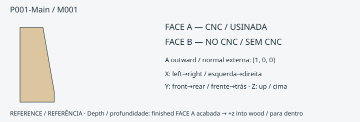

**ONE_SIDE_CNC_PLUS_MANUAL_FINISH** · 18 mm · FACE A [1.0, 0.0, 0.0]

FORNECIDO PELO CNC: contorno externo; 2 CUT; 2 POCKET; redução da face 0.0 mm.
PENDÊNCIA de ajuste/cupom: True

- P001-Main-R6: POCKET · FACE A · [9.270362255620057e-15, 3.000000000000012] mm
- P001-Main-R8: POCKET · FACE A · [9.270362255620057e-15, 3.000000000000012] mm
- P001-Main-R7: CUT · FACE A · [3.0000000000000098, 18.0] mm
- P001-Main-R9: CUT · FACE A · [3.0000000000000098, 18.0] mm
- ACABAMENTO DO MONTADOR: furar / escarear com broca selecionada, limitador e guia validada · P001-Main-R1 · FACE A datum [0, 18.0] mm. Não amplie pilotos menores que Ø4 para localizadores Ø4. É necessária validação física das ferramentas/ferragens.
- ACABAMENTO DO MONTADOR: furar / escarear com broca selecionada, limitador e guia validada · P001-Main-R2 · FACE A datum [0, 18.0] mm. Não amplie pilotos menores que Ø4 para localizadores Ø4. É necessária validação física das ferramentas/ferragens.
- ACABAMENTO DO MONTADOR: furar / escarear com broca selecionada, limitador e guia validada · P001-Main-R3 · FACE A datum [0, 12.99999999999999] mm. Não amplie pilotos menores que Ø4 para localizadores Ø4. É necessária validação física das ferramentas/ferragens.
- ACABAMENTO DO MONTADOR: furar / escarear com broca selecionada, limitador e guia validada · P001-Main-R4 · FACE A datum [0, 12.99999999999999] mm. Não amplie pilotos menores que Ø4 para localizadores Ø4. É necessária validação física das ferramentas/ferragens.
- ACABAMENTO DO MONTADOR: furar / escarear com broca selecionada, limitador e guia validada · P001-Main-R5 · FACE A datum [0, 12.99999999999999] mm. Não amplie pilotos menores que Ø4 para localizadores Ø4. É necessária validação física das ferramentas/ferragens.
- ACABAMENTO DO MONTADOR: furar / escarear com broca selecionada, limitador e guia validada · P001-Main-R10 · FACE A datum [0, 12.99999999999999] mm. Não amplie pilotos menores que Ø4 para localizadores Ø4. É necessária validação física das ferramentas/ferragens.
- ACABAMENTO DO MONTADOR: furar / escarear com broca selecionada, limitador e guia validada · P001-Main-R11 · FACE A datum [0, 12.999999999999996] mm. Não amplie pilotos menores que Ø4 para localizadores Ø4. É necessária validação física das ferramentas/ferragens.
- ACABAMENTO DO MONTADOR: furar / escarear com broca selecionada, limitador e guia validada · P001-Main-R12 · FACE A datum [0, 18.0] mm. Não amplie pilotos menores que Ø4 para localizadores Ø4. É necessária validação física das ferramentas/ferragens.
- ACABAMENTO DO MONTADOR: furar / escarear com broca selecionada, limitador e guia validada · P001-Main-R13 · FACE A datum [0, 18.0] mm. Não amplie pilotos menores que Ø4 para localizadores Ø4. É necessária validação física das ferramentas/ferragens.
- ACABAMENTO DO MONTADOR: furar / escarear com broca selecionada, limitador e guia validada · P001-Main-R14 · FACE A datum [0, 0.9999999999999931] mm. Não amplie pilotos menores que Ø4 para localizadores Ø4. É necessária validação física das ferramentas/ferragens.
- ACABAMENTO DO MONTADOR: furar / escarear com broca selecionada, limitador e guia validada · P001-Main-R15 · FACE A datum [0, 12.999999999999996] mm. Não amplie pilotos menores que Ø4 para localizadores Ø4. É necessária validação física das ferramentas/ferragens.
- ACABAMENTO DO MONTADOR: furar / escarear com broca selecionada, limitador e guia validada · P001-Main-R16 · FACE A datum [6.938893903907228e-15, 1.0000000000000073] mm. Não amplie pilotos menores que Ø4 para localizadores Ø4. É necessária validação física das ferramentas/ferragens.
- ACABAMENTO DO MONTADOR: furar / escarear com broca selecionada, limitador e guia validada · P001-Main-R17 · FACE A datum [2.1149748619109232e-14, 1.0000000000000215] mm. Não amplie pilotos menores que Ø4 para localizadores Ø4. É necessária validação física das ferramentas/ferragens.

[Eixos, profundidades e operações exatas](../exports/generated/flatpack-v331/manual-finish-schedule.json) · [Inspecionar peça](../exports/generated/viewer-v32/index.html?part=P001-Main&lang=pt-BR)

### P002-Main / M002

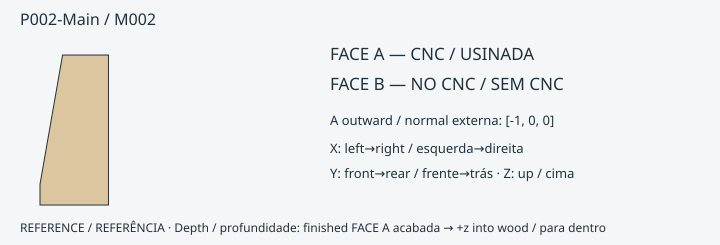

**ONE_SIDE_CNC_PLUS_MANUAL_FINISH** · 18 mm · FACE A [-1.0, 0.0, 0.0]

FORNECIDO PELO CNC: contorno externo; 2 CUT; 2 POCKET; redução da face 0.0 mm.
PENDÊNCIA de ajuste/cupom: True

- P002-Main-R3: POCKET · FACE A · [0, 3.0000000000000013] mm
- P002-Main-R5: POCKET · FACE A · [0, 3.0000000000000013] mm
- P002-Main-R4: CUT · FACE A · [2.999999999999999, 18.0] mm
- P002-Main-R6: CUT · FACE A · [2.999999999999999, 18.0] mm
- ACABAMENTO DO MONTADOR: furar / escarear com broca selecionada, limitador e guia validada · P002-Main-R1 · FACE A datum [0, 18.0] mm. Não amplie pilotos menores que Ø4 para localizadores Ø4. É necessária validação física das ferramentas/ferragens.
- ACABAMENTO DO MONTADOR: furar / escarear com broca selecionada, limitador e guia validada · P002-Main-R2 · FACE A datum [0, 18.0] mm. Não amplie pilotos menores que Ø4 para localizadores Ø4. É necessária validação física das ferramentas/ferragens.
- ACABAMENTO DO MONTADOR: furar / escarear com broca selecionada, limitador e guia validada · P002-Main-R7 · FACE A datum [0, 13.0] mm. Não amplie pilotos menores que Ø4 para localizadores Ø4. É necessária validação física das ferramentas/ferragens.
- ACABAMENTO DO MONTADOR: furar / escarear com broca selecionada, limitador e guia validada · P002-Main-R8 · FACE A datum [0, 13.0] mm. Não amplie pilotos menores que Ø4 para localizadores Ø4. É necessária validação física das ferramentas/ferragens.
- ACABAMENTO DO MONTADOR: furar / escarear com broca selecionada, limitador e guia validada · P002-Main-R9 · FACE A datum [0, 13.0] mm. Não amplie pilotos menores que Ø4 para localizadores Ø4. É necessária validação física das ferramentas/ferragens.
- ACABAMENTO DO MONTADOR: furar / escarear com broca selecionada, limitador e guia validada · P002-Main-R10 · FACE A datum [0, 1.0000000000000002] mm. Não amplie pilotos menores que Ø4 para localizadores Ø4. É necessária validação física das ferramentas/ferragens.
- ACABAMENTO DO MONTADOR: furar / escarear com broca selecionada, limitador e guia validada · P002-Main-R11 · FACE A datum [0, 1.0000000000000002] mm. Não amplie pilotos menores que Ø4 para localizadores Ø4. É necessária validação física das ferramentas/ferragens.
- ACABAMENTO DO MONTADOR: furar / escarear com broca selecionada, limitador e guia validada · P002-Main-R12 · FACE A datum [0, 13.0] mm. Não amplie pilotos menores que Ø4 para localizadores Ø4. É necessária validação física das ferramentas/ferragens.
- ACABAMENTO DO MONTADOR: furar / escarear com broca selecionada, limitador e guia validada · P002-Main-R13 · FACE A datum [0, 13.0] mm. Não amplie pilotos menores que Ø4 para localizadores Ø4. É necessária validação física das ferramentas/ferragens.
- ACABAMENTO DO MONTADOR: furar / escarear com broca selecionada, limitador e guia validada · P002-Main-R14 · FACE A datum [0, 13.0] mm. Não amplie pilotos menores que Ø4 para localizadores Ø4. É necessária validação física das ferramentas/ferragens.
- ACABAMENTO DO MONTADOR: furar / escarear com broca selecionada, limitador e guia validada · P002-Main-R15 · FACE A datum [0, 1.0000000000000002] mm. Não amplie pilotos menores que Ø4 para localizadores Ø4. É necessária validação física das ferramentas/ferragens.
- ACABAMENTO DO MONTADOR: furar / escarear com broca selecionada, limitador e guia validada · P002-Main-R16 · FACE A datum [0, 18.0] mm. Não amplie pilotos menores que Ø4 para localizadores Ø4. É necessária validação física das ferramentas/ferragens.
- ACABAMENTO DO MONTADOR: furar / escarear com broca selecionada, limitador e guia validada · P002-Main-R17 · FACE A datum [0, 18.0] mm. Não amplie pilotos menores que Ø4 para localizadores Ø4. É necessária validação física das ferramentas/ferragens.

[Eixos, profundidades e operações exatas](../exports/generated/flatpack-v331/manual-finish-schedule.json) · [Inspecionar peça](../exports/generated/viewer-v32/index.html?part=P002-Main&lang=pt-BR)

### P003-Main / M003

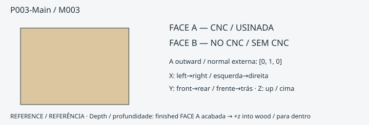

**ONE_SIDE_CNC_PLUS_MANUAL_FINISH** · 18 mm · FACE A [0.0, 1.0, 0.0]

FORNECIDO PELO CNC: contorno externo; 11 CUT; 0 POCKET; redução da face -3.552713678800501e-15 mm.
PENDÊNCIA de ajuste/cupom: True

- P003-Main-R5: CUT · FACE A · [5.695444116327053e-15, 18.000000000000004] mm
- P003-Main-R6: CUT · FACE A · [0, 17.999999999999993] mm
- P003-Main-R7: CUT · FACE A · [5.695444116327053e-15, 18.000000000000004] mm
- P003-Main-R8: CUT · FACE A · [9.248157795127554e-15, 18.000000000000004] mm
- P003-Main-R9: CUT · FACE A · [6.708869570992704e-15, 18.000000000000004] mm
- P003-Main-R10: CUT · FACE A · [1.6353585152728557e-14, 18.000000000000004] mm
- P003-Main-R11: CUT · FACE A · [2.0919724286194707e-14, 18.000000000000004] mm
- P003-Main-R12: CUT · FACE A · [0, 18.000000000000004] mm
- P003-Main-R13: CUT · FACE A · [6.708869570992704e-15, 18.000000000000004] mm
- P003-Main-R14: CUT · FACE A · [2.0919724286194707e-14, 18.000000000000004] mm
- P003-Main-R15: CUT · FACE A · [2.0919724286194707e-14, 18.000000000000004] mm
- ACABAMENTO DO MONTADOR: furar / escarear com broca selecionada, limitador e guia validada · P003-Main-R1 · FACE A datum [0, 7.778182980084499] mm. Não amplie pilotos menores que Ø4 para localizadores Ø4. É necessária validação física das ferramentas/ferragens.
- ACABAMENTO DO MONTADOR: furar / escarear com broca selecionada, limitador e guia validada · P003-Main-R2 · FACE A datum [0, 7.778182980084506] mm. Não amplie pilotos menores que Ø4 para localizadores Ø4. É necessária validação física das ferramentas/ferragens.
- ACABAMENTO DO MONTADOR: furar / escarear com broca selecionada, limitador e guia validada · P003-Main-R3 · FACE A datum [0, 7.778174593052076] mm. Não amplie pilotos menores que Ø4 para localizadores Ø4. É necessária validação física das ferramentas/ferragens.
- ACABAMENTO DO MONTADOR: furar / escarear com broca selecionada, limitador e guia validada · P003-Main-R4 · FACE A datum [0, 7.778174593052083] mm. Não amplie pilotos menores que Ø4 para localizadores Ø4. É necessária validação física das ferramentas/ferragens.
- ACABAMENTO DO MONTADOR: limar/formonar canto até a referência · P003-Main-R12 · FACE A datum 18.000000000000004 mm. Não amplie pilotos menores que Ø4 para localizadores Ø4. É necessária validação física das ferramentas/ferragens.

[Eixos, profundidades e operações exatas](../exports/generated/flatpack-v331/manual-finish-schedule.json) · [Inspecionar peça](../exports/generated/viewer-v32/index.html?part=P003-Main&lang=pt-BR)

### P004-Main / M004

**ONE_SIDE_CNC_PLUS_MANUAL_FINISH** · 18 mm · FACE A [0.0, -1.0, 0.0]

FORNECIDO PELO CNC: contorno externo; 15 CUT; 1 POCKET; redução da face 0.0 mm.
PENDÊNCIA de ajuste/cupom: True

- P004-Main-R19: POCKET · FACE A · [0, 7.999999999999943] mm
- P004-Main-R5: CUT · FACE A · [0, 18.0] mm
- P004-Main-R6: CUT · FACE A · [0, 18.0] mm
- P004-Main-R7: CUT · FACE A · [0, 18.0] mm
- P004-Main-R8: CUT · FACE A · [0, 18.0] mm
- P004-Main-R9: CUT · FACE A · [0, 18.0] mm
- P004-Main-R10: CUT · FACE A · [0, 18.0] mm
- P004-Main-R11: CUT · FACE A · [0, 18.0] mm
- P004-Main-R12: CUT · FACE A · [0, 18.0] mm
- P004-Main-R13: CUT · FACE A · [0, 18.0] mm
- P004-Main-R14: CUT · FACE A · [0, 18.0] mm
- P004-Main-R15: CUT · FACE A · [0, 18.0] mm
- P004-Main-R16: CUT · FACE A · [0, 18.0] mm
- P004-Main-R17: CUT · FACE A · [0, 18.0] mm
- P004-Main-R21: CUT · FACE A · [0, 18.0] mm
- P004-Main-R22: CUT · FACE A · [0, 18.0] mm
- ACABAMENTO DO MONTADOR: furar / escarear com broca selecionada, limitador e guia validada · P004-Main-R1 · FACE A datum [0, 7.7781745930520225] mm. Não amplie pilotos menores que Ø4 para localizadores Ø4. É necessária validação física das ferramentas/ferragens.
- ACABAMENTO DO MONTADOR: furar / escarear com broca selecionada, limitador e guia validada · P004-Main-R2 · FACE A datum [0, 7.7781745930520225] mm. Não amplie pilotos menores que Ø4 para localizadores Ø4. É necessária validação física das ferramentas/ferragens.
- ACABAMENTO DO MONTADOR: furar / escarear com broca selecionada, limitador e guia validada · P004-Main-R3 · FACE A datum [0, 7.778182980084677] mm. Não amplie pilotos menores que Ø4 para localizadores Ø4. É necessária validação física das ferramentas/ferragens.
- ACABAMENTO DO MONTADOR: furar / escarear com broca selecionada, limitador e guia validada · P004-Main-R4 · FACE A datum [0, 7.778182980084677] mm. Não amplie pilotos menores que Ø4 para localizadores Ø4. É necessária validação física das ferramentas/ferragens.
- ACABAMENTO DO MONTADOR: furar / escarear com broca selecionada, limitador e guia validada · P004-Main-R18 · FACE A datum [0, 18.0] mm. Não amplie pilotos menores que Ø4 para localizadores Ø4. É necessária validação física das ferramentas/ferragens.
- ACABAMENTO DO MONTADOR: limar/formonar canto até a referência · P004-Main-R19 · FACE A datum 7.999999999999943 mm. Não amplie pilotos menores que Ø4 para localizadores Ø4. É necessária validação física das ferramentas/ferragens.
- ACABAMENTO DO MONTADOR: acabar a região estreita com ferramentas manuais validadas · P004-Main-R19 · FACE A datum 7.999999999999943 mm. Não amplie pilotos menores que Ø4 para localizadores Ø4. É necessária validação física das ferramentas/ferragens.
- ACABAMENTO DO MONTADOR: furar / escarear com broca selecionada, limitador e guia validada · P004-Main-R20 · FACE A datum [0, 18.0] mm. Não amplie pilotos menores que Ø4 para localizadores Ø4. É necessária validação física das ferramentas/ferragens.
- ACABAMENTO DO MONTADOR: limar/formonar canto até a referência · P004-Main-R22 · FACE A datum 18.0 mm. Não amplie pilotos menores que Ø4 para localizadores Ø4. É necessária validação física das ferramentas/ferragens.
- ACABAMENTO DO MONTADOR: furar / escarear com broca selecionada, limitador e guia validada · P004-Main-R23 · FACE A datum [6.0, 18.0] mm. Não amplie pilotos menores que Ø4 para localizadores Ø4. É necessária validação física das ferramentas/ferragens.
- ACABAMENTO DO MONTADOR: furar / escarear com broca selecionada, limitador e guia validada · P004-Main-R24 · FACE A datum [6.0, 18.0] mm. Não amplie pilotos menores que Ø4 para localizadores Ø4. É necessária validação física das ferramentas/ferragens.

[Eixos, profundidades e operações exatas](../exports/generated/flatpack-v331/manual-finish-schedule.json) · [Inspecionar peça](../exports/generated/viewer-v32/index.html?part=P004-Main&lang=pt-BR)

### P005-Main / M005

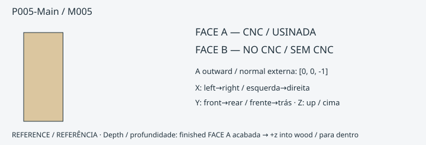

**ONE_SIDE_CNC_READY** · 18 mm · FACE A [0.0, 0.0, -1.0]

FORNECIDO PELO CNC: contorno externo; 27 CUT; 8 POCKET; redução da face 0.0 mm.
PENDÊNCIA de ajuste/cupom: True

- P005-Main-R5: POCKET · FACE A · [0, 8.0] mm
- P005-Main-R10: POCKET · FACE A · [0, 8.0] mm
- P005-Main-R19: POCKET · FACE A · [0, 8.0] mm
- P005-Main-R22: POCKET · FACE A · [0, 8.0] mm
- P005-Main-R24: POCKET · FACE A · [0, 8.0] mm
- P005-Main-R28: POCKET · FACE A · [0, 8.0] mm
- P005-Main-R30: POCKET · FACE A · [0, 8.0] mm
- P005-Main-R34: POCKET · FACE A · [0, 8.0] mm
- P005-Main-R1: CUT · FACE A · [0, 18.0] mm
- P005-Main-R2: CUT · FACE A · [0, 18.0] mm
- P005-Main-R3: CUT · FACE A · [0, 18.0] mm
- P005-Main-R4: CUT · FACE A · [0, 18.0] mm
- P005-Main-R6: CUT · FACE A · [0, 18.0] mm
- P005-Main-R7: CUT · FACE A · [0, 18.0] mm
- P005-Main-R8: CUT · FACE A · [0, 18.0] mm
- P005-Main-R9: CUT · FACE A · [0, 18.0] mm
- P005-Main-R11: CUT · FACE A · [0, 18.0] mm
- P005-Main-R12: CUT · FACE A · [0, 18.0] mm
- P005-Main-R13: CUT · FACE A · [0, 18.0] mm
- P005-Main-R14: CUT · FACE A · [0, 18.0] mm
- P005-Main-R15: CUT · FACE A · [0, 18.0] mm
- P005-Main-R16: CUT · FACE A · [0, 18.0] mm
- P005-Main-R17: CUT · FACE A · [0, 18.0] mm
- P005-Main-R18: CUT · FACE A · [0, 18.0] mm
- P005-Main-R20: CUT · FACE A · [0, 18.0] mm
- P005-Main-R21: CUT · FACE A · [0, 18.0] mm
- P005-Main-R23: CUT · FACE A · [0, 18.0] mm
- P005-Main-R25: CUT · FACE A · [0, 18.0] mm
- P005-Main-R26: CUT · FACE A · [0, 18.0] mm
- P005-Main-R27: CUT · FACE A · [0, 18.0] mm
- P005-Main-R29: CUT · FACE A · [0, 18.0] mm
- P005-Main-R31: CUT · FACE A · [0, 18.0] mm
- P005-Main-R32: CUT · FACE A · [0, 18.0] mm
- P005-Main-R33: CUT · FACE A · [0, 18.0] mm
- P005-Main-R35: CUT · FACE A · [0, 18.0] mm
ACABAMENTO DO MONTADOR: nenhum na auditoria nominal de operações.

[Eixos, profundidades e operações exatas](../exports/generated/flatpack-v331/manual-finish-schedule.json) · [Inspecionar peça](../exports/generated/viewer-v32/index.html?part=P005-Main&lang=pt-BR)

### P006-Main / M006

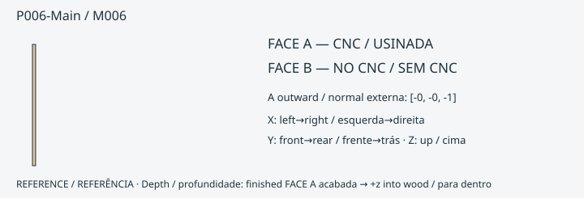

**ONE_SIDE_CNC_READY** · 18 mm · FACE A [-0.0, -0.0, -1.0]

FORNECIDO PELO CNC: contorno externo; 0 CUT; 0 POCKET; redução da face 0.0 mm.
PENDÊNCIA de ajuste/cupom: True

ACABAMENTO DO MONTADOR: nenhum na auditoria nominal de operações.

[Eixos, profundidades e operações exatas](../exports/generated/flatpack-v331/manual-finish-schedule.json) · [Inspecionar peça](../exports/generated/viewer-v32/index.html?part=P006-Main&lang=pt-BR)

### P007-Main / M006

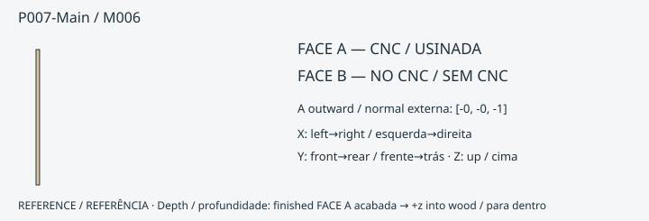

**ONE_SIDE_CNC_READY** · 18 mm · FACE A [-0.0, -0.0, -1.0]

FORNECIDO PELO CNC: contorno externo; 0 CUT; 0 POCKET; redução da face 0.0 mm.
PENDÊNCIA de ajuste/cupom: True

ACABAMENTO DO MONTADOR: nenhum na auditoria nominal de operações.

[Eixos, profundidades e operações exatas](../exports/generated/flatpack-v331/manual-finish-schedule.json) · [Inspecionar peça](../exports/generated/viewer-v32/index.html?part=P007-Main&lang=pt-BR)

### P008-Main / M007

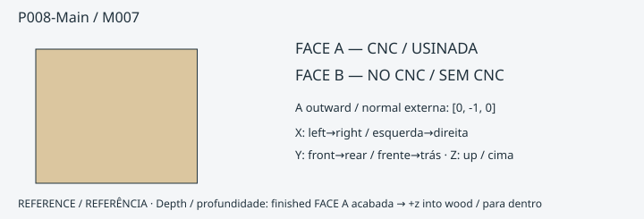

**ONE_SIDE_CNC_PLUS_MANUAL_FINISH** · 12 mm · FACE A [0.0, -1.0, 0.0]

FORNECIDO PELO CNC: contorno externo; 3 CUT; 0 POCKET; redução da face 0.0 mm.
PENDÊNCIA de ajuste/cupom: True

- P008-Main-R1: CUT · FACE A · [0, 12.0] mm
- P008-Main-R2: CUT · FACE A · [0, 12.0] mm
- P008-Main-R3: CUT · FACE A · [0, 12.0] mm
- ACABAMENTO DO MONTADOR: limar/formonar o resíduo inacessível à fresa até a referência · P008-Main-R3 · FACE A datum 12.0 mm. Não amplie pilotos menores que Ø4 para localizadores Ø4. É necessária validação física das ferramentas/ferragens.

[Eixos, profundidades e operações exatas](../exports/generated/flatpack-v331/manual-finish-schedule.json) · [Inspecionar peça](../exports/generated/viewer-v32/index.html?part=P008-Main&lang=pt-BR)

### P009-Main / M008

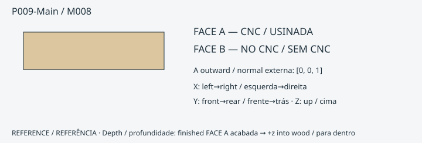

**ONE_SIDE_CNC_READY** · 12 mm · FACE A [0.0, 0.0, 1.0]

FORNECIDO PELO CNC: contorno externo; 4 CUT; 0 POCKET; redução da face 0.0 mm.
PENDÊNCIA de ajuste/cupom: True

- P009-Main-R1: CUT · FACE A · [0, 11.999999999999972] mm
- P009-Main-R2: CUT · FACE A · [2.8084931560638486e-14, 12.0] mm
- P009-Main-R3: CUT · FACE A · [0, 11.999999999999972] mm
- P009-Main-R4: CUT · FACE A · [2.8084931560638486e-14, 12.0] mm
ACABAMENTO DO MONTADOR: nenhum na auditoria nominal de operações.

[Eixos, profundidades e operações exatas](../exports/generated/flatpack-v331/manual-finish-schedule.json) · [Inspecionar peça](../exports/generated/viewer-v32/index.html?part=P009-Main&lang=pt-BR)

### P010-Main / M008

**ONE_SIDE_CNC_READY** · 12 mm · FACE A [0.0, 0.0, 1.0]

FORNECIDO PELO CNC: contorno externo; 4 CUT; 0 POCKET; redução da face 0.0 mm.
PENDÊNCIA de ajuste/cupom: True

- P010-Main-R1: CUT · FACE A · [0, 11.999999999999972] mm
- P010-Main-R2: CUT · FACE A · [2.8084931560638486e-14, 12.0] mm
- P010-Main-R3: CUT · FACE A · [0, 11.999999999999972] mm
- P010-Main-R4: CUT · FACE A · [2.8084931560638486e-14, 12.0] mm
ACABAMENTO DO MONTADOR: nenhum na auditoria nominal de operações.

[Eixos, profundidades e operações exatas](../exports/generated/flatpack-v331/manual-finish-schedule.json) · [Inspecionar peça](../exports/generated/viewer-v32/index.html?part=P010-Main&lang=pt-BR)

### P011-Main / M009

**ONE_SIDE_CNC_READY** · 12 mm · FACE A [0.0, 0.0, 1.0]

FORNECIDO PELO CNC: contorno externo; 4 CUT; 0 POCKET; redução da face 0.0 mm.
PENDÊNCIA de ajuste/cupom: True

- P011-Main-R1: CUT · FACE A · [0, 11.999999999999972] mm
- P011-Main-R2: CUT · FACE A · [2.8084931560638486e-14, 12.0] mm
- P011-Main-R3: CUT · FACE A · [0, 11.999999999999972] mm
- P011-Main-R4: CUT · FACE A · [2.8084931560638486e-14, 12.0] mm
ACABAMENTO DO MONTADOR: nenhum na auditoria nominal de operações.

[Eixos, profundidades e operações exatas](../exports/generated/flatpack-v331/manual-finish-schedule.json) · [Inspecionar peça](../exports/generated/viewer-v32/index.html?part=P011-Main&lang=pt-BR)

### P012-Main / M010

**ONE_SIDE_CNC_PLUS_MANUAL_FINISH** · 18 mm · FACE A [0.0, 0.0, 1.0]

FORNECIDO PELO CNC: contorno externo; 0 CUT; 4 POCKET; redução da face 0.0 mm.
PENDÊNCIA de ajuste/cupom: True

- P012-Main-R3: POCKET · FACE A · [0, 10.5] mm
- P012-Main-R4: POCKET · FACE A · [10.5, 12.5] mm
- P012-Main-R5: POCKET · FACE A · [0, 10.5] mm
- P012-Main-R6: POCKET · FACE A · [10.5, 12.5] mm
- ACABAMENTO DO MONTADOR: furar / escarear com broca selecionada, limitador e guia validada · P012-Main-R1 · FACE A datum [6.749999999999995, 11.25] mm. Não amplie pilotos menores que Ø4 para localizadores Ø4. É necessária validação física das ferramentas/ferragens.
- ACABAMENTO DO MONTADOR: furar / escarear com broca selecionada, limitador e guia validada · P012-Main-R2 · FACE A datum [6.749999999999995, 11.25] mm. Não amplie pilotos menores que Ø4 para localizadores Ø4. É necessária validação física das ferramentas/ferragens.

[Eixos, profundidades e operações exatas](../exports/generated/flatpack-v331/manual-finish-schedule.json) · [Inspecionar peça](../exports/generated/viewer-v32/index.html?part=P012-Main&lang=pt-BR)

### P013-Main / M011

**ONE_SIDE_CNC_PLUS_MANUAL_FINISH** · 18 mm · FACE A [0.0, 0.0, 1.0]

FORNECIDO PELO CNC: contorno externo; 0 CUT; 4 POCKET; redução da face 0.0 mm.
PENDÊNCIA de ajuste/cupom: True

- P013-Main-R3: POCKET · FACE A · [0, 10.5] mm
- P013-Main-R4: POCKET · FACE A · [10.5, 12.5] mm
- P013-Main-R5: POCKET · FACE A · [0, 10.5] mm
- P013-Main-R6: POCKET · FACE A · [10.5, 12.5] mm
- ACABAMENTO DO MONTADOR: furar / escarear com broca selecionada, limitador e guia validada · P013-Main-R1 · FACE A datum [6.75, 11.250000000000028] mm. Não amplie pilotos menores que Ø4 para localizadores Ø4. É necessária validação física das ferramentas/ferragens.
- ACABAMENTO DO MONTADOR: furar / escarear com broca selecionada, limitador e guia validada · P013-Main-R2 · FACE A datum [6.75, 11.250000000000028] mm. Não amplie pilotos menores que Ø4 para localizadores Ø4. É necessária validação física das ferramentas/ferragens.

[Eixos, profundidades e operações exatas](../exports/generated/flatpack-v331/manual-finish-schedule.json) · [Inspecionar peça](../exports/generated/viewer-v32/index.html?part=P013-Main&lang=pt-BR)

### P014-Main / M010

**ONE_SIDE_CNC_PLUS_MANUAL_FINISH** · 18 mm · FACE A [0.0, 0.0, 1.0]

FORNECIDO PELO CNC: contorno externo; 0 CUT; 4 POCKET; redução da face -2.842170943040401e-14 mm.
PENDÊNCIA de ajuste/cupom: True

- P014-Main-R3: POCKET · FACE A · [2.7901234540766383e-14, 10.500000000000028] mm
- P014-Main-R4: POCKET · FACE A · [10.500000000000028, 12.500000000000028] mm
- P014-Main-R5: POCKET · FACE A · [2.7901234540766383e-14, 10.500000000000028] mm
- P014-Main-R6: POCKET · FACE A · [10.500000000000028, 12.500000000000028] mm
- ACABAMENTO DO MONTADOR: furar / escarear com broca selecionada, limitador e guia validada · P014-Main-R1 · FACE A datum [6.750000000000023, 11.250000000000028] mm. Não amplie pilotos menores que Ø4 para localizadores Ø4. É necessária validação física das ferramentas/ferragens.
- ACABAMENTO DO MONTADOR: furar / escarear com broca selecionada, limitador e guia validada · P014-Main-R2 · FACE A datum [6.750000000000023, 11.250000000000028] mm. Não amplie pilotos menores que Ø4 para localizadores Ø4. É necessária validação física das ferramentas/ferragens.

[Eixos, profundidades e operações exatas](../exports/generated/flatpack-v331/manual-finish-schedule.json) · [Inspecionar peça](../exports/generated/viewer-v32/index.html?part=P014-Main&lang=pt-BR)

### P015-Main / M011

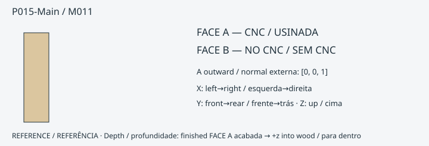

**ONE_SIDE_CNC_PLUS_MANUAL_FINISH** · 18 mm · FACE A [0.0, 0.0, 1.0]

FORNECIDO PELO CNC: contorno externo; 0 CUT; 4 POCKET; redução da face 0.0 mm.
PENDÊNCIA de ajuste/cupom: True

- P015-Main-R3: POCKET · FACE A · [0, 10.5] mm
- P015-Main-R4: POCKET · FACE A · [10.5, 12.5] mm
- P015-Main-R5: POCKET · FACE A · [0, 10.5] mm
- P015-Main-R6: POCKET · FACE A · [10.5, 12.5] mm
- ACABAMENTO DO MONTADOR: furar / escarear com broca selecionada, limitador e guia validada · P015-Main-R1 · FACE A datum [6.75, 11.250000000000028] mm. Não amplie pilotos menores que Ø4 para localizadores Ø4. É necessária validação física das ferramentas/ferragens.
- ACABAMENTO DO MONTADOR: furar / escarear com broca selecionada, limitador e guia validada · P015-Main-R2 · FACE A datum [6.75, 11.250000000000028] mm. Não amplie pilotos menores que Ø4 para localizadores Ø4. É necessária validação física das ferramentas/ferragens.

[Eixos, profundidades e operações exatas](../exports/generated/flatpack-v331/manual-finish-schedule.json) · [Inspecionar peça](../exports/generated/viewer-v32/index.html?part=P015-Main&lang=pt-BR)

### P016-Main / M012

**ONE_SIDE_CNC_PLUS_MANUAL_FINISH** · 18 mm · FACE A [0.0, 0.0, 1.0]

FORNECIDO PELO CNC: contorno externo; 0 CUT; 4 POCKET; redução da face 0.0 mm.
PENDÊNCIA de ajuste/cupom: True

- P016-Main-R3: POCKET · FACE A · [0, 10.5] mm
- P016-Main-R4: POCKET · FACE A · [10.5, 12.5] mm
- P016-Main-R5: POCKET · FACE A · [0, 10.5] mm
- P016-Main-R6: POCKET · FACE A · [10.5, 12.5] mm
- ACABAMENTO DO MONTADOR: furar / escarear com broca selecionada, limitador e guia validada · P016-Main-R1 · FACE A datum [6.749999999999995, 11.25] mm. Não amplie pilotos menores que Ø4 para localizadores Ø4. É necessária validação física das ferramentas/ferragens.
- ACABAMENTO DO MONTADOR: furar / escarear com broca selecionada, limitador e guia validada · P016-Main-R2 · FACE A datum [6.749999999999995, 11.25] mm. Não amplie pilotos menores que Ø4 para localizadores Ø4. É necessária validação física das ferramentas/ferragens.

[Eixos, profundidades e operações exatas](../exports/generated/flatpack-v331/manual-finish-schedule.json) · [Inspecionar peça](../exports/generated/viewer-v32/index.html?part=P016-Main&lang=pt-BR)

### P017-Main / M013

**ONE_SIDE_CNC_PLUS_MANUAL_FINISH** · 18 mm · FACE A [0.0, 0.0, 1.0]

FORNECIDO PELO CNC: contorno externo; 0 CUT; 4 POCKET; redução da face 2.842170943040401e-14 mm.
PENDÊNCIA de ajuste/cupom: True

- P017-Main-R3: POCKET · FACE A · [0, 10.5] mm
- P017-Main-R4: POCKET · FACE A · [10.5, 12.5] mm
- P017-Main-R5: POCKET · FACE A · [0, 10.5] mm
- P017-Main-R6: POCKET · FACE A · [10.5, 12.5] mm
- ACABAMENTO DO MONTADOR: furar / escarear com broca selecionada, limitador e guia validada · P017-Main-R1 · FACE A datum [6.75, 11.250000000000028] mm. Não amplie pilotos menores que Ø4 para localizadores Ø4. É necessária validação física das ferramentas/ferragens.
- ACABAMENTO DO MONTADOR: furar / escarear com broca selecionada, limitador e guia validada · P017-Main-R2 · FACE A datum [6.75, 11.250000000000028] mm. Não amplie pilotos menores que Ø4 para localizadores Ø4. É necessária validação física das ferramentas/ferragens.

[Eixos, profundidades e operações exatas](../exports/generated/flatpack-v331/manual-finish-schedule.json) · [Inspecionar peça](../exports/generated/viewer-v32/index.html?part=P017-Main&lang=pt-BR)

### P018-Main / M014

**ONE_SIDE_CNC_PLUS_MANUAL_FINISH** · 18 mm · FACE A [0.0, -1.0, 0.0]

FORNECIDO PELO CNC: contorno externo; 0 CUT; 16 POCKET; redução da face 0.0 mm.
PENDÊNCIA de ajuste/cupom: True

- P018-Main-R1-STEP2: POCKET · FACE A · see register mm
- P018-Main-R1-STEP3: POCKET · FACE A · see register mm
- P018-Main-R1-STEP4: POCKET · FACE A · see register mm
- P018-Main-R1-STEP5: POCKET · FACE A · see register mm
- P018-Main-R1-STEP6: POCKET · FACE A · see register mm
- P018-Main-R1-STEP7: POCKET · FACE A · see register mm
- P018-Main-R1-STEP8: POCKET · FACE A · see register mm
- P018-Main-R1-STEP9: POCKET · FACE A · see register mm
- P018-Main-R1-STEP10: POCKET · FACE A · see register mm
- P018-Main-R1-STEP11: POCKET · FACE A · see register mm
- P018-Main-R1-STEP12: POCKET · FACE A · see register mm
- P018-Main-R1-STEP13: POCKET · FACE A · see register mm
- P018-Main-R1-STEP14: POCKET · FACE A · see register mm
- P018-Main-R1-STEP15: POCKET · FACE A · see register mm
- P018-Main-R1-STEP16: POCKET · FACE A · see register mm
- P018-Main-R1-STEP17: POCKET · FACE A · see register mm
- ACABAMENTO DO MONTADOR: lixar até o chanfro de referência com régua e gabarito angular · P018-Main-R1 · FACE A datum [0, 18.0] mm. Não amplie pilotos menores que Ø4 para localizadores Ø4. É necessária validação física das ferramentas/ferragens.

[Eixos, profundidades e operações exatas](../exports/generated/flatpack-v331/manual-finish-schedule.json) · [Inspecionar peça](../exports/generated/viewer-v32/index.html?part=P018-Main&lang=pt-BR)

### P019-Main / M014

**ONE_SIDE_CNC_PLUS_MANUAL_FINISH** · 18 mm · FACE A [0.0, -1.0, 0.0]

FORNECIDO PELO CNC: contorno externo; 0 CUT; 16 POCKET; redução da face 0.0 mm.
PENDÊNCIA de ajuste/cupom: True

- P019-Main-R1-STEP2: POCKET · FACE A · see register mm
- P019-Main-R1-STEP3: POCKET · FACE A · see register mm
- P019-Main-R1-STEP4: POCKET · FACE A · see register mm
- P019-Main-R1-STEP5: POCKET · FACE A · see register mm
- P019-Main-R1-STEP6: POCKET · FACE A · see register mm
- P019-Main-R1-STEP7: POCKET · FACE A · see register mm
- P019-Main-R1-STEP8: POCKET · FACE A · see register mm
- P019-Main-R1-STEP9: POCKET · FACE A · see register mm
- P019-Main-R1-STEP10: POCKET · FACE A · see register mm
- P019-Main-R1-STEP11: POCKET · FACE A · see register mm
- P019-Main-R1-STEP12: POCKET · FACE A · see register mm
- P019-Main-R1-STEP13: POCKET · FACE A · see register mm
- P019-Main-R1-STEP14: POCKET · FACE A · see register mm
- P019-Main-R1-STEP15: POCKET · FACE A · see register mm
- P019-Main-R1-STEP16: POCKET · FACE A · see register mm
- P019-Main-R1-STEP17: POCKET · FACE A · see register mm
- ACABAMENTO DO MONTADOR: lixar até o chanfro de referência com régua e gabarito angular · P019-Main-R1 · FACE A datum [0, 18.0] mm. Não amplie pilotos menores que Ø4 para localizadores Ø4. É necessária validação física das ferramentas/ferragens.

[Eixos, profundidades e operações exatas](../exports/generated/flatpack-v331/manual-finish-schedule.json) · [Inspecionar peça](../exports/generated/viewer-v32/index.html?part=P019-Main&lang=pt-BR)

### P020-Main / M014

**ONE_SIDE_CNC_PLUS_MANUAL_FINISH** · 18 mm · FACE A [0.0, -1.0, 0.0]

FORNECIDO PELO CNC: contorno externo; 0 CUT; 16 POCKET; redução da face -1.1368683772161603e-13 mm.
PENDÊNCIA de ajuste/cupom: True

- P020-Main-R1-STEP2: POCKET · FACE A · see register mm
- P020-Main-R1-STEP3: POCKET · FACE A · see register mm
- P020-Main-R1-STEP4: POCKET · FACE A · see register mm
- P020-Main-R1-STEP5: POCKET · FACE A · see register mm
- P020-Main-R1-STEP6: POCKET · FACE A · see register mm
- P020-Main-R1-STEP7: POCKET · FACE A · see register mm
- P020-Main-R1-STEP8: POCKET · FACE A · see register mm
- P020-Main-R1-STEP9: POCKET · FACE A · see register mm
- P020-Main-R1-STEP10: POCKET · FACE A · see register mm
- P020-Main-R1-STEP11: POCKET · FACE A · see register mm
- P020-Main-R1-STEP12: POCKET · FACE A · see register mm
- P020-Main-R1-STEP13: POCKET · FACE A · see register mm
- P020-Main-R1-STEP14: POCKET · FACE A · see register mm
- P020-Main-R1-STEP15: POCKET · FACE A · see register mm
- P020-Main-R1-STEP16: POCKET · FACE A · see register mm
- P020-Main-R1-STEP17: POCKET · FACE A · see register mm
- ACABAMENTO DO MONTADOR: lixar até o chanfro de referência com régua e gabarito angular · P020-Main-R1 · FACE A datum [0, 18.000000000000114] mm. Não amplie pilotos menores que Ø4 para localizadores Ø4. É necessária validação física das ferramentas/ferragens.

[Eixos, profundidades e operações exatas](../exports/generated/flatpack-v331/manual-finish-schedule.json) · [Inspecionar peça](../exports/generated/viewer-v32/index.html?part=P020-Main&lang=pt-BR)

### P021-Main / M015

**ONE_SIDE_CNC_PLUS_MANUAL_FINISH** · 18 mm · FACE A [1.0, 0.0, 0.0]

FORNECIDO PELO CNC: contorno externo; 10 CUT; 1 POCKET; redução da face 0.0 mm.
PENDÊNCIA de ajuste/cupom: True

- P021-Main-R1: POCKET · FACE A · [0, 6.000000000000007] mm
- P021-Main-R2: CUT · FACE A · [0, 17.999999999999993] mm
- P021-Main-R3: CUT · FACE A · [0, 17.999999999999993] mm
- P021-Main-R4: CUT · FACE A · [0, 17.999999999999993] mm
- P021-Main-R5: CUT · FACE A · [0, 17.999999999999996] mm
- P021-Main-R6: CUT · FACE A · [3.247402347028583e-15, 18.0] mm
- P021-Main-R7: CUT · FACE A · [0, 17.999999999999993] mm
- P021-Main-R8: CUT · FACE A · [0, 17.999999999999993] mm
- P021-Main-R9: CUT · FACE A · [0, 17.999999999999993] mm
- P021-Main-R10: CUT · FACE A · [0, 17.999999999999996] mm
- P021-Main-R11: CUT · FACE A · [3.247402347028583e-15, 18.0] mm
- ACABAMENTO DO MONTADOR: limar/formonar canto até a referência · P021-Main-R1 · FACE A datum 6.000000000000007 mm. Não amplie pilotos menores que Ø4 para localizadores Ø4. É necessária validação física das ferramentas/ferragens.

[Eixos, profundidades e operações exatas](../exports/generated/flatpack-v331/manual-finish-schedule.json) · [Inspecionar peça](../exports/generated/viewer-v32/index.html?part=P021-Main&lang=pt-BR)

### P022-Main / M016

**ONE_SIDE_CNC_PLUS_MANUAL_FINISH** · 18 mm · FACE A [-1.0, 0.0, 0.0]

FORNECIDO PELO CNC: contorno externo; 10 CUT; 1 POCKET; redução da face 0.0 mm.
PENDÊNCIA de ajuste/cupom: True

- P022-Main-R1: POCKET · FACE A · [0, 6.000000000000014] mm
- P022-Main-R2: CUT · FACE A · [0, 18.0] mm
- P022-Main-R3: CUT · FACE A · [0, 18.0] mm
- P022-Main-R4: CUT · FACE A · [0, 18.0] mm
- P022-Main-R5: CUT · FACE A · [0, 18.0] mm
- P022-Main-R6: CUT · FACE A · [0, 18.0] mm
- P022-Main-R7: CUT · FACE A · [0, 18.0] mm
- P022-Main-R8: CUT · FACE A · [0, 18.0] mm
- P022-Main-R9: CUT · FACE A · [0, 18.0] mm
- P022-Main-R10: CUT · FACE A · [0, 18.0] mm
- P022-Main-R11: CUT · FACE A · [0, 18.0] mm
- ACABAMENTO DO MONTADOR: limar/formonar canto até a referência · P022-Main-R1 · FACE A datum 6.000000000000014 mm. Não amplie pilotos menores que Ø4 para localizadores Ø4. É necessária validação física das ferramentas/ferragens.

[Eixos, profundidades e operações exatas](../exports/generated/flatpack-v331/manual-finish-schedule.json) · [Inspecionar peça](../exports/generated/viewer-v32/index.html?part=P022-Main&lang=pt-BR)

### P023-Main / M015

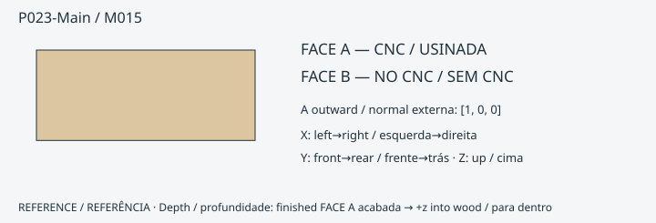

**ONE_SIDE_CNC_PLUS_MANUAL_FINISH** · 18 mm · FACE A [1.0, 0.0, 0.0]

FORNECIDO PELO CNC: contorno externo; 10 CUT; 1 POCKET; redução da face 0.0 mm.
PENDÊNCIA de ajuste/cupom: True

- P023-Main-R1: POCKET · FACE A · [0, 6.000000000000007] mm
- P023-Main-R2: CUT · FACE A · [0, 17.999999999999993] mm
- P023-Main-R3: CUT · FACE A · [0, 17.999999999999993] mm
- P023-Main-R4: CUT · FACE A · [0, 17.999999999999993] mm
- P023-Main-R5: CUT · FACE A · [0, 17.999999999999996] mm
- P023-Main-R6: CUT · FACE A · [0, 18.0] mm
- P023-Main-R7: CUT · FACE A · [0, 17.999999999999993] mm
- P023-Main-R8: CUT · FACE A · [0, 17.999999999999993] mm
- P023-Main-R9: CUT · FACE A · [0, 17.999999999999993] mm
- P023-Main-R10: CUT · FACE A · [0, 17.999999999999996] mm
- P023-Main-R11: CUT · FACE A · [0, 18.0] mm
- ACABAMENTO DO MONTADOR: limar/formonar canto até a referência · P023-Main-R1 · FACE A datum 6.000000000000007 mm. Não amplie pilotos menores que Ø4 para localizadores Ø4. É necessária validação física das ferramentas/ferragens.

[Eixos, profundidades e operações exatas](../exports/generated/flatpack-v331/manual-finish-schedule.json) · [Inspecionar peça](../exports/generated/viewer-v32/index.html?part=P023-Main&lang=pt-BR)

### P024-Main / M016

**ONE_SIDE_CNC_PLUS_MANUAL_FINISH** · 18 mm · FACE A [-1.0, 0.0, 0.0]

FORNECIDO PELO CNC: contorno externo; 10 CUT; 1 POCKET; redução da face 0.0 mm.
PENDÊNCIA de ajuste/cupom: True

- P024-Main-R1: POCKET · FACE A · [0, 6.000000000000014] mm
- P024-Main-R2: CUT · FACE A · [0, 18.0] mm
- P024-Main-R3: CUT · FACE A · [0, 18.0] mm
- P024-Main-R4: CUT · FACE A · [0, 18.0] mm
- P024-Main-R5: CUT · FACE A · [0, 18.0] mm
- P024-Main-R6: CUT · FACE A · [0, 18.0] mm
- P024-Main-R7: CUT · FACE A · [0, 18.0] mm
- P024-Main-R8: CUT · FACE A · [0, 18.0] mm
- P024-Main-R9: CUT · FACE A · [0, 18.0] mm
- P024-Main-R10: CUT · FACE A · [0, 18.0] mm
- P024-Main-R11: CUT · FACE A · [0, 18.0] mm
- ACABAMENTO DO MONTADOR: limar/formonar canto até a referência · P024-Main-R1 · FACE A datum 6.000000000000014 mm. Não amplie pilotos menores que Ø4 para localizadores Ø4. É necessária validação física das ferramentas/ferragens.

[Eixos, profundidades e operações exatas](../exports/generated/flatpack-v331/manual-finish-schedule.json) · [Inspecionar peça](../exports/generated/viewer-v32/index.html?part=P024-Main&lang=pt-BR)

### P025-Main / M015

**ONE_SIDE_CNC_PLUS_MANUAL_FINISH** · 18 mm · FACE A [1.0, 0.0, 0.0]

FORNECIDO PELO CNC: contorno externo; 10 CUT; 1 POCKET; redução da face -3.552713678800501e-15 mm.
PENDÊNCIA de ajuste/cupom: True

- P025-Main-R1: POCKET · FACE A · [0, 6.000000000000011] mm
- P025-Main-R2: CUT · FACE A · [0, 17.999999999999996] mm
- P025-Main-R3: CUT · FACE A · [0, 17.999999999999996] mm
- P025-Main-R4: CUT · FACE A · [0, 18.0] mm
- P025-Main-R5: CUT · FACE A · [0, 18.000000000000004] mm
- P025-Main-R6: CUT · FACE A · [6.800116025829084e-15, 18.000000000000004] mm
- P025-Main-R7: CUT · FACE A · [0, 17.999999999999996] mm
- P025-Main-R8: CUT · FACE A · [0, 17.999999999999996] mm
- P025-Main-R9: CUT · FACE A · [0, 18.0] mm
- P025-Main-R10: CUT · FACE A · [0, 18.000000000000004] mm
- P025-Main-R11: CUT · FACE A · [6.800116025829084e-15, 18.000000000000004] mm
- ACABAMENTO DO MONTADOR: limar/formonar canto até a referência · P025-Main-R1 · FACE A datum 6.000000000000011 mm. Não amplie pilotos menores que Ø4 para localizadores Ø4. É necessária validação física das ferramentas/ferragens.

[Eixos, profundidades e operações exatas](../exports/generated/flatpack-v331/manual-finish-schedule.json) · [Inspecionar peça](../exports/generated/viewer-v32/index.html?part=P025-Main&lang=pt-BR)

### P026-Main / M016

**ONE_SIDE_CNC_PLUS_MANUAL_FINISH** · 18 mm · FACE A [-1.0, 0.0, 0.0]

FORNECIDO PELO CNC: contorno externo; 10 CUT; 1 POCKET; redução da face 0.0 mm.
PENDÊNCIA de ajuste/cupom: True

- P026-Main-R1: POCKET · FACE A · [0, 6.000000000000014] mm
- P026-Main-R2: CUT · FACE A · [0, 18.0] mm
- P026-Main-R3: CUT · FACE A · [0, 18.0] mm
- P026-Main-R4: CUT · FACE A · [0, 18.0] mm
- P026-Main-R5: CUT · FACE A · [0, 18.0] mm
- P026-Main-R6: CUT · FACE A · [0, 18.0] mm
- P026-Main-R7: CUT · FACE A · [0, 18.0] mm
- P026-Main-R8: CUT · FACE A · [0, 18.0] mm
- P026-Main-R9: CUT · FACE A · [0, 18.0] mm
- P026-Main-R10: CUT · FACE A · [0, 18.0] mm
- P026-Main-R11: CUT · FACE A · [0, 18.0] mm
- ACABAMENTO DO MONTADOR: limar/formonar canto até a referência · P026-Main-R1 · FACE A datum 6.000000000000014 mm. Não amplie pilotos menores que Ø4 para localizadores Ø4. É necessária validação física das ferramentas/ferragens.

[Eixos, profundidades e operações exatas](../exports/generated/flatpack-v331/manual-finish-schedule.json) · [Inspecionar peça](../exports/generated/viewer-v32/index.html?part=P026-Main&lang=pt-BR)

### P027-Main / M017

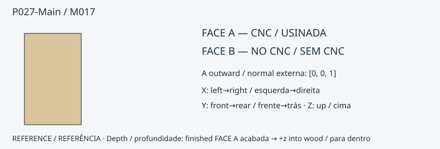

**ONE_SIDE_CNC_PLUS_MANUAL_FINISH** · 18 mm · FACE A [0.0, 0.0, 1.0]

FORNECIDO PELO CNC: contorno externo; 0 CUT; 0 POCKET; redução da face 0.0 mm.
PENDÊNCIA de ajuste/cupom: True

- ACABAMENTO DO MONTADOR: furar / escarear com broca selecionada, limitador e guia validada · P027-Main-R1 · FACE A datum [0, 17.999999999999986] mm. Não amplie pilotos menores que Ø4 para localizadores Ø4. É necessária validação física das ferramentas/ferragens.
- ACABAMENTO DO MONTADOR: furar / escarear com broca selecionada, limitador e guia validada · P027-Main-R2 · FACE A datum [1.312382593579958e-14, 18.0] mm. Não amplie pilotos menores que Ø4 para localizadores Ø4. É necessária validação física das ferramentas/ferragens.
- ACABAMENTO DO MONTADOR: furar / escarear com broca selecionada, limitador e guia validada · P027-Main-R3 · FACE A datum [0, 17.999999999999986] mm. Não amplie pilotos menores que Ø4 para localizadores Ø4. É necessária validação física das ferramentas/ferragens.
- ACABAMENTO DO MONTADOR: furar / escarear com broca selecionada, limitador e guia validada · P027-Main-R4 · FACE A datum [1.312382593579958e-14, 18.0] mm. Não amplie pilotos menores que Ø4 para localizadores Ø4. É necessária validação física das ferramentas/ferragens.

[Eixos, profundidades e operações exatas](../exports/generated/flatpack-v331/manual-finish-schedule.json) · [Inspecionar peça](../exports/generated/viewer-v32/index.html?part=P027-Main&lang=pt-BR)

### P028-Main / M018

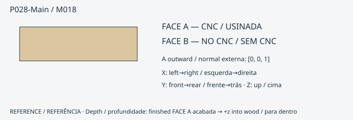

**ONE_SIDE_CNC_PLUS_MANUAL_FINISH** · 18 mm · FACE A [0.0, 0.0, 1.0]

FORNECIDO PELO CNC: contorno externo; 3 CUT; 0 POCKET; redução da face 0.0 mm.
PENDÊNCIA de ajuste/cupom: True

- P028-Main-R1: CUT · FACE A · [0, 18.0] mm
- P028-Main-R2: CUT · FACE A · [0, 18.0] mm
- P028-Main-R3: CUT · FACE A · [1.1295204964212762e-13, 18.0] mm
- ACABAMENTO DO MONTADOR: limar/formonar canto até a referência · P028-Main-R1 · FACE A datum 18.0 mm. Não amplie pilotos menores que Ø4 para localizadores Ø4. É necessária validação física das ferramentas/ferragens.
- ACABAMENTO DO MONTADOR: furar / escarear com broca selecionada, limitador e guia validada · P028-Main-R4 · FACE A datum [6.0, 18.0] mm. Não amplie pilotos menores que Ø4 para localizadores Ø4. É necessária validação física das ferramentas/ferragens.
- ACABAMENTO DO MONTADOR: furar / escarear com broca selecionada, limitador e guia validada · P028-Main-R5 · FACE A datum [6.0, 18.0] mm. Não amplie pilotos menores que Ø4 para localizadores Ø4. É necessária validação física das ferramentas/ferragens.
- ACABAMENTO DO MONTADOR: furar / escarear com broca selecionada, limitador e guia validada · P028-Main-R6 · FACE A datum [6.000000000000114, 18.0] mm. Não amplie pilotos menores que Ø4 para localizadores Ø4. É necessária validação física das ferramentas/ferragens.
- ACABAMENTO DO MONTADOR: furar / escarear com broca selecionada, limitador e guia validada · P028-Main-R7 · FACE A datum [6.000000000000114, 18.0] mm. Não amplie pilotos menores que Ø4 para localizadores Ø4. É necessária validação física das ferramentas/ferragens.

[Eixos, profundidades e operações exatas](../exports/generated/flatpack-v331/manual-finish-schedule.json) · [Inspecionar peça](../exports/generated/viewer-v32/index.html?part=P028-Main&lang=pt-BR)

### P029-L1 / M019

**ONE_SIDE_CNC_READY** · 18 mm · FACE A [0.0, 0.0, 1.0]

FORNECIDO PELO CNC: contorno externo; 0 CUT; 0 POCKET; redução da face 0.0 mm.
PENDÊNCIA de ajuste/cupom: True

ACABAMENTO DO MONTADOR: nenhum na auditoria nominal de operações.

[Eixos, profundidades e operações exatas](../exports/generated/flatpack-v331/manual-finish-schedule.json) · [Inspecionar peça](../exports/generated/viewer-v32/index.html?part=P029-L1&lang=pt-BR)

### P029-L2 / M019

**ONE_SIDE_CNC_READY** · 18 mm · FACE A [0.0, 0.0, 1.0]

FORNECIDO PELO CNC: contorno externo; 0 CUT; 0 POCKET; redução da face 0.0 mm.
PENDÊNCIA de ajuste/cupom: True

ACABAMENTO DO MONTADOR: nenhum na auditoria nominal de operações.

[Eixos, profundidades e operações exatas](../exports/generated/flatpack-v331/manual-finish-schedule.json) · [Inspecionar peça](../exports/generated/viewer-v32/index.html?part=P029-L2&lang=pt-BR)

### P029-L3 / M020

**ONE_SIDE_CNC_PLUS_MANUAL_FINISH** · 18 mm · FACE A [0.0, 0.0, 1.0]

FORNECIDO PELO CNC: contorno externo; 0 CUT; 0 POCKET; redução da face 0.0 mm.
PENDÊNCIA de ajuste/cupom: True

- ACABAMENTO DO MONTADOR: furar / escarear com broca selecionada, limitador e guia validada · P029-L3-R1 · FACE A datum [6.5, 17.500000000000007] mm. Não amplie pilotos menores que Ø4 para localizadores Ø4. É necessária validação física das ferramentas/ferragens.

[Eixos, profundidades e operações exatas](../exports/generated/flatpack-v331/manual-finish-schedule.json) · [Inspecionar peça](../exports/generated/viewer-v32/index.html?part=P029-L3&lang=pt-BR)

### P029-L4 / M019

**ONE_SIDE_CNC_READY** · 18 mm · FACE A [0.0, 0.0, 1.0]

FORNECIDO PELO CNC: contorno externo; 0 CUT; 0 POCKET; redução da face 0.0 mm.
PENDÊNCIA de ajuste/cupom: True

ACABAMENTO DO MONTADOR: nenhum na auditoria nominal de operações.

[Eixos, profundidades e operações exatas](../exports/generated/flatpack-v331/manual-finish-schedule.json) · [Inspecionar peça](../exports/generated/viewer-v32/index.html?part=P029-L4&lang=pt-BR)

### P029-L5 / M019

**ONE_SIDE_CNC_READY** · 18 mm · FACE A [0.0, 0.0, 1.0]

FORNECIDO PELO CNC: contorno externo; 0 CUT; 0 POCKET; redução da face 0.0 mm.
PENDÊNCIA de ajuste/cupom: True

ACABAMENTO DO MONTADOR: nenhum na auditoria nominal de operações.

[Eixos, profundidades e operações exatas](../exports/generated/flatpack-v331/manual-finish-schedule.json) · [Inspecionar peça](../exports/generated/viewer-v32/index.html?part=P029-L5&lang=pt-BR)

### P029-L6 / M021

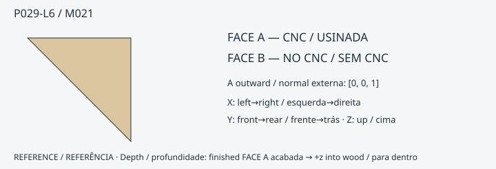

**ONE_SIDE_CNC_PLUS_MANUAL_FINISH** · 18 mm · FACE A [0.0, 0.0, 1.0]

FORNECIDO PELO CNC: contorno externo; 0 CUT; 0 POCKET; redução da face 0.0 mm.
PENDÊNCIA de ajuste/cupom: True

- ACABAMENTO DO MONTADOR: furar / escarear com broca selecionada, limitador e guia validada · P029-L6-R1 · FACE A datum [2.5, 13.500000000000007] mm. Não amplie pilotos menores que Ø4 para localizadores Ø4. É necessária validação física das ferramentas/ferragens.

[Eixos, profundidades e operações exatas](../exports/generated/flatpack-v331/manual-finish-schedule.json) · [Inspecionar peça](../exports/generated/viewer-v32/index.html?part=P029-L6&lang=pt-BR)

### P029-L7 / M019

**ONE_SIDE_CNC_READY** · 18 mm · FACE A [0.0, 0.0, 1.0]

FORNECIDO PELO CNC: contorno externo; 0 CUT; 0 POCKET; redução da face -2.842170943040401e-14 mm.
PENDÊNCIA de ajuste/cupom: True

ACABAMENTO DO MONTADOR: nenhum na auditoria nominal de operações.

[Eixos, profundidades e operações exatas](../exports/generated/flatpack-v331/manual-finish-schedule.json) · [Inspecionar peça](../exports/generated/viewer-v32/index.html?part=P029-L7&lang=pt-BR)

### P030-L1 / M019

**ONE_SIDE_CNC_READY** · 18 mm · FACE A [0.0, 0.0, 1.0]

FORNECIDO PELO CNC: contorno externo; 0 CUT; 0 POCKET; redução da face 7.105427357601002e-15 mm.
PENDÊNCIA de ajuste/cupom: True

ACABAMENTO DO MONTADOR: nenhum na auditoria nominal de operações.

[Eixos, profundidades e operações exatas](../exports/generated/flatpack-v331/manual-finish-schedule.json) · [Inspecionar peça](../exports/generated/viewer-v32/index.html?part=P030-L1&lang=pt-BR)

### P030-L2 / M019

**ONE_SIDE_CNC_READY** · 18 mm · FACE A [0.0, 0.0, 1.0]

FORNECIDO PELO CNC: contorno externo; 0 CUT; 0 POCKET; redução da face 0.0 mm.
PENDÊNCIA de ajuste/cupom: True

ACABAMENTO DO MONTADOR: nenhum na auditoria nominal de operações.

[Eixos, profundidades e operações exatas](../exports/generated/flatpack-v331/manual-finish-schedule.json) · [Inspecionar peça](../exports/generated/viewer-v32/index.html?part=P030-L2&lang=pt-BR)

### P030-L3 / M020

**ONE_SIDE_CNC_PLUS_MANUAL_FINISH** · 18 mm · FACE A [0.0, 0.0, 1.0]

FORNECIDO PELO CNC: contorno externo; 0 CUT; 0 POCKET; redução da face 0.0 mm.
PENDÊNCIA de ajuste/cupom: True

- ACABAMENTO DO MONTADOR: furar / escarear com broca selecionada, limitador e guia validada · P030-L3-R1 · FACE A datum [6.499999999994714, 17.500000000005286] mm. Não amplie pilotos menores que Ø4 para localizadores Ø4. É necessária validação física das ferramentas/ferragens.

[Eixos, profundidades e operações exatas](../exports/generated/flatpack-v331/manual-finish-schedule.json) · [Inspecionar peça](../exports/generated/viewer-v32/index.html?part=P030-L3&lang=pt-BR)

### P030-L4 / M019

**ONE_SIDE_CNC_READY** · 18 mm · FACE A [0.0, 0.0, 1.0]

FORNECIDO PELO CNC: contorno externo; 0 CUT; 0 POCKET; redução da face 0.0 mm.
PENDÊNCIA de ajuste/cupom: True

ACABAMENTO DO MONTADOR: nenhum na auditoria nominal de operações.

[Eixos, profundidades e operações exatas](../exports/generated/flatpack-v331/manual-finish-schedule.json) · [Inspecionar peça](../exports/generated/viewer-v32/index.html?part=P030-L4&lang=pt-BR)

### P030-L5 / M019

**ONE_SIDE_CNC_READY** · 18 mm · FACE A [0.0, 0.0, 1.0]

FORNECIDO PELO CNC: contorno externo; 0 CUT; 0 POCKET; redução da face -1.4210854715202004e-14 mm.
PENDÊNCIA de ajuste/cupom: True

ACABAMENTO DO MONTADOR: nenhum na auditoria nominal de operações.

[Eixos, profundidades e operações exatas](../exports/generated/flatpack-v331/manual-finish-schedule.json) · [Inspecionar peça](../exports/generated/viewer-v32/index.html?part=P030-L5&lang=pt-BR)

### P030-L6 / M021

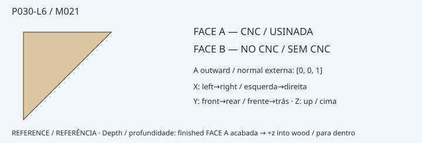

**ONE_SIDE_CNC_PLUS_MANUAL_FINISH** · 18 mm · FACE A [0.0, 0.0, 1.0]

FORNECIDO PELO CNC: contorno externo; 0 CUT; 0 POCKET; redução da face 0.0 mm.
PENDÊNCIA de ajuste/cupom: True

- ACABAMENTO DO MONTADOR: furar / escarear com broca selecionada, limitador e guia validada · P030-L6-R1 · FACE A datum [2.499999999994742, 13.500000000005315] mm. Não amplie pilotos menores que Ø4 para localizadores Ø4. É necessária validação física das ferramentas/ferragens.

[Eixos, profundidades e operações exatas](../exports/generated/flatpack-v331/manual-finish-schedule.json) · [Inspecionar peça](../exports/generated/viewer-v32/index.html?part=P030-L6&lang=pt-BR)

### P030-L7 / M019

**ONE_SIDE_CNC_READY** · 18 mm · FACE A [0.0, 0.0, 1.0]

FORNECIDO PELO CNC: contorno externo; 0 CUT; 0 POCKET; redução da face 0.0 mm.
PENDÊNCIA de ajuste/cupom: True

ACABAMENTO DO MONTADOR: nenhum na auditoria nominal de operações.

[Eixos, profundidades e operações exatas](../exports/generated/flatpack-v331/manual-finish-schedule.json) · [Inspecionar peça](../exports/generated/viewer-v32/index.html?part=P030-L7&lang=pt-BR)

### P031-L1 / M019

**ONE_SIDE_CNC_READY** · 18 mm · FACE A [0.0, 0.0, 1.0]

FORNECIDO PELO CNC: contorno externo; 0 CUT; 0 POCKET; redução da face 7.105427357601002e-15 mm.
PENDÊNCIA de ajuste/cupom: True

ACABAMENTO DO MONTADOR: nenhum na auditoria nominal de operações.

[Eixos, profundidades e operações exatas](../exports/generated/flatpack-v331/manual-finish-schedule.json) · [Inspecionar peça](../exports/generated/viewer-v32/index.html?part=P031-L1&lang=pt-BR)

### P031-L2 / M021

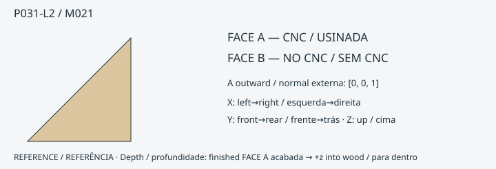

**ONE_SIDE_CNC_PLUS_MANUAL_FINISH** · 18 mm · FACE A [0.0, 0.0, 1.0]

FORNECIDO PELO CNC: contorno externo; 0 CUT; 0 POCKET; redução da face -7.105427357601002e-15 mm.
PENDÊNCIA de ajuste/cupom: True

- ACABAMENTO DO MONTADOR: furar / escarear com broca selecionada, limitador e guia validada · P031-L2-R1 · FACE A datum [2.5, 13.500000000000007] mm. Não amplie pilotos menores que Ø4 para localizadores Ø4. É necessária validação física das ferramentas/ferragens.

[Eixos, profundidades e operações exatas](../exports/generated/flatpack-v331/manual-finish-schedule.json) · [Inspecionar peça](../exports/generated/viewer-v32/index.html?part=P031-L2&lang=pt-BR)

### P031-L3 / M019

**ONE_SIDE_CNC_READY** · 18 mm · FACE A [0.0, 0.0, 1.0]

FORNECIDO PELO CNC: contorno externo; 0 CUT; 0 POCKET; redução da face 0.0 mm.
PENDÊNCIA de ajuste/cupom: True

ACABAMENTO DO MONTADOR: nenhum na auditoria nominal de operações.

[Eixos, profundidades e operações exatas](../exports/generated/flatpack-v331/manual-finish-schedule.json) · [Inspecionar peça](../exports/generated/viewer-v32/index.html?part=P031-L3&lang=pt-BR)

### P031-L4 / M019

**ONE_SIDE_CNC_READY** · 18 mm · FACE A [0.0, 0.0, 1.0]

FORNECIDO PELO CNC: contorno externo; 0 CUT; 0 POCKET; redução da face 0.0 mm.
PENDÊNCIA de ajuste/cupom: True

ACABAMENTO DO MONTADOR: nenhum na auditoria nominal de operações.

[Eixos, profundidades e operações exatas](../exports/generated/flatpack-v331/manual-finish-schedule.json) · [Inspecionar peça](../exports/generated/viewer-v32/index.html?part=P031-L4&lang=pt-BR)

### P031-L5 / M022

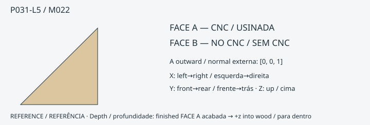

**ONE_SIDE_CNC_PLUS_MANUAL_FINISH** · 18 mm · FACE A [0.0, 0.0, 1.0]

FORNECIDO PELO CNC: contorno externo; 0 CUT; 0 POCKET; redução da face 0.0 mm.
PENDÊNCIA de ajuste/cupom: True

- ACABAMENTO DO MONTADOR: furar / escarear com broca selecionada, limitador e guia validada · P031-L5-R1 · FACE A datum [0, 9.500000000000007] mm. Não amplie pilotos menores que Ø4 para localizadores Ø4. É necessária validação física das ferramentas/ferragens.

[Eixos, profundidades e operações exatas](../exports/generated/flatpack-v331/manual-finish-schedule.json) · [Inspecionar peça](../exports/generated/viewer-v32/index.html?part=P031-L5&lang=pt-BR)

### P031-L6 / M023

**ONE_SIDE_CNC_PLUS_MANUAL_FINISH** · 18 mm · FACE A [0.0, 0.0, 1.0]

FORNECIDO PELO CNC: contorno externo; 0 CUT; 0 POCKET; redução da face -1.4210854715202004e-14 mm.
PENDÊNCIA de ajuste/cupom: True

- ACABAMENTO DO MONTADOR: furar / escarear com broca selecionada, limitador e guia validada · P031-L6-R1 · FACE A datum [16.5, 18.000000000000014] mm. Não amplie pilotos menores que Ø4 para localizadores Ø4. É necessária validação física das ferramentas/ferragens.

[Eixos, profundidades e operações exatas](../exports/generated/flatpack-v331/manual-finish-schedule.json) · [Inspecionar peça](../exports/generated/viewer-v32/index.html?part=P031-L6&lang=pt-BR)

### P031-L7 / M019

**ONE_SIDE_CNC_READY** · 18 mm · FACE A [0.0, 0.0, 1.0]

FORNECIDO PELO CNC: contorno externo; 0 CUT; 0 POCKET; redução da face 0.0 mm.
PENDÊNCIA de ajuste/cupom: True

ACABAMENTO DO MONTADOR: nenhum na auditoria nominal de operações.

[Eixos, profundidades e operações exatas](../exports/generated/flatpack-v331/manual-finish-schedule.json) · [Inspecionar peça](../exports/generated/viewer-v32/index.html?part=P031-L7&lang=pt-BR)

### P032-L1 / M019

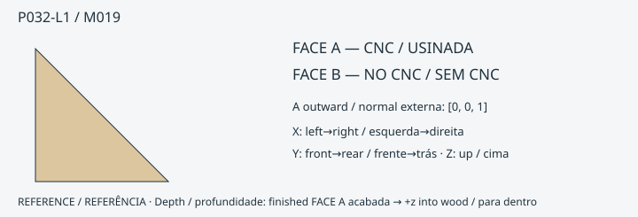

**ONE_SIDE_CNC_READY** · 18 mm · FACE A [0.0, 0.0, 1.0]

FORNECIDO PELO CNC: contorno externo; 0 CUT; 0 POCKET; redução da face 7.105427357601002e-15 mm.
PENDÊNCIA de ajuste/cupom: True

ACABAMENTO DO MONTADOR: nenhum na auditoria nominal de operações.

[Eixos, profundidades e operações exatas](../exports/generated/flatpack-v331/manual-finish-schedule.json) · [Inspecionar peça](../exports/generated/viewer-v32/index.html?part=P032-L1&lang=pt-BR)

### P032-L2 / M021

**ONE_SIDE_CNC_PLUS_MANUAL_FINISH** · 18 mm · FACE A [0.0, 0.0, 1.0]

FORNECIDO PELO CNC: contorno externo; 0 CUT; 0 POCKET; redução da face 0.0 mm.
PENDÊNCIA de ajuste/cupom: True

- ACABAMENTO DO MONTADOR: furar / escarear com broca selecionada, limitador e guia validada · P032-L2-R1 · FACE A datum [2.499999999999994, 13.5] mm. Não amplie pilotos menores que Ø4 para localizadores Ø4. É necessária validação física das ferramentas/ferragens.

[Eixos, profundidades e operações exatas](../exports/generated/flatpack-v331/manual-finish-schedule.json) · [Inspecionar peça](../exports/generated/viewer-v32/index.html?part=P032-L2&lang=pt-BR)

### P032-L3 / M019

**ONE_SIDE_CNC_READY** · 18 mm · FACE A [0.0, 0.0, 1.0]

FORNECIDO PELO CNC: contorno externo; 0 CUT; 0 POCKET; redução da face 0.0 mm.
PENDÊNCIA de ajuste/cupom: True

ACABAMENTO DO MONTADOR: nenhum na auditoria nominal de operações.

[Eixos, profundidades e operações exatas](../exports/generated/flatpack-v331/manual-finish-schedule.json) · [Inspecionar peça](../exports/generated/viewer-v32/index.html?part=P032-L3&lang=pt-BR)

### P032-L4 / M019

**ONE_SIDE_CNC_READY** · 18 mm · FACE A [0.0, 0.0, 1.0]

FORNECIDO PELO CNC: contorno externo; 0 CUT; 0 POCKET; redução da face 0.0 mm.
PENDÊNCIA de ajuste/cupom: True

ACABAMENTO DO MONTADOR: nenhum na auditoria nominal de operações.

[Eixos, profundidades e operações exatas](../exports/generated/flatpack-v331/manual-finish-schedule.json) · [Inspecionar peça](../exports/generated/viewer-v32/index.html?part=P032-L4&lang=pt-BR)

### P032-L5 / M022

**ONE_SIDE_CNC_PLUS_MANUAL_FINISH** · 18 mm · FACE A [0.0, 0.0, 1.0]

FORNECIDO PELO CNC: contorno externo; 0 CUT; 0 POCKET; redução da face 0.0 mm.
PENDÊNCIA de ajuste/cupom: True

- ACABAMENTO DO MONTADOR: furar / escarear com broca selecionada, limitador e guia validada · P032-L5-R1 · FACE A datum [0, 9.5] mm. Não amplie pilotos menores que Ø4 para localizadores Ø4. É necessária validação física das ferramentas/ferragens.

[Eixos, profundidades e operações exatas](../exports/generated/flatpack-v331/manual-finish-schedule.json) · [Inspecionar peça](../exports/generated/viewer-v32/index.html?part=P032-L5&lang=pt-BR)

### P032-L6 / M023

**ONE_SIDE_CNC_PLUS_MANUAL_FINISH** · 18 mm · FACE A [0.0, 0.0, 1.0]

FORNECIDO PELO CNC: contorno externo; 0 CUT; 0 POCKET; redução da face -2.842170943040401e-14 mm.
PENDÊNCIA de ajuste/cupom: True

- ACABAMENTO DO MONTADOR: furar / escarear com broca selecionada, limitador e guia validada · P032-L6-R1 · FACE A datum [16.500000000000007, 18.00000000000003] mm. Não amplie pilotos menores que Ø4 para localizadores Ø4. É necessária validação física das ferramentas/ferragens.

[Eixos, profundidades e operações exatas](../exports/generated/flatpack-v331/manual-finish-schedule.json) · [Inspecionar peça](../exports/generated/viewer-v32/index.html?part=P032-L6&lang=pt-BR)

### P032-L7 / M019

**ONE_SIDE_CNC_READY** · 18 mm · FACE A [0.0, 0.0, 1.0]

FORNECIDO PELO CNC: contorno externo; 0 CUT; 0 POCKET; redução da face 0.0 mm.
PENDÊNCIA de ajuste/cupom: True

ACABAMENTO DO MONTADOR: nenhum na auditoria nominal de operações.

[Eixos, profundidades e operações exatas](../exports/generated/flatpack-v331/manual-finish-schedule.json) · [Inspecionar peça](../exports/generated/viewer-v32/index.html?part=P032-L7&lang=pt-BR)

### P033-Main / M024

**ONE_SIDE_CNC_READY** · 12 mm · FACE A [0.0, 0.0, 1.0]

FORNECIDO PELO CNC: contorno externo; 4 CUT; 0 POCKET; redução da face 0.0 mm.
PENDÊNCIA de ajuste/cupom: True

- P033-Main-R1: CUT · FACE A · [0, 11.999999999999993] mm
- P033-Main-R2: CUT · FACE A · [1.0321363166635981e-14, 12.0] mm
- P033-Main-R3: CUT · FACE A · [0, 11.999999999999993] mm
- P033-Main-R4: CUT · FACE A · [1.0321363166635981e-14, 12.0] mm
ACABAMENTO DO MONTADOR: nenhum na auditoria nominal de operações.

[Eixos, profundidades e operações exatas](../exports/generated/flatpack-v331/manual-finish-schedule.json) · [Inspecionar peça](../exports/generated/viewer-v32/index.html?part=P033-Main&lang=pt-BR)

### P034-Main / M025

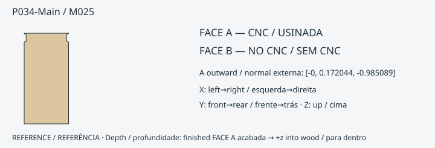

**ONE_SIDE_CNC_READY** · 18 mm · FACE A [-0.0, 0.172043766268355, -0.9850893068591292]

FORNECIDO PELO CNC: contorno externo; 0 CUT; 0 POCKET; redução da face 0.0 mm.
PENDÊNCIA de ajuste/cupom: True

ACABAMENTO DO MONTADOR: nenhum na auditoria nominal de operações.

[Eixos, profundidades e operações exatas](../exports/generated/flatpack-v331/manual-finish-schedule.json) · [Inspecionar peça](../exports/generated/viewer-v32/index.html?part=P034-Main&lang=pt-BR)

### P035-Main / M026

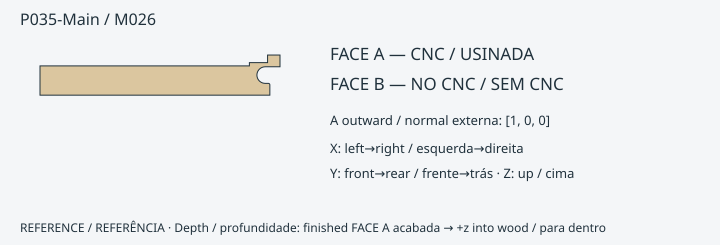

**ONE_SIDE_CNC_PLUS_MANUAL_FINISH** · 18 mm · FACE A [1.0, 0.0, 0.0]

FORNECIDO PELO CNC: contorno externo; 0 CUT; 0 POCKET; redução da face 0.0 mm.
PENDÊNCIA de ajuste/cupom: True

- ACABAMENTO DO MONTADOR: limar/formonar a raiz reentrante até a referência exata ·  · FACE A datum 18.0 mm. Não amplie pilotos menores que Ø4 para localizadores Ø4. É necessária validação física das ferramentas/ferragens.
- ACABAMENTO DO MONTADOR: furar / escarear com broca selecionada, limitador e guia validada · P035-Main-R1 · FACE A datum [1.326716514427062e-14, 18.0] mm. Não amplie pilotos menores que Ø4 para localizadores Ø4. É necessária validação física das ferramentas/ferragens.
- ACABAMENTO DO MONTADOR: furar / escarear com broca selecionada, limitador e guia validada · P035-Main-R2 · FACE A datum [0, 17.999999999999993] mm. Não amplie pilotos menores que Ø4 para localizadores Ø4. É necessária validação física das ferramentas/ferragens.
- ACABAMENTO DO MONTADOR: furar / escarear com broca selecionada, limitador e guia validada · P035-Main-R3 · FACE A datum [0, 18.0] mm. Não amplie pilotos menores que Ø4 para localizadores Ø4. É necessária validação física das ferramentas/ferragens.

[Eixos, profundidades e operações exatas](../exports/generated/flatpack-v331/manual-finish-schedule.json) · [Inspecionar peça](../exports/generated/viewer-v32/index.html?part=P035-Main&lang=pt-BR)

### P036-Main / M027

**ONE_SIDE_CNC_PLUS_MANUAL_FINISH** · 18 mm · FACE A [-1.0, 0.0, 0.0]

FORNECIDO PELO CNC: contorno externo; 0 CUT; 0 POCKET; redução da face 0.0 mm.
PENDÊNCIA de ajuste/cupom: True

- ACABAMENTO DO MONTADOR: limar/formonar a raiz reentrante até a referência exata ·  · FACE A datum 18.0 mm. Não amplie pilotos menores que Ø4 para localizadores Ø4. É necessária validação física das ferramentas/ferragens.
- ACABAMENTO DO MONTADOR: furar / escarear com broca selecionada, limitador e guia validada · P036-Main-R1 · FACE A datum [0, 18.0] mm. Não amplie pilotos menores que Ø4 para localizadores Ø4. É necessária validação física das ferramentas/ferragens.
- ACABAMENTO DO MONTADOR: furar / escarear com broca selecionada, limitador e guia validada · P036-Main-R2 · FACE A datum [0, 18.0] mm. Não amplie pilotos menores que Ø4 para localizadores Ø4. É necessária validação física das ferramentas/ferragens.
- ACABAMENTO DO MONTADOR: furar / escarear com broca selecionada, limitador e guia validada · P036-Main-R3 · FACE A datum [0, 18.0] mm. Não amplie pilotos menores que Ø4 para localizadores Ø4. É necessária validação física das ferramentas/ferragens.

[Eixos, profundidades e operações exatas](../exports/generated/flatpack-v331/manual-finish-schedule.json) · [Inspecionar peça](../exports/generated/viewer-v32/index.html?part=P036-Main&lang=pt-BR)

### P037-Main / M028

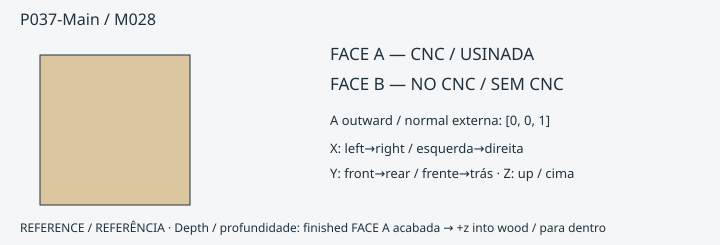

**ONE_SIDE_CNC_READY** · 8 mm · FACE A [0.0, 0.0, 1.0]

FORNECIDO PELO CNC: contorno externo; 9 CUT; 0 POCKET; redução da face 3.552713678800501e-15 mm.
PENDÊNCIA de ajuste/cupom: True

- P037-Main-R1: CUT · FACE A · [0, 7.999999999999989] mm
- P037-Main-R2: CUT · FACE A · [0, 7.999999999999992] mm
- P037-Main-R3: CUT · FACE A · [5.053524988392597e-15, 7.9999999999999964] mm
- P037-Main-R4: CUT · FACE A · [2.8179255993120893e-15, 7.9999999999999964] mm
- P037-Main-R5: CUT · FACE A · [0, 7.999999999999992] mm
- P037-Main-R6: CUT · FACE A · [0, 7.999999999999989] mm
- P037-Main-R7: CUT · FACE A · [0, 7.9999999999999964] mm
- P037-Main-R8: CUT · FACE A · [2.8179255993120893e-15, 7.9999999999999964] mm
- P037-Main-R9: CUT · FACE A · [5.053524988392597e-15, 7.9999999999999964] mm
ACABAMENTO DO MONTADOR: nenhum na auditoria nominal de operações.

[Eixos, profundidades e operações exatas](../exports/generated/flatpack-v331/manual-finish-schedule.json) · [Inspecionar peça](../exports/generated/viewer-v32/index.html?part=P037-Main&lang=pt-BR)

### P038-Main / M028

**ONE_SIDE_CNC_READY** · 8 mm · FACE A [0.0, 0.0, 1.0]

FORNECIDO PELO CNC: contorno externo; 9 CUT; 0 POCKET; redução da face -1.7763568394002505e-15 mm.
PENDÊNCIA de ajuste/cupom: True

- P038-Main-R1: CUT · FACE A · [0, 7.999999999999993] mm
- P038-Main-R2: CUT · FACE A · [0, 7.999999999999996] mm
- P038-Main-R3: CUT · FACE A · [1.0382595506593349e-14, 8.000000000000002] mm
- P038-Main-R4: CUT · FACE A · [6.37063927811259e-15, 8.000000000000002] mm
- P038-Main-R5: CUT · FACE A · [0, 7.999999999999996] mm
- P038-Main-R6: CUT · FACE A · [0, 7.999999999999993] mm
- P038-Main-R7: CUT · FACE A · [0, 8.000000000000002] mm
- P038-Main-R8: CUT · FACE A · [6.37063927811259e-15, 8.000000000000002] mm
- P038-Main-R9: CUT · FACE A · [1.0382595506593349e-14, 8.000000000000002] mm
ACABAMENTO DO MONTADOR: nenhum na auditoria nominal de operações.

[Eixos, profundidades e operações exatas](../exports/generated/flatpack-v331/manual-finish-schedule.json) · [Inspecionar peça](../exports/generated/viewer-v32/index.html?part=P038-Main&lang=pt-BR)

### P039-Main / M029

**ONE_SIDE_CNC_PLUS_MANUAL_FINISH** · 18 mm · FACE A [-1.0, -0.0, -0.0]

FORNECIDO PELO CNC: contorno externo; 0 CUT; 0 POCKET; redução da face 1.4210854715202004e-14 mm.
PENDÊNCIA de ajuste/cupom: True

- ACABAMENTO DO MONTADOR: limar/formonar a raiz reentrante até a referência exata ·  · FACE A datum 17.999999999999986 mm. Não amplie pilotos menores que Ø4 para localizadores Ø4. É necessária validação física das ferramentas/ferragens.
- ACABAMENTO DO MONTADOR: furar / escarear com broca selecionada, limitador e guia validada · P039-Main-R1 · FACE A datum [4.999999999999979, 12.999999999999979] mm. Não amplie pilotos menores que Ø4 para localizadores Ø4. É necessária validação física das ferramentas/ferragens.
- ACABAMENTO DO MONTADOR: furar / escarear com broca selecionada, limitador e guia validada · P039-Main-R2 · FACE A datum [4.999999999999979, 12.999999999999979] mm. Não amplie pilotos menores que Ø4 para localizadores Ø4. É necessária validação física das ferramentas/ferragens.
- ACABAMENTO DO MONTADOR: furar / escarear com broca selecionada, limitador e guia validada · P039-Main-R3 · FACE A datum [5.949999999999986, 12.049999999999986] mm. Não amplie pilotos menores que Ø4 para localizadores Ø4. É necessária validação física das ferramentas/ferragens.

[Eixos, profundidades e operações exatas](../exports/generated/flatpack-v331/manual-finish-schedule.json) · [Inspecionar peça](../exports/generated/viewer-v32/index.html?part=P039-Main&lang=pt-BR)

### P040-Main / M029

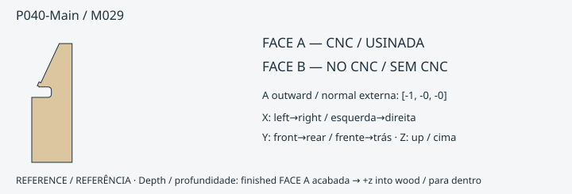

**ONE_SIDE_CNC_PLUS_MANUAL_FINISH** · 18 mm · FACE A [-1.0, -0.0, -0.0]

FORNECIDO PELO CNC: contorno externo; 0 CUT; 0 POCKET; redução da face 1.1368683772161603e-13 mm.
PENDÊNCIA de ajuste/cupom: True

- ACABAMENTO DO MONTADOR: limar/formonar a raiz reentrante até a referência exata ·  · FACE A datum 17.999999999999886 mm. Não amplie pilotos menores que Ø4 para localizadores Ø4. É necessária validação física das ferramentas/ferragens.
- ACABAMENTO DO MONTADOR: furar / escarear com broca selecionada, limitador e guia validada · P040-Main-R1 · FACE A datum [4.999999999999886, 12.999999999999886] mm. Não amplie pilotos menores que Ø4 para localizadores Ø4. É necessária validação física das ferramentas/ferragens.
- ACABAMENTO DO MONTADOR: furar / escarear com broca selecionada, limitador e guia validada · P040-Main-R2 · FACE A datum [4.999999999999886, 12.999999999999886] mm. Não amplie pilotos menores que Ø4 para localizadores Ø4. É necessária validação física das ferramentas/ferragens.
- ACABAMENTO DO MONTADOR: furar / escarear com broca selecionada, limitador e guia validada · P040-Main-R3 · FACE A datum [5.9499999999998865, 12.049999999999887] mm. Não amplie pilotos menores que Ø4 para localizadores Ø4. É necessária validação física das ferramentas/ferragens.

[Eixos, profundidades e operações exatas](../exports/generated/flatpack-v331/manual-finish-schedule.json) · [Inspecionar peça](../exports/generated/viewer-v32/index.html?part=P040-Main&lang=pt-BR)

### P041-Main / M030

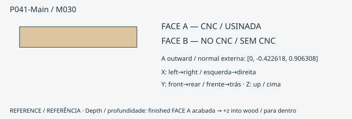

**ONE_SIDE_CNC_PLUS_MANUAL_FINISH** · 12 mm · FACE A [0.0, -0.42261826174069905, 0.9063077870366502]

FORNECIDO PELO CNC: contorno externo; 2 CUT; 0 POCKET; redução da face 0.0 mm.
PENDÊNCIA de ajuste/cupom: True

- P041-Main-R3: CUT · FACE A · [4.3576253716537394e-15, 11.99999999999996] mm
- P041-Main-R4: CUT · FACE A · [4.3576253716537394e-15, 11.99999999999996] mm
- ACABAMENTO DO MONTADOR: furar / escarear com broca selecionada, limitador e guia validada · P041-Main-R1 · FACE A datum [9.499999999999943, 12.0] mm. Não amplie pilotos menores que Ø4 para localizadores Ø4. É necessária validação física das ferramentas/ferragens.
- ACABAMENTO DO MONTADOR: furar / escarear com broca selecionada, limitador e guia validada · P041-Main-R2 · FACE A datum [9.499999999999943, 12.0] mm. Não amplie pilotos menores que Ø4 para localizadores Ø4. É necessária validação física das ferramentas/ferragens.

[Eixos, profundidades e operações exatas](../exports/generated/flatpack-v331/manual-finish-schedule.json) · [Inspecionar peça](../exports/generated/viewer-v32/index.html?part=P041-Main&lang=pt-BR)

### P042-Main / M031

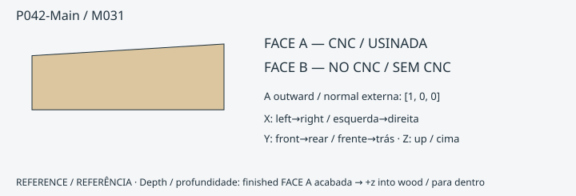

**ONE_SIDE_CNC_PLUS_MANUAL_FINISH** · 18 mm · FACE A [1.0, 0.0, 0.0]

FORNECIDO PELO CNC: contorno externo; 0 CUT; 2 POCKET; redução da face 0.0 mm.
PENDÊNCIA de ajuste/cupom: True

- P042-Main-R1: POCKET · FACE A · [1.4210854715202004e-14, 6.000000000000066] mm
- P042-Main-R2: POCKET · FACE A · [0, 5.999999999999988] mm
- ACABAMENTO DO MONTADOR: limar/formonar canto até a referência · P042-Main-R1 · FACE A datum 6.000000000000066 mm. Não amplie pilotos menores que Ø4 para localizadores Ø4. É necessária validação física das ferramentas/ferragens.
- ACABAMENTO DO MONTADOR: limar/formonar canto até a referência · P042-Main-R2 · FACE A datum 5.999999999999988 mm. Não amplie pilotos menores que Ø4 para localizadores Ø4. É necessária validação física das ferramentas/ferragens.

[Eixos, profundidades e operações exatas](../exports/generated/flatpack-v331/manual-finish-schedule.json) · [Inspecionar peça](../exports/generated/viewer-v32/index.html?part=P042-Main&lang=pt-BR)

### P043-Main / M032

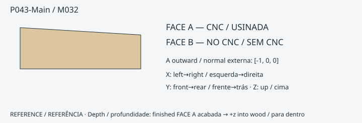

**ONE_SIDE_CNC_PLUS_MANUAL_FINISH** · 18 mm · FACE A [-1.0, 0.0, 0.0]

FORNECIDO PELO CNC: contorno externo; 0 CUT; 2 POCKET; redução da face 0.0 mm.
PENDÊNCIA de ajuste/cupom: True

- P043-Main-R1: POCKET · FACE A · [0, 6.000000000000002] mm
- P043-Main-R2: POCKET · FACE A · [0, 6.000000000000057] mm
- ACABAMENTO DO MONTADOR: limar/formonar canto até a referência · P043-Main-R1 · FACE A datum 6.000000000000002 mm. Não amplie pilotos menores que Ø4 para localizadores Ø4. É necessária validação física das ferramentas/ferragens.
- ACABAMENTO DO MONTADOR: limar/formonar canto até a referência · P043-Main-R2 · FACE A datum 6.000000000000057 mm. Não amplie pilotos menores que Ø4 para localizadores Ø4. É necessária validação física das ferramentas/ferragens.

[Eixos, profundidades e operações exatas](../exports/generated/flatpack-v331/manual-finish-schedule.json) · [Inspecionar peça](../exports/generated/viewer-v32/index.html?part=P043-Main&lang=pt-BR)

### P044-Main / M033

**ONE_SIDE_CNC_PLUS_MANUAL_FINISH** · 18 mm · FACE A [0.0, 0.0, 1.0]

FORNECIDO PELO CNC: contorno externo; 3 CUT; 2 POCKET; redução da face 0.0 mm.
PENDÊNCIA de ajuste/cupom: True

- P044-Main-R3: POCKET · FACE A · [0, 3.0000000000000004] mm
- P044-Main-R5: POCKET · FACE A · [0, 3.0000000000000004] mm
- P044-Main-R1: CUT · FACE A · [0, 18.0] mm
- P044-Main-R2: CUT · FACE A · [0, 18.0] mm
- P044-Main-R4: CUT · FACE A · [1.1313574666199972e-13, 18.0] mm
- ACABAMENTO DO MONTADOR: limar/formonar canto até a referência · P044-Main-R1 · FACE A datum 18.0 mm. Não amplie pilotos menores que Ø4 para localizadores Ø4. É necessária validação física das ferramentas/ferragens.

[Eixos, profundidades e operações exatas](../exports/generated/flatpack-v331/manual-finish-schedule.json) · [Inspecionar peça](../exports/generated/viewer-v32/index.html?part=P044-Main&lang=pt-BR)

### P045-Main / M034

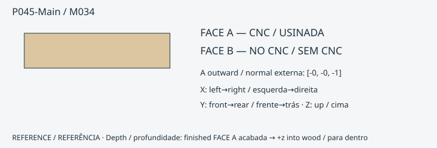

**ONE_SIDE_CNC_READY** · 18 mm · FACE A [-0.0, -0.0, -1.0]

FORNECIDO PELO CNC: contorno externo; 0 CUT; 0 POCKET; redução da face 0.0 mm.
PENDÊNCIA de ajuste/cupom: True

ACABAMENTO DO MONTADOR: nenhum na auditoria nominal de operações.

[Eixos, profundidades e operações exatas](../exports/generated/flatpack-v331/manual-finish-schedule.json) · [Inspecionar peça](../exports/generated/viewer-v32/index.html?part=P045-Main&lang=pt-BR)

### P046-Main / M035

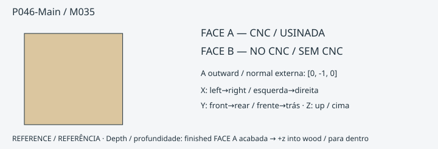

**ONE_SIDE_CNC_PLUS_MANUAL_FINISH** · 18 mm · FACE A [0.0, -1.0, 0.0]

FORNECIDO PELO CNC: contorno externo; 1 CUT; 1 POCKET; redução da face -2.2737367544323206e-13 mm.
PENDÊNCIA de ajuste/cupom: True

- P046-Main-R1: POCKET · FACE A · [0, 12.000000000000227] mm
- P046-Main-R2: CUT · FACE A · [0, 18.000000000000227] mm
- ACABAMENTO DO MONTADOR: limar/formonar canto até a referência · P046-Main-R1 · FACE A datum 12.000000000000227 mm. Não amplie pilotos menores que Ø4 para localizadores Ø4. É necessária validação física das ferramentas/ferragens.
- ACABAMENTO DO MONTADOR: limar/formonar canto até a referência · P046-Main-R2 · FACE A datum 18.000000000000227 mm. Não amplie pilotos menores que Ø4 para localizadores Ø4. É necessária validação física das ferramentas/ferragens.

[Eixos, profundidades e operações exatas](../exports/generated/flatpack-v331/manual-finish-schedule.json) · [Inspecionar peça](../exports/generated/viewer-v32/index.html?part=P046-Main&lang=pt-BR)

### P047-Main / M036

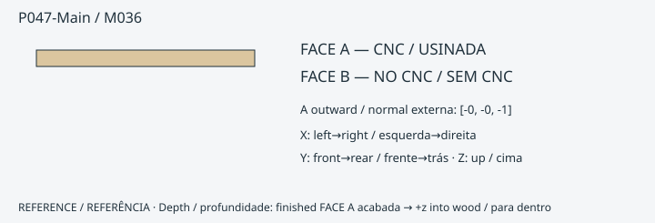

**ONE_SIDE_CNC_READY** · 18 mm · FACE A [-0.0, -0.0, -1.0]

FORNECIDO PELO CNC: contorno externo; 0 CUT; 0 POCKET; redução da face 0.0 mm.
PENDÊNCIA de ajuste/cupom: True

ACABAMENTO DO MONTADOR: nenhum na auditoria nominal de operações.

[Eixos, profundidades e operações exatas](../exports/generated/flatpack-v331/manual-finish-schedule.json) · [Inspecionar peça](../exports/generated/viewer-v32/index.html?part=P047-Main&lang=pt-BR)

### P048-Main / M037

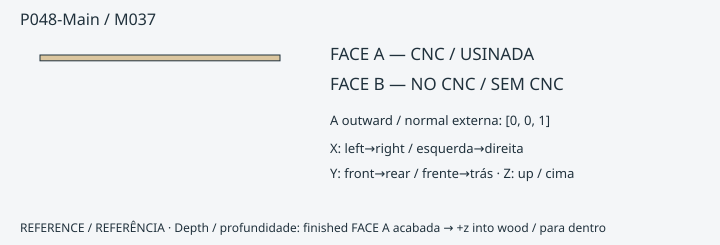

**ONE_SIDE_CNC_PLUS_MANUAL_FINISH** · 18 mm · FACE A [0.0, 0.0, 1.0]

FORNECIDO PELO CNC: contorno externo; 0 CUT; 1 POCKET; redução da face 0.0 mm.
PENDÊNCIA de ajuste/cupom: True

- P048-Main-R1: POCKET · FACE A · [0, 2.0000000000001137] mm
- ACABAMENTO DO MONTADOR: limar/formonar canto até a referência · P048-Main-R1 · FACE A datum 2.0000000000001137 mm. Não amplie pilotos menores que Ø4 para localizadores Ø4. É necessária validação física das ferramentas/ferragens.

[Eixos, profundidades e operações exatas](../exports/generated/flatpack-v331/manual-finish-schedule.json) · [Inspecionar peça](../exports/generated/viewer-v32/index.html?part=P048-Main&lang=pt-BR)

### P049-Cap / M038

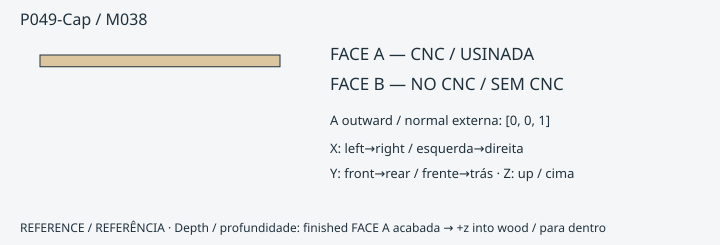

**ONE_SIDE_CNC_READY** · 12 mm · FACE A [0.0, 0.0, 1.0]

FORNECIDO PELO CNC: contorno externo; 2 CUT; 0 POCKET; redução da face 0.0 mm.
PENDÊNCIA de ajuste/cupom: True

- P049-Cap-R1: CUT · FACE A · [0, 12.0] mm
- P049-Cap-R2: CUT · FACE A · [0, 12.0] mm
ACABAMENTO DO MONTADOR: nenhum na auditoria nominal de operações.

[Eixos, profundidades e operações exatas](../exports/generated/flatpack-v331/manual-finish-schedule.json) · [Inspecionar peça](../exports/generated/viewer-v32/index.html?part=P049-Cap&lang=pt-BR)

### P049-Strip / M039

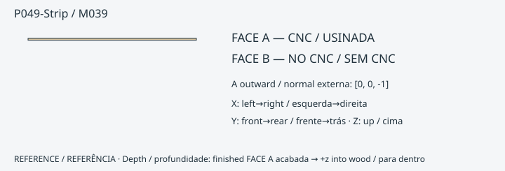

**ONE_SIDE_CNC_READY** · 18 mm · FACE A [0.0, 0.0, -1.0]

FORNECIDO PELO CNC: contorno externo; 0 CUT; 1 POCKET; redução da face 4.2000000000000455 mm.
PENDÊNCIA de ajuste/cupom: True

- P049-Strip-FACE_REDUCTION: POCKET · FACE A · see register mm
ACABAMENTO DO MONTADOR: nenhum na auditoria nominal de operações.

[Eixos, profundidades e operações exatas](../exports/generated/flatpack-v331/manual-finish-schedule.json) · [Inspecionar peça](../exports/generated/viewer-v32/index.html?part=P049-Strip&lang=pt-BR)

### P050-Main / M040

**ONE_SIDE_CNC_PLUS_MANUAL_FINISH** · 18 mm · FACE A [-0.0, -1.0, -0.0]

FORNECIDO PELO CNC: contorno externo; 0 CUT; 0 POCKET; redução da face 0.0 mm.
PENDÊNCIA de ajuste/cupom: True

- ACABAMENTO DO MONTADOR: furar / escarear com broca selecionada, limitador e guia validada · P050-Main-R1 · FACE A datum [5.75, 12.250000000000005] mm. Não amplie pilotos menores que Ø4 para localizadores Ø4. É necessária validação física das ferramentas/ferragens.
- ACABAMENTO DO MONTADOR: furar / escarear com broca selecionada, limitador e guia validada · P050-Main-R2 · FACE A datum [5.75, 12.250000000000005] mm. Não amplie pilotos menores que Ø4 para localizadores Ø4. É necessária validação física das ferramentas/ferragens.

[Eixos, profundidades e operações exatas](../exports/generated/flatpack-v331/manual-finish-schedule.json) · [Inspecionar peça](../exports/generated/viewer-v32/index.html?part=P050-Main&lang=pt-BR)

### P051-Main / M041

**ONE_SIDE_CNC_READY** · 18 mm · FACE A [-1.0, -0.0, 0.0]

FORNECIDO PELO CNC: contorno externo; 0 CUT; 0 POCKET; redução da face 0.0 mm.
PENDÊNCIA de ajuste/cupom: True

ACABAMENTO DO MONTADOR: nenhum na auditoria nominal de operações.

[Eixos, profundidades e operações exatas](../exports/generated/flatpack-v331/manual-finish-schedule.json) · [Inspecionar peça](../exports/generated/viewer-v32/index.html?part=P051-Main&lang=pt-BR)

### P052-Main / M041

**ONE_SIDE_CNC_READY** · 18 mm · FACE A [-1.0, -0.0, 0.0]

FORNECIDO PELO CNC: contorno externo; 0 CUT; 0 POCKET; redução da face 0.0 mm.
PENDÊNCIA de ajuste/cupom: True

ACABAMENTO DO MONTADOR: nenhum na auditoria nominal de operações.

[Eixos, profundidades e operações exatas](../exports/generated/flatpack-v331/manual-finish-schedule.json) · [Inspecionar peça](../exports/generated/viewer-v32/index.html?part=P052-Main&lang=pt-BR)

### P053-Main / M040

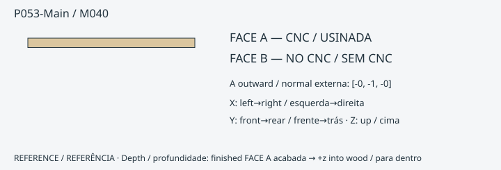

**ONE_SIDE_CNC_PLUS_MANUAL_FINISH** · 18 mm · FACE A [-0.0, -1.0, -0.0]

FORNECIDO PELO CNC: contorno externo; 0 CUT; 0 POCKET; redução da face 0.0 mm.
PENDÊNCIA de ajuste/cupom: True

- ACABAMENTO DO MONTADOR: furar / escarear com broca selecionada, limitador e guia validada · P053-Main-R1 · FACE A datum [5.75, 12.250000000000005] mm. Não amplie pilotos menores que Ø4 para localizadores Ø4. É necessária validação física das ferramentas/ferragens.
- ACABAMENTO DO MONTADOR: furar / escarear com broca selecionada, limitador e guia validada · P053-Main-R2 · FACE A datum [5.75, 12.250000000000005] mm. Não amplie pilotos menores que Ø4 para localizadores Ø4. É necessária validação física das ferramentas/ferragens.

[Eixos, profundidades e operações exatas](../exports/generated/flatpack-v331/manual-finish-schedule.json) · [Inspecionar peça](../exports/generated/viewer-v32/index.html?part=P053-Main&lang=pt-BR)

### P054-Main / M041

**ONE_SIDE_CNC_READY** · 18 mm · FACE A [-1.0, -0.0, 0.0]

FORNECIDO PELO CNC: contorno externo; 0 CUT; 0 POCKET; redução da face 7.105427357601002e-15 mm.
PENDÊNCIA de ajuste/cupom: True

ACABAMENTO DO MONTADOR: nenhum na auditoria nominal de operações.

[Eixos, profundidades e operações exatas](../exports/generated/flatpack-v331/manual-finish-schedule.json) · [Inspecionar peça](../exports/generated/viewer-v32/index.html?part=P054-Main&lang=pt-BR)

### P055-Main / M041

**ONE_SIDE_CNC_READY** · 18 mm · FACE A [-1.0, -0.0, 0.0]

FORNECIDO PELO CNC: contorno externo; 0 CUT; 0 POCKET; redução da face 0.0 mm.
PENDÊNCIA de ajuste/cupom: True

ACABAMENTO DO MONTADOR: nenhum na auditoria nominal de operações.

[Eixos, profundidades e operações exatas](../exports/generated/flatpack-v331/manual-finish-schedule.json) · [Inspecionar peça](../exports/generated/viewer-v32/index.html?part=P055-Main&lang=pt-BR)

### P056-Main / M042

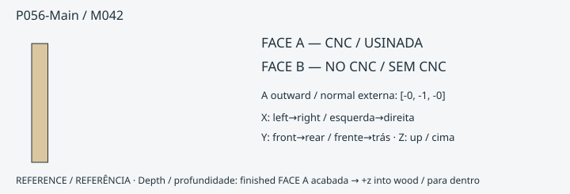

**ONE_SIDE_CNC_READY** · 18 mm · FACE A [-0.0, -1.0, -0.0]

FORNECIDO PELO CNC: contorno externo; 2 CUT; 0 POCKET; redução da face 0.0 mm.
PENDÊNCIA de ajuste/cupom: True

- P056-Main-R1: CUT · FACE A · [0, 18.0] mm
- P056-Main-R2: CUT · FACE A · [1.4377388168895777e-14, 18.0] mm
ACABAMENTO DO MONTADOR: nenhum na auditoria nominal de operações.

[Eixos, profundidades e operações exatas](../exports/generated/flatpack-v331/manual-finish-schedule.json) · [Inspecionar peça](../exports/generated/viewer-v32/index.html?part=P056-Main&lang=pt-BR)

### P057-Main / M043

**ONE_SIDE_CNC_PLUS_MANUAL_FINISH** · 18 mm · FACE A [0.0, 0.0, 1.0]

FORNECIDO PELO CNC: contorno externo; 2 CUT; 1 POCKET; redução da face 1.1368683772161603e-13 mm.
PENDÊNCIA de ajuste/cupom: True

- P057-Main-R1: POCKET · FACE A · [0, 6.0] mm
- P057-Main-R2: CUT · FACE A · [5.999999999999886, 17.999999999999886] mm
- P057-Main-R3: CUT · FACE A · [0, 17.999999999999886] mm
- ACABAMENTO DO MONTADOR: limar/formonar canto até a referência · P057-Main-R1 · FACE A datum 6.0 mm. Não amplie pilotos menores que Ø4 para localizadores Ø4. É necessária validação física das ferramentas/ferragens.

[Eixos, profundidades e operações exatas](../exports/generated/flatpack-v331/manual-finish-schedule.json) · [Inspecionar peça](../exports/generated/viewer-v32/index.html?part=P057-Main&lang=pt-BR)

### P058-Main / M043

**ONE_SIDE_CNC_PLUS_MANUAL_FINISH** · 18 mm · FACE A [0.0, 0.0, -1.0]

FORNECIDO PELO CNC: contorno externo; 2 CUT; 1 POCKET; redução da face 0.0 mm.
PENDÊNCIA de ajuste/cupom: True

- P058-Main-R1: POCKET · FACE A · [0, 6.0] mm
- P058-Main-R2: CUT · FACE A · [6.0, 18.0] mm
- P058-Main-R3: CUT · FACE A · [0, 18.0] mm
- ACABAMENTO DO MONTADOR: limar/formonar canto até a referência · P058-Main-R1 · FACE A datum 6.0 mm. Não amplie pilotos menores que Ø4 para localizadores Ø4. É necessária validação física das ferramentas/ferragens.

[Eixos, profundidades e operações exatas](../exports/generated/flatpack-v331/manual-finish-schedule.json) · [Inspecionar peça](../exports/generated/viewer-v32/index.html?part=P058-Main&lang=pt-BR)

### P059-Main / M042

**ONE_SIDE_CNC_READY** · 18 mm · FACE A [-0.0, -1.0, -0.0]

FORNECIDO PELO CNC: contorno externo; 2 CUT; 0 POCKET; redução da face 0.0 mm.
PENDÊNCIA de ajuste/cupom: True

- P059-Main-R1: CUT · FACE A · [0, 18.0] mm
- P059-Main-R2: CUT · FACE A · [1.4377388168895777e-14, 18.0] mm
ACABAMENTO DO MONTADOR: nenhum na auditoria nominal de operações.

[Eixos, profundidades e operações exatas](../exports/generated/flatpack-v331/manual-finish-schedule.json) · [Inspecionar peça](../exports/generated/viewer-v32/index.html?part=P059-Main&lang=pt-BR)

### P060-Main / M043

**ONE_SIDE_CNC_PLUS_MANUAL_FINISH** · 18 mm · FACE A [0.0, 0.0, 1.0]

FORNECIDO PELO CNC: contorno externo; 2 CUT; 1 POCKET; redução da face 1.1368683772161603e-13 mm.
PENDÊNCIA de ajuste/cupom: True

- P060-Main-R1: POCKET · FACE A · [0, 6.0] mm
- P060-Main-R2: CUT · FACE A · [5.999999999999886, 17.999999999999886] mm
- P060-Main-R3: CUT · FACE A · [0, 17.999999999999886] mm
- ACABAMENTO DO MONTADOR: limar/formonar canto até a referência · P060-Main-R1 · FACE A datum 6.0 mm. Não amplie pilotos menores que Ø4 para localizadores Ø4. É necessária validação física das ferramentas/ferragens.

[Eixos, profundidades e operações exatas](../exports/generated/flatpack-v331/manual-finish-schedule.json) · [Inspecionar peça](../exports/generated/viewer-v32/index.html?part=P060-Main&lang=pt-BR)

### P061-Main / M043

**ONE_SIDE_CNC_PLUS_MANUAL_FINISH** · 18 mm · FACE A [0.0, 0.0, -1.0]

FORNECIDO PELO CNC: contorno externo; 2 CUT; 1 POCKET; redução da face 0.0 mm.
PENDÊNCIA de ajuste/cupom: True

- P061-Main-R1: POCKET · FACE A · [0, 6.0] mm
- P061-Main-R2: CUT · FACE A · [6.0, 18.0] mm
- P061-Main-R3: CUT · FACE A · [0, 18.0] mm
- ACABAMENTO DO MONTADOR: limar/formonar canto até a referência · P061-Main-R1 · FACE A datum 6.0 mm. Não amplie pilotos menores que Ø4 para localizadores Ø4. É necessária validação física das ferramentas/ferragens.

[Eixos, profundidades e operações exatas](../exports/generated/flatpack-v331/manual-finish-schedule.json) · [Inspecionar peça](../exports/generated/viewer-v32/index.html?part=P061-Main&lang=pt-BR)

### P062-Main / M044

**ONE_SIDE_CNC_READY** · 12 mm · FACE A [-0.0, -1.0, -0.0]

FORNECIDO PELO CNC: contorno externo; 4 CUT; 0 POCKET; redução da face 0.0 mm.
PENDÊNCIA de ajuste/cupom: True

- P062-Main-R1: CUT · FACE A · [0, 12.0] mm
- P062-Main-R2: CUT · FACE A · [0, 12.0] mm
- P062-Main-R3: CUT · FACE A · [0, 12.0] mm
- P062-Main-R4: CUT · FACE A · [0, 12.0] mm
ACABAMENTO DO MONTADOR: nenhum na auditoria nominal de operações.

[Eixos, profundidades e operações exatas](../exports/generated/flatpack-v331/manual-finish-schedule.json) · [Inspecionar peça](../exports/generated/viewer-v32/index.html?part=P062-Main&lang=pt-BR)

### P063-Main / M045

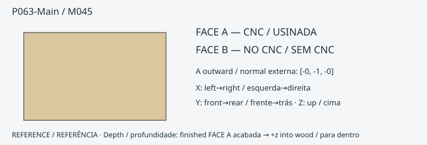

**ONE_SIDE_CNC_PLUS_MANUAL_FINISH** · 6 mm · FACE A [-0.0, -1.0, -0.0]

FORNECIDO PELO CNC: contorno externo; 1 CUT; 0 POCKET; redução da face 0.0 mm.
PENDÊNCIA de ajuste/cupom: True

- P063-Main-R1: CUT · FACE A · [0, 6.0] mm
- ACABAMENTO DO MONTADOR: limar/formonar canto até a referência · P063-Main-R1 · FACE A datum 6.0 mm. Não amplie pilotos menores que Ø4 para localizadores Ø4. É necessária validação física das ferramentas/ferragens.

[Eixos, profundidades e operações exatas](../exports/generated/flatpack-v331/manual-finish-schedule.json) · [Inspecionar peça](../exports/generated/viewer-v32/index.html?part=P063-Main&lang=pt-BR)

### P064-Base18 / M046

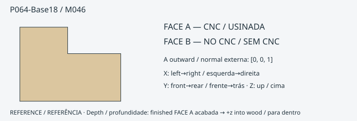

**ONE_SIDE_CNC_PLUS_MANUAL_FINISH** · 18 mm · FACE A [0.0, 0.0, 1.0]

FORNECIDO PELO CNC: contorno externo; 0 CUT; 0 POCKET; redução da face 0.0 mm.
PENDÊNCIA de ajuste/cupom: True

- ACABAMENTO DO MONTADOR: limar/formonar a raiz reentrante até a referência exata ·  · FACE A datum 18.0 mm. Não amplie pilotos menores que Ø4 para localizadores Ø4. É necessária validação física das ferramentas/ferragens.

[Eixos, profundidades e operações exatas](../exports/generated/flatpack-v331/manual-finish-schedule.json) · [Inspecionar peça](../exports/generated/viewer-v32/index.html?part=P064-Base18&lang=pt-BR)

### P064-Cap12 / M047

**ONE_SIDE_CNC_READY** · 12 mm · FACE A [0.0, 0.0, 1.0]

FORNECIDO PELO CNC: contorno externo; 0 CUT; 0 POCKET; redução da face 0.0 mm.
PENDÊNCIA de ajuste/cupom: True

ACABAMENTO DO MONTADOR: nenhum na auditoria nominal de operações.

[Eixos, profundidades e operações exatas](../exports/generated/flatpack-v331/manual-finish-schedule.json) · [Inspecionar peça](../exports/generated/viewer-v32/index.html?part=P064-Cap12&lang=pt-BR)

### P065-Base18 / M048

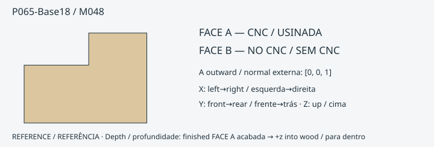

**ONE_SIDE_CNC_PLUS_MANUAL_FINISH** · 18 mm · FACE A [0.0, 0.0, 1.0]

FORNECIDO PELO CNC: contorno externo; 0 CUT; 0 POCKET; redução da face 0.0 mm.
PENDÊNCIA de ajuste/cupom: True

- ACABAMENTO DO MONTADOR: limar/formonar a raiz reentrante até a referência exata ·  · FACE A datum 18.0 mm. Não amplie pilotos menores que Ø4 para localizadores Ø4. É necessária validação física das ferramentas/ferragens.

[Eixos, profundidades e operações exatas](../exports/generated/flatpack-v331/manual-finish-schedule.json) · [Inspecionar peça](../exports/generated/viewer-v32/index.html?part=P065-Base18&lang=pt-BR)

### P065-Cap12 / M047

**ONE_SIDE_CNC_READY** · 12 mm · FACE A [0.0, 0.0, 1.0]

FORNECIDO PELO CNC: contorno externo; 0 CUT; 0 POCKET; redução da face 0.0 mm.
PENDÊNCIA de ajuste/cupom: True

ACABAMENTO DO MONTADOR: nenhum na auditoria nominal de operações.

[Eixos, profundidades e operações exatas](../exports/generated/flatpack-v331/manual-finish-schedule.json) · [Inspecionar peça](../exports/generated/viewer-v32/index.html?part=P065-Cap12&lang=pt-BR)

### P066-Main / M049

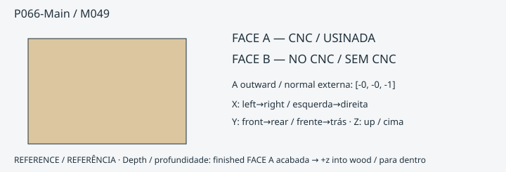

**ONE_SIDE_CNC_READY** · 4 mm · FACE A [-0.0, -0.0, -1.0]

FORNECIDO PELO CNC: contorno externo; 0 CUT; 0 POCKET; redução da face 0.0 mm.
PENDÊNCIA de ajuste/cupom: True

ACABAMENTO DO MONTADOR: nenhum na auditoria nominal de operações.

[Eixos, profundidades e operações exatas](../exports/generated/flatpack-v331/manual-finish-schedule.json) · [Inspecionar peça](../exports/generated/viewer-v32/index.html?part=P066-Main&lang=pt-BR)

### P067-Main / M049

**ONE_SIDE_CNC_READY** · 4 mm · FACE A [-0.0, -0.0, -1.0]

FORNECIDO PELO CNC: contorno externo; 0 CUT; 0 POCKET; redução da face 0.0 mm.
PENDÊNCIA de ajuste/cupom: True

ACABAMENTO DO MONTADOR: nenhum na auditoria nominal de operações.

[Eixos, profundidades e operações exatas](../exports/generated/flatpack-v331/manual-finish-schedule.json) · [Inspecionar peça](../exports/generated/viewer-v32/index.html?part=P067-Main&lang=pt-BR)

### P068-Main / M050

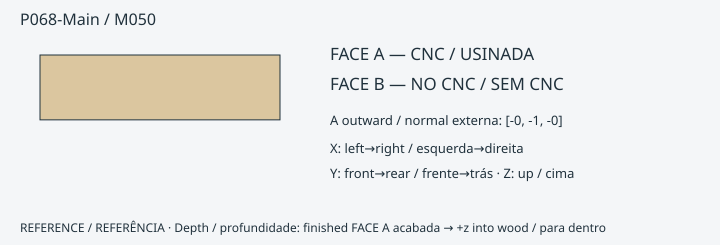

**ONE_SIDE_CNC_PLUS_MANUAL_FINISH** · 18 mm · FACE A [-0.0, -1.0, -0.0]

FORNECIDO PELO CNC: contorno externo; 3 CUT; 0 POCKET; redução da face 0.0 mm.
PENDÊNCIA de ajuste/cupom: True

- P068-Main-R1: CUT · FACE A · [0, 18.0] mm
- P068-Main-R2: CUT · FACE A · [0, 18.0] mm
- P068-Main-R3: CUT · FACE A · [0, 18.0] mm
- ACABAMENTO DO MONTADOR: limar/formonar canto até a referência · P068-Main-R1 · FACE A datum 18.0 mm. Não amplie pilotos menores que Ø4 para localizadores Ø4. É necessária validação física das ferramentas/ferragens.
- ACABAMENTO DO MONTADOR: limar/formonar canto até a referência · P068-Main-R2 · FACE A datum 18.0 mm. Não amplie pilotos menores que Ø4 para localizadores Ø4. É necessária validação física das ferramentas/ferragens.
- ACABAMENTO DO MONTADOR: limar/formonar canto até a referência · P068-Main-R3 · FACE A datum 18.0 mm. Não amplie pilotos menores que Ø4 para localizadores Ø4. É necessária validação física das ferramentas/ferragens.

[Eixos, profundidades e operações exatas](../exports/generated/flatpack-v331/manual-finish-schedule.json) · [Inspecionar peça](../exports/generated/viewer-v32/index.html?part=P068-Main&lang=pt-BR)

### P069-Main / M051

**ONE_SIDE_CNC_READY** · 12 mm · FACE A [-0.0, -1.0, -0.0]

FORNECIDO PELO CNC: contorno externo; 0 CUT; 0 POCKET; redução da face 0.0 mm.
PENDÊNCIA de ajuste/cupom: True

ACABAMENTO DO MONTADOR: nenhum na auditoria nominal de operações.

[Eixos, profundidades e operações exatas](../exports/generated/flatpack-v331/manual-finish-schedule.json) · [Inspecionar peça](../exports/generated/viewer-v32/index.html?part=P069-Main&lang=pt-BR)

### P070-Main / M051

**ONE_SIDE_CNC_READY** · 12 mm · FACE A [-0.0, -1.0, -0.0]

FORNECIDO PELO CNC: contorno externo; 0 CUT; 0 POCKET; redução da face 0.0 mm.
PENDÊNCIA de ajuste/cupom: True

ACABAMENTO DO MONTADOR: nenhum na auditoria nominal de operações.

[Eixos, profundidades e operações exatas](../exports/generated/flatpack-v331/manual-finish-schedule.json) · [Inspecionar peça](../exports/generated/viewer-v32/index.html?part=P070-Main&lang=pt-BR)

### P071-Main / M052

**ONE_SIDE_CNC_PLUS_MANUAL_FINISH** · 12 mm · FACE A [-0.0, -1.0, -0.0]

FORNECIDO PELO CNC: contorno externo; 1 CUT; 0 POCKET; redução da face 0.0 mm.
PENDÊNCIA de ajuste/cupom: True

- P071-Main-R1: CUT · FACE A · [0, 12.0] mm
- ACABAMENTO DO MONTADOR: limar/formonar canto até a referência · P071-Main-R1 · FACE A datum 12.0 mm. Não amplie pilotos menores que Ø4 para localizadores Ø4. É necessária validação física das ferramentas/ferragens.

[Eixos, profundidades e operações exatas](../exports/generated/flatpack-v331/manual-finish-schedule.json) · [Inspecionar peça](../exports/generated/viewer-v32/index.html?part=P071-Main&lang=pt-BR)

### P072-Main / M053

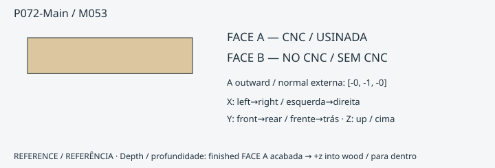

**ONE_SIDE_CNC_READY** · 12 mm · FACE A [-0.0, -1.0, -0.0]

FORNECIDO PELO CNC: contorno externo; 0 CUT; 0 POCKET; redução da face 0.0 mm.
PENDÊNCIA de ajuste/cupom: True

ACABAMENTO DO MONTADOR: nenhum na auditoria nominal de operações.

[Eixos, profundidades e operações exatas](../exports/generated/flatpack-v331/manual-finish-schedule.json) · [Inspecionar peça](../exports/generated/viewer-v32/index.html?part=P072-Main&lang=pt-BR)

### P073-Main / M054

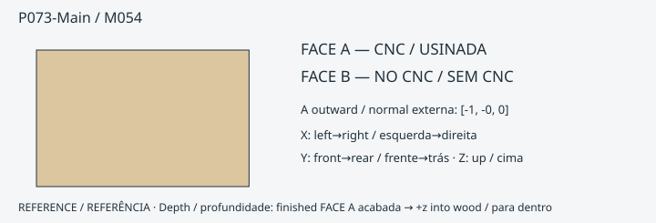

**ONE_SIDE_CNC_READY** · 18 mm · FACE A [-1.0, -0.0, 0.0]

FORNECIDO PELO CNC: contorno externo; 0 CUT; 0 POCKET; redução da face -1.4210854715202004e-14 mm.
PENDÊNCIA de ajuste/cupom: True

ACABAMENTO DO MONTADOR: nenhum na auditoria nominal de operações.

[Eixos, profundidades e operações exatas](../exports/generated/flatpack-v331/manual-finish-schedule.json) · [Inspecionar peça](../exports/generated/viewer-v32/index.html?part=P073-Main&lang=pt-BR)

### P074-Main / M054

**ONE_SIDE_CNC_READY** · 18 mm · FACE A [-1.0, -0.0, 0.0]

FORNECIDO PELO CNC: contorno externo; 0 CUT; 0 POCKET; redução da face -5.684341886080802e-14 mm.
PENDÊNCIA de ajuste/cupom: True

ACABAMENTO DO MONTADOR: nenhum na auditoria nominal de operações.

[Eixos, profundidades e operações exatas](../exports/generated/flatpack-v331/manual-finish-schedule.json) · [Inspecionar peça](../exports/generated/viewer-v32/index.html?part=P074-Main&lang=pt-BR)

### P075-Ply1 / M055

**ONE_SIDE_CNC_READY** · 12 mm · FACE A [0.0, 0.0, 1.0]

FORNECIDO PELO CNC: contorno externo; 0 CUT; 0 POCKET; redução da face 0.0 mm.
PENDÊNCIA de ajuste/cupom: True

ACABAMENTO DO MONTADOR: nenhum na auditoria nominal de operações.

[Eixos, profundidades e operações exatas](../exports/generated/flatpack-v331/manual-finish-schedule.json) · [Inspecionar peça](../exports/generated/viewer-v32/index.html?part=P075-Ply1&lang=pt-BR)

### P075-Ply2 / M055

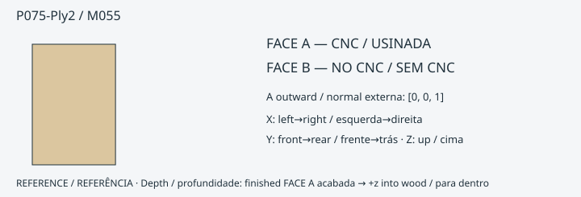

**ONE_SIDE_CNC_READY** · 12 mm · FACE A [0.0, 0.0, 1.0]

FORNECIDO PELO CNC: contorno externo; 0 CUT; 0 POCKET; redução da face 0.0 mm.
PENDÊNCIA de ajuste/cupom: True

ACABAMENTO DO MONTADOR: nenhum na auditoria nominal de operações.

[Eixos, profundidades e operações exatas](../exports/generated/flatpack-v331/manual-finish-schedule.json) · [Inspecionar peça](../exports/generated/viewer-v32/index.html?part=P075-Ply2&lang=pt-BR)

### P076-Ply1 / M055

**ONE_SIDE_CNC_READY** · 12 mm · FACE A [0.0, 0.0, 1.0]

FORNECIDO PELO CNC: contorno externo; 0 CUT; 0 POCKET; redução da face 0.0 mm.
PENDÊNCIA de ajuste/cupom: True

ACABAMENTO DO MONTADOR: nenhum na auditoria nominal de operações.

[Eixos, profundidades e operações exatas](../exports/generated/flatpack-v331/manual-finish-schedule.json) · [Inspecionar peça](../exports/generated/viewer-v32/index.html?part=P076-Ply1&lang=pt-BR)

### P076-Ply2 / M055

**ONE_SIDE_CNC_READY** · 12 mm · FACE A [0.0, 0.0, 1.0]

FORNECIDO PELO CNC: contorno externo; 0 CUT; 0 POCKET; redução da face 0.0 mm.
PENDÊNCIA de ajuste/cupom: True

ACABAMENTO DO MONTADOR: nenhum na auditoria nominal de operações.

[Eixos, profundidades e operações exatas](../exports/generated/flatpack-v331/manual-finish-schedule.json) · [Inspecionar peça](../exports/generated/viewer-v32/index.html?part=P076-Ply2&lang=pt-BR)

### P077-Ply1 / M055

**ONE_SIDE_CNC_READY** · 12 mm · FACE A [0.0, 0.0, 1.0]

FORNECIDO PELO CNC: contorno externo; 0 CUT; 0 POCKET; redução da face 0.0 mm.
PENDÊNCIA de ajuste/cupom: True

ACABAMENTO DO MONTADOR: nenhum na auditoria nominal de operações.

[Eixos, profundidades e operações exatas](../exports/generated/flatpack-v331/manual-finish-schedule.json) · [Inspecionar peça](../exports/generated/viewer-v32/index.html?part=P077-Ply1&lang=pt-BR)

### P077-Ply2 / M055

**ONE_SIDE_CNC_READY** · 12 mm · FACE A [0.0, 0.0, 1.0]

FORNECIDO PELO CNC: contorno externo; 0 CUT; 0 POCKET; redução da face 0.0 mm.
PENDÊNCIA de ajuste/cupom: True

ACABAMENTO DO MONTADOR: nenhum na auditoria nominal de operações.

[Eixos, profundidades e operações exatas](../exports/generated/flatpack-v331/manual-finish-schedule.json) · [Inspecionar peça](../exports/generated/viewer-v32/index.html?part=P077-Ply2&lang=pt-BR)

### P078-Ply1 / M055

**ONE_SIDE_CNC_READY** · 12 mm · FACE A [0.0, 0.0, 1.0]

FORNECIDO PELO CNC: contorno externo; 0 CUT; 0 POCKET; redução da face 0.0 mm.
PENDÊNCIA de ajuste/cupom: True

ACABAMENTO DO MONTADOR: nenhum na auditoria nominal de operações.

[Eixos, profundidades e operações exatas](../exports/generated/flatpack-v331/manual-finish-schedule.json) · [Inspecionar peça](../exports/generated/viewer-v32/index.html?part=P078-Ply1&lang=pt-BR)

### P078-Ply2 / M055

**ONE_SIDE_CNC_READY** · 12 mm · FACE A [0.0, 0.0, 1.0]

FORNECIDO PELO CNC: contorno externo; 0 CUT; 0 POCKET; redução da face 0.0 mm.
PENDÊNCIA de ajuste/cupom: True

ACABAMENTO DO MONTADOR: nenhum na auditoria nominal de operações.

[Eixos, profundidades e operações exatas](../exports/generated/flatpack-v331/manual-finish-schedule.json) · [Inspecionar peça](../exports/generated/viewer-v32/index.html?part=P078-Ply2&lang=pt-BR)

### P079-Main / M056

**ONE_SIDE_CNC_PLUS_MANUAL_FINISH** · 12 mm · FACE A [0.0, -1.0, 0.0]

FORNECIDO PELO CNC: contorno externo; 6 CUT; 0 POCKET; redução da face 0.0 mm.
PENDÊNCIA de ajuste/cupom: True

- P079-Main-R1: CUT · FACE A · [1.1343703754107537e-13, 12.0] mm
- P079-Main-R2: CUT · FACE A · [1.1343703754107537e-13, 12.0] mm
- P079-Main-R3: CUT · FACE A · [0, 12.0] mm
- P079-Main-R4: CUT · FACE A · [2.2093438190040615e-13, 12.0] mm
- P079-Main-R5: CUT · FACE A · [1.1343703754107537e-13, 12.0] mm
- P079-Main-R6: CUT · FACE A · [1.1343703754107537e-13, 12.0] mm
- ACABAMENTO DO MONTADOR: limar/formonar canto até a referência · P079-Main-R3 · FACE A datum 12.0 mm. Não amplie pilotos menores que Ø4 para localizadores Ø4. É necessária validação física das ferramentas/ferragens.

[Eixos, profundidades e operações exatas](../exports/generated/flatpack-v331/manual-finish-schedule.json) · [Inspecionar peça](../exports/generated/viewer-v32/index.html?part=P079-Main&lang=pt-BR)

### P080-Main / M057

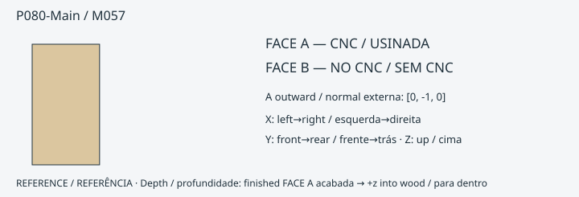

**ONE_SIDE_CNC_PLUS_MANUAL_FINISH** · 12 mm · FACE A [0.0, -1.0, 0.0]

FORNECIDO PELO CNC: contorno externo; 6 CUT; 0 POCKET; redução da face 0.0 mm.
PENDÊNCIA de ajuste/cupom: True

- P080-Main-R1: CUT · FACE A · [1.1343703754107537e-13, 12.0] mm
- P080-Main-R2: CUT · FACE A · [1.1343703754107537e-13, 12.0] mm
- P080-Main-R3: CUT · FACE A · [2.2093438190040615e-13, 12.0] mm
- P080-Main-R4: CUT · FACE A · [0, 12.0] mm
- P080-Main-R5: CUT · FACE A · [1.1343703754107537e-13, 12.0] mm
- P080-Main-R6: CUT · FACE A · [1.1343703754107537e-13, 12.0] mm
- ACABAMENTO DO MONTADOR: limar/formonar canto até a referência · P080-Main-R4 · FACE A datum 12.0 mm. Não amplie pilotos menores que Ø4 para localizadores Ø4. É necessária validação física das ferramentas/ferragens.

[Eixos, profundidades e operações exatas](../exports/generated/flatpack-v331/manual-finish-schedule.json) · [Inspecionar peça](../exports/generated/viewer-v32/index.html?part=P080-Main&lang=pt-BR)

### P081-Main / M058

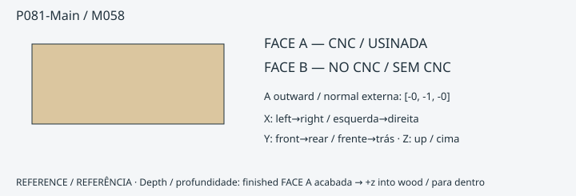

**ONE_SIDE_CNC_PLUS_MANUAL_FINISH** · 6 mm · FACE A [-0.0, -1.0, -0.0]

FORNECIDO PELO CNC: contorno externo; 1 CUT; 0 POCKET; redução da face 0.0 mm.
PENDÊNCIA de ajuste/cupom: True

- P081-Main-R1: CUT · FACE A · [0, 6.0] mm
- ACABAMENTO DO MONTADOR: limar/formonar canto até a referência · P081-Main-R1 · FACE A datum 6.0 mm. Não amplie pilotos menores que Ø4 para localizadores Ø4. É necessária validação física das ferramentas/ferragens.

[Eixos, profundidades e operações exatas](../exports/generated/flatpack-v331/manual-finish-schedule.json) · [Inspecionar peça](../exports/generated/viewer-v32/index.html?part=P081-Main&lang=pt-BR)

### P082-Main / M058

**ONE_SIDE_CNC_PLUS_MANUAL_FINISH** · 6 mm · FACE A [-0.0, -1.0, -0.0]

FORNECIDO PELO CNC: contorno externo; 1 CUT; 0 POCKET; redução da face 0.0 mm.
PENDÊNCIA de ajuste/cupom: True

- P082-Main-R1: CUT · FACE A · [0, 6.0] mm
- ACABAMENTO DO MONTADOR: limar/formonar canto até a referência · P082-Main-R1 · FACE A datum 6.0 mm. Não amplie pilotos menores que Ø4 para localizadores Ø4. É necessária validação física das ferramentas/ferragens.

[Eixos, profundidades e operações exatas](../exports/generated/flatpack-v331/manual-finish-schedule.json) · [Inspecionar peça](../exports/generated/viewer-v32/index.html?part=P082-Main&lang=pt-BR)

### P083-Face / M059

**ONE_SIDE_CNC_READY** · 6 mm · FACE A [0.0, -1.0, 0.0]

FORNECIDO PELO CNC: contorno externo; 0 CUT; 0 POCKET; redução da face 4.547473508864641e-13 mm.
PENDÊNCIA de ajuste/cupom: True

ACABAMENTO DO MONTADOR: nenhum na auditoria nominal de operações.

[Eixos, profundidades e operações exatas](../exports/generated/flatpack-v331/manual-finish-schedule.json) · [Inspecionar peça](../exports/generated/viewer-v32/index.html?part=P083-Face&lang=pt-BR)

### P083-Top / M060

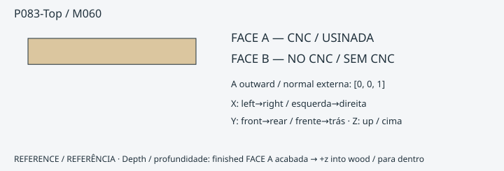

**ONE_SIDE_CNC_READY** · 6 mm · FACE A [0.0, 0.0, 1.0]

FORNECIDO PELO CNC: contorno externo; 0 CUT; 0 POCKET; redução da face 0.0 mm.
PENDÊNCIA de ajuste/cupom: True

ACABAMENTO DO MONTADOR: nenhum na auditoria nominal de operações.

[Eixos, profundidades e operações exatas](../exports/generated/flatpack-v331/manual-finish-schedule.json) · [Inspecionar peça](../exports/generated/viewer-v32/index.html?part=P083-Top&lang=pt-BR)

### P083-Side1 / M061

**ONE_SIDE_CNC_READY** · 6 mm · FACE A [1.0, 0.0, 0.0]

FORNECIDO PELO CNC: contorno externo; 0 CUT; 0 POCKET; redução da face 0.0 mm.
PENDÊNCIA de ajuste/cupom: True

ACABAMENTO DO MONTADOR: nenhum na auditoria nominal de operações.

[Eixos, profundidades e operações exatas](../exports/generated/flatpack-v331/manual-finish-schedule.json) · [Inspecionar peça](../exports/generated/viewer-v32/index.html?part=P083-Side1&lang=pt-BR)

### P083-Side2 / M061

**ONE_SIDE_CNC_READY** · 6 mm · FACE A [1.0, 0.0, 0.0]

FORNECIDO PELO CNC: contorno externo; 0 CUT; 0 POCKET; redução da face 0.0 mm.
PENDÊNCIA de ajuste/cupom: True

ACABAMENTO DO MONTADOR: nenhum na auditoria nominal de operações.

[Eixos, profundidades e operações exatas](../exports/generated/flatpack-v331/manual-finish-schedule.json) · [Inspecionar peça](../exports/generated/viewer-v32/index.html?part=P083-Side2&lang=pt-BR)

### P084-Face / M059

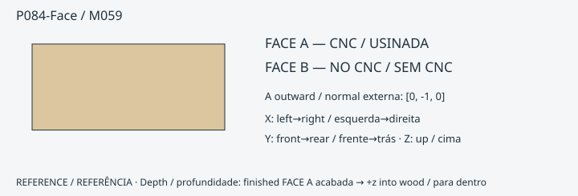

**ONE_SIDE_CNC_READY** · 6 mm · FACE A [0.0, -1.0, 0.0]

FORNECIDO PELO CNC: contorno externo; 0 CUT; 0 POCKET; redução da face 4.547473508864641e-13 mm.
PENDÊNCIA de ajuste/cupom: True

ACABAMENTO DO MONTADOR: nenhum na auditoria nominal de operações.

[Eixos, profundidades e operações exatas](../exports/generated/flatpack-v331/manual-finish-schedule.json) · [Inspecionar peça](../exports/generated/viewer-v32/index.html?part=P084-Face&lang=pt-BR)

### P084-Top / M060

**ONE_SIDE_CNC_READY** · 6 mm · FACE A [0.0, 0.0, 1.0]

FORNECIDO PELO CNC: contorno externo; 0 CUT; 0 POCKET; redução da face 0.0 mm.
PENDÊNCIA de ajuste/cupom: True

ACABAMENTO DO MONTADOR: nenhum na auditoria nominal de operações.

[Eixos, profundidades e operações exatas](../exports/generated/flatpack-v331/manual-finish-schedule.json) · [Inspecionar peça](../exports/generated/viewer-v32/index.html?part=P084-Top&lang=pt-BR)

### P084-Side1 / M061

**ONE_SIDE_CNC_READY** · 6 mm · FACE A [1.0, 0.0, 0.0]

FORNECIDO PELO CNC: contorno externo; 0 CUT; 0 POCKET; redução da face 0.0 mm.
PENDÊNCIA de ajuste/cupom: True

ACABAMENTO DO MONTADOR: nenhum na auditoria nominal de operações.

[Eixos, profundidades e operações exatas](../exports/generated/flatpack-v331/manual-finish-schedule.json) · [Inspecionar peça](../exports/generated/viewer-v32/index.html?part=P084-Side1&lang=pt-BR)

### P084-Side2 / M061

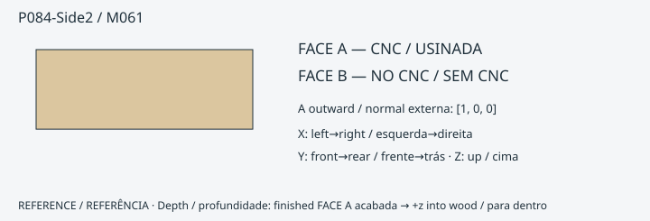

**ONE_SIDE_CNC_READY** · 6 mm · FACE A [1.0, 0.0, 0.0]

FORNECIDO PELO CNC: contorno externo; 0 CUT; 0 POCKET; redução da face 0.0 mm.
PENDÊNCIA de ajuste/cupom: True

ACABAMENTO DO MONTADOR: nenhum na auditoria nominal de operações.

[Eixos, profundidades e operações exatas](../exports/generated/flatpack-v331/manual-finish-schedule.json) · [Inspecionar peça](../exports/generated/viewer-v32/index.html?part=P084-Side2&lang=pt-BR)

### P085-Reduced18 / M062

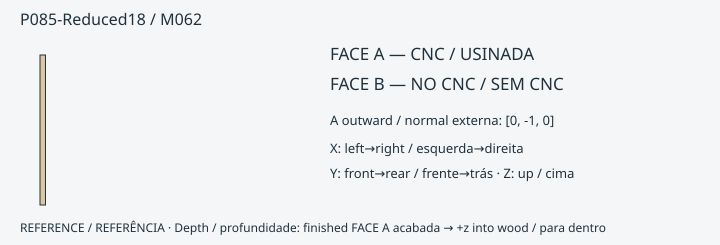

**ONE_SIDE_CNC_READY** · 18 mm · FACE A [0.0, -1.0, 0.0]

FORNECIDO PELO CNC: contorno externo; 0 CUT; 1 POCKET; redução da face 4.0 mm.
PENDÊNCIA de ajuste/cupom: True

- P085-Reduced18-FACE_REDUCTION: POCKET · FACE A · see register mm
ACABAMENTO DO MONTADOR: nenhum na auditoria nominal de operações.

[Eixos, profundidades e operações exatas](../exports/generated/flatpack-v331/manual-finish-schedule.json) · [Inspecionar peça](../exports/generated/viewer-v32/index.html?part=P085-Reduced18&lang=pt-BR)

### P086-Reduced18 / M062

**ONE_SIDE_CNC_READY** · 18 mm · FACE A [0.0, -1.0, 0.0]

FORNECIDO PELO CNC: contorno externo; 0 CUT; 1 POCKET; redução da face 4.0 mm.
PENDÊNCIA de ajuste/cupom: True

- P086-Reduced18-FACE_REDUCTION: POCKET · FACE A · see register mm
ACABAMENTO DO MONTADOR: nenhum na auditoria nominal de operações.

[Eixos, profundidades e operações exatas](../exports/generated/flatpack-v331/manual-finish-schedule.json) · [Inspecionar peça](../exports/generated/viewer-v32/index.html?part=P086-Reduced18&lang=pt-BR)

### P087-Main / M063

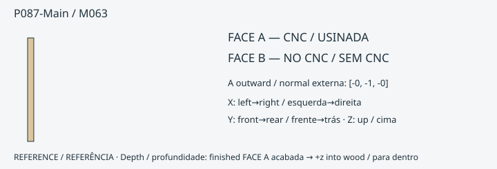

**ONE_SIDE_CNC_READY** · 12 mm · FACE A [-0.0, -1.0, -0.0]

FORNECIDO PELO CNC: contorno externo; 0 CUT; 0 POCKET; redução da face 0.0 mm.
PENDÊNCIA de ajuste/cupom: True

ACABAMENTO DO MONTADOR: nenhum na auditoria nominal de operações.

[Eixos, profundidades e operações exatas](../exports/generated/flatpack-v331/manual-finish-schedule.json) · [Inspecionar peça](../exports/generated/viewer-v32/index.html?part=P087-Main&lang=pt-BR)

### P088-Main / M064

**ONE_SIDE_CNC_READY** · 18 mm · FACE A [0.0, 0.0, 1.0]

FORNECIDO PELO CNC: contorno externo; 3 CUT; 0 POCKET; redução da face 0.0 mm.
PENDÊNCIA de ajuste/cupom: True

- P088-Main-R1: CUT · FACE A · [0, 18.0] mm
- P088-Main-R2: CUT · FACE A · [0, 18.0] mm
- P088-Main-R3: CUT · FACE A · [0, 18.0] mm
ACABAMENTO DO MONTADOR: nenhum na auditoria nominal de operações.

[Eixos, profundidades e operações exatas](../exports/generated/flatpack-v331/manual-finish-schedule.json) · [Inspecionar peça](../exports/generated/viewer-v32/index.html?part=P088-Main&lang=pt-BR)

### P089-Main / M065

**ONE_SIDE_CNC_PLUS_MANUAL_FINISH** · 18 mm · FACE A [0.0, 0.0, 1.0]

FORNECIDO PELO CNC: contorno externo; 1 CUT; 0 POCKET; redução da face 0.0 mm.
PENDÊNCIA de ajuste/cupom: True

- P089-Main-R2: CUT · FACE A · [0, 18.0] mm
- ACABAMENTO DO MONTADOR: furar / escarear com broca selecionada, limitador e guia validada · P089-Main-R1 · FACE A datum [0, 18.0] mm. Não amplie pilotos menores que Ø4 para localizadores Ø4. É necessária validação física das ferramentas/ferragens.
- ACABAMENTO DO MONTADOR: furar / escarear com broca selecionada, limitador e guia validada · P089-Main-R3 · FACE A datum [0, 18.0] mm. Não amplie pilotos menores que Ø4 para localizadores Ø4. É necessária validação física das ferramentas/ferragens.

[Eixos, profundidades e operações exatas](../exports/generated/flatpack-v331/manual-finish-schedule.json) · [Inspecionar peça](../exports/generated/viewer-v32/index.html?part=P089-Main&lang=pt-BR)

### P090-Main / M064

**ONE_SIDE_CNC_READY** · 18 mm · FACE A [0.0, 0.0, 1.0]

FORNECIDO PELO CNC: contorno externo; 3 CUT; 0 POCKET; redução da face 0.0 mm.
PENDÊNCIA de ajuste/cupom: True

- P090-Main-R1: CUT · FACE A · [0, 18.0] mm
- P090-Main-R2: CUT · FACE A · [0, 18.0] mm
- P090-Main-R3: CUT · FACE A · [0, 18.0] mm
ACABAMENTO DO MONTADOR: nenhum na auditoria nominal de operações.

[Eixos, profundidades e operações exatas](../exports/generated/flatpack-v331/manual-finish-schedule.json) · [Inspecionar peça](../exports/generated/viewer-v32/index.html?part=P090-Main&lang=pt-BR)

### P091-Main / M065

**ONE_SIDE_CNC_PLUS_MANUAL_FINISH** · 18 mm · FACE A [0.0, 0.0, 1.0]

FORNECIDO PELO CNC: contorno externo; 1 CUT; 0 POCKET; redução da face 0.0 mm.
PENDÊNCIA de ajuste/cupom: True

- P091-Main-R2: CUT · FACE A · [0, 18.0] mm
- ACABAMENTO DO MONTADOR: furar / escarear com broca selecionada, limitador e guia validada · P091-Main-R1 · FACE A datum [0, 18.0] mm. Não amplie pilotos menores que Ø4 para localizadores Ø4. É necessária validação física das ferramentas/ferragens.
- ACABAMENTO DO MONTADOR: furar / escarear com broca selecionada, limitador e guia validada · P091-Main-R3 · FACE A datum [0, 18.0] mm. Não amplie pilotos menores que Ø4 para localizadores Ø4. É necessária validação física das ferramentas/ferragens.

[Eixos, profundidades e operações exatas](../exports/generated/flatpack-v331/manual-finish-schedule.json) · [Inspecionar peça](../exports/generated/viewer-v32/index.html?part=P091-Main&lang=pt-BR)

### P092-Main / M066

**ONE_SIDE_CNC_READY** · 6 mm · FACE A [-0.0, -1.0, -0.0]

FORNECIDO PELO CNC: contorno externo; 4 CUT; 0 POCKET; redução da face 0.0 mm.
PENDÊNCIA de ajuste/cupom: True

- P092-Main-R1: CUT · FACE A · [0, 6.0] mm
- P092-Main-R2: CUT · FACE A · [0, 6.0] mm
- P092-Main-R3: CUT · FACE A · [0, 6.0] mm
- P092-Main-R4: CUT · FACE A · [0, 6.0] mm
ACABAMENTO DO MONTADOR: nenhum na auditoria nominal de operações.

[Eixos, profundidades e operações exatas](../exports/generated/flatpack-v331/manual-finish-schedule.json) · [Inspecionar peça](../exports/generated/viewer-v32/index.html?part=P092-Main&lang=pt-BR)

### P093-Main / M066

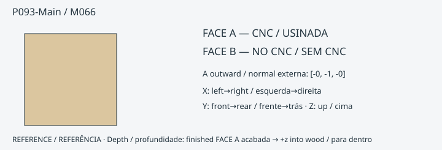

**ONE_SIDE_CNC_READY** · 6 mm · FACE A [-0.0, -1.0, -0.0]

FORNECIDO PELO CNC: contorno externo; 4 CUT; 0 POCKET; redução da face 0.0 mm.
PENDÊNCIA de ajuste/cupom: True

- P093-Main-R1: CUT · FACE A · [0, 6.0] mm
- P093-Main-R2: CUT · FACE A · [0, 6.0] mm
- P093-Main-R3: CUT · FACE A · [0, 6.0] mm
- P093-Main-R4: CUT · FACE A · [0, 6.0] mm
ACABAMENTO DO MONTADOR: nenhum na auditoria nominal de operações.

[Eixos, profundidades e operações exatas](../exports/generated/flatpack-v331/manual-finish-schedule.json) · [Inspecionar peça](../exports/generated/viewer-v32/index.html?part=P093-Main&lang=pt-BR)

---
CERN-OHL-S-2.0 · Source Location: https://github.com/advpeterrobinson-hash/vpin-cabinet
