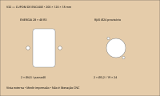

# V32 — fixação, acesso interno e cupom dos conectores

Continuação dos recortes diretos aprovados. Nenhuma placa extra ou alteração das prateleiras, fans, PC ou painéis foi introduzida. O CAD integrado permanece no estado validado em `fixed-rear-services-v32`; este estudo acrescenta verificação de acesso e um cupom separado.

## Ajustes de montagem

- Energia: candidato M4×30 passante, dois pontos. Com flange assumida2, madeira18, arruela0,8 e porca3,2, sobram6 mm além da porca.
- RJ45: candidato M3×30 passante, dois pontos. Com flange assumida2, madeira18, arruela0,5 e porca2,4, sobram7,1 mm. M3×25 deixaria2,1 mm com essas mesmas hipóteses; escolheu-se30 no estudo para reservar ao menos um diâmetro além da porca. Não é exigência normativa nem seleção de compra.
- São volumes e comprimentos candidatos: rosca real, cabeça, flange, arruelas, porcas e aperto precisam corresponder às peças. Não apertar a flange plástica para compensar falta de encaixe.

O corredor de ferramenta de120 mm até cada porca da energia encontra a parede do invólucro interno. **A proteção interna deve permitir remoção ou abertura para manutenção das fixações**, com a alimentação desconectada. A auditoria confirma que o corredor fica livre sem o invólucro; não foi modelada uma tampa removível ou sua retenção. Não transformar a caixa protetora candidata numa caixa permanentemente colada sobre as porcas. Isso também deve preservar a proteção dos terminais em uso.

No RJ45, o corpo não está modelado em escala. Uma verificação circular conservadora com corpoØ23,6 e soquete externoØ8,4 indica sobreposição radial de aproximadamente0,695 mm: **não presumir acesso com soquete**. A montagem precisa ser testada com chave pequena adequada à porca, incluindo a orientação da flange e o cabo interno. A reserva de arruelaØ6,4 deixa apenas0,105 mm até a borda do recorteØ24; não há margem para uma arruela larga nessa região. A ponte de madeira de1,705 mm continua sem qualificação estrutural. O cupom permite verificar essas limitações antes do painel definitivo.

## Cupom de encaixe

[Cupom FreeCAD](../exports/generated/connector-fit-v32/connector-coupon.FCStd) · [DXF em mm](../exports/generated/connector-fit-v32/connector-coupon-mm.dxf) · [SVG em tamanho real](../exports/generated/connector-fit-v32/connector-coupon.svg) · [Relatório](../exports/generated/connector-fit-v32/validation.json).

Peça200×120×18 mm nominal. Usar amostra do material real. As duas interfaces aparecem lado a lado em posições locais próprias: **não é gabarito de localização do painel traseiro**. Vista pela face externa, com diagonal do RJ45 igual ao desenho do fornecedor. Energia28×48R3 e2×Ø4,5 a40; RJ45Ø24 e2×Ø3,2 a19×24. O cupom não valida o resto da usinagem do gabinete.

DXF separa `COUPON_OUTLINE`, `THROUGH_BODY` e `DRILL_THROUGH`; geometria nominal, sem compensação da ferramenta. A oficina deve conferir unidades, fechamento dos contornos, ferramenta capaz de fazerR3, espessura medida e operação dos furos pequenos. O SVG tem200×120 mm: imprimir100%, sem ajustar à folha, e medir antes de usar. Texto no SVG é legenda, não gravação solicitada no DXF.

Teste com as peças físicas, ainda sem energia: encaixe sem forçar, cobertura da flange, apoio das arruelas/porcas, acesso da chave, remoção do fusível e conexão/desconexão dos cabos pelos dois lados. Para energia, conferir que os terminais e sua isolação são acessíveis atrás do estoque18 mm. Se falhar, registrar a medida necessária; não ampliar o painel definitivo por tentativa.

## Evidência

`bash tools/run_connector_fit_v32.sh` exige `CONNECTOR_FIT_PASS`:24 verificações. Confere hastes nos furos, reservas de porcas, comprimentos assumidos, ferramenta com e sem proteção, rejeição do soquete RJ45, cupom sólido válido e reaberto, preservação dos arquivos de entrada. Nenhuma prova de resistência, segurança elétrica, tolerância real ou corte físico foi realizada. Liberação CNC permanece pendente.

Original CERN-OHL-S-2.0. Preservar LICENSE e NOTICE.md. Source Location: https://github.com/advpeterrobinson-hash/vpin-cabinet
