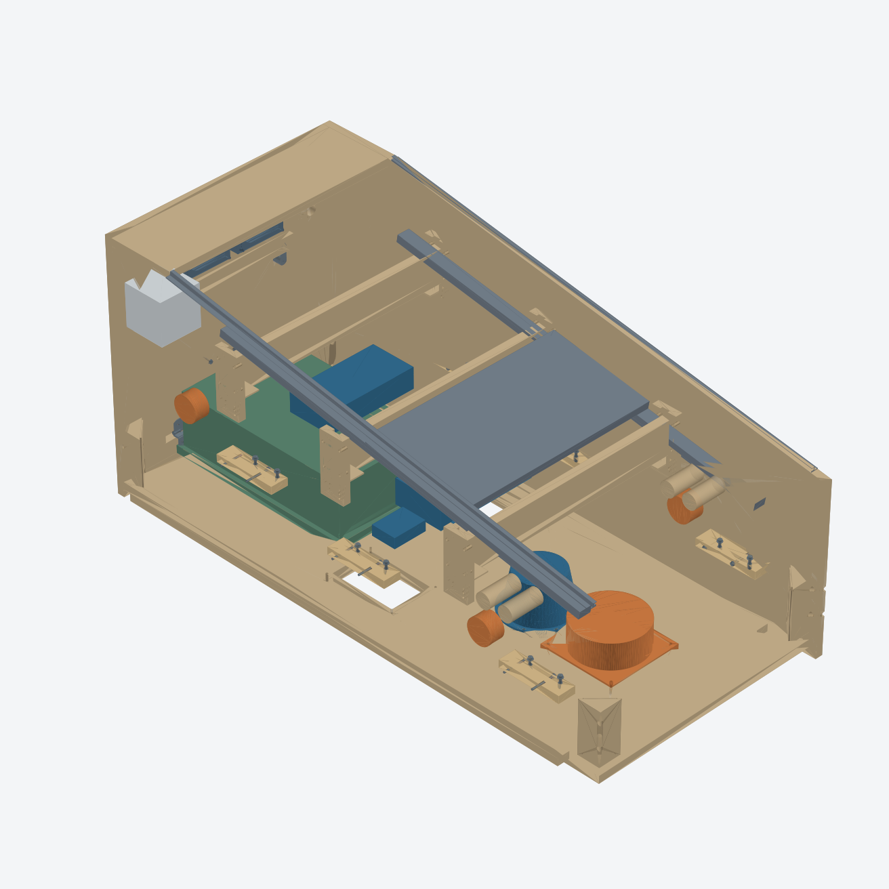

# V32 — desenho consolidado com SSF Cleveland4.1

[PDF de oito pranchas](../output/pdf/v32-desenho-consolidado.pdf) · [CAD FreeCAD](../exports/generated/consolidated-v32/cabinet-v32-consolidated.FCStd) · [STEP](../exports/generated/consolidated-v32/cabinet-v32-consolidated.step) · [DXF nominal do piso](../exports/generated/consolidated-v32/floor-draft-mm.dxf) · [Pacote ZIP](../exports/generated/consolidated-v32/v32-desenho-consolidado.zip).

**Entrega consolidada do desenho de referência; não é liberação de fabricação.** A prancha final distingue o que entrou no CAD das confirmações de ferragem, carga, elétrica e CAM que não podem ser certificadas com os dados disponíveis. Nenhum pedido de compra ou fabricação foi enviado.

## Referência de áudio

O proprietário escolheu o SSF4.1 da Cleveland com subwoofer como referência. A [página oficial do kit](https://www.clevelandsoftwaredesign.com/pinball-parts/p/high-power-ssf-kit) lista quatro excitersEX32EP2-4 com IMS, um BST-1 e interfaceUSB7.1; DCS165-4 é o subwoofer adicional. Portanto o corpo recebe quatro exciters, um shaker e um subwoofer acústico separado. O kit não define sozinho a acústica do gabinete ou a fixação dos componentes.

As páginas e fichas Dayton foram consultadas pela ferramenta web. Tentativas de download retornaram bloqueioHTML/403, registradas em `library/references/links.txt`; os PDFs não estão disponíveis localmente. Não afirmar inspeção visual completa dos PDFs. A geometria foi criada no projeto a partir das cotas técnicas indexadas, sem importar desenhos ou modelos proprietários. As discrepâncias entre profundidades publicadas permanecem abertas.

## O que mudou

- **Subwoofer:** centroX300/Y440 mantido. Abertura cresceu de139,7 para143,5;143 é referência do desenhoDCS165-4 e0,5 é folga proposta. Oito passagens candidatasØ5,5 emPCD158, fase22,5° adotada; dimensão das fendas do driver não é a dimensão do furo na madeira. Envelope do corpo até90mm acima do piso e reserva de serviçoØ180×110. Conferir revisão física e baffle/vedação antes de cortar.
- **BST-1:** centroX300/Y260 em placa local180×180×12, fixada ao piso em quatro pontosM5 candidatos. A placa transmite vibração ao piso e é substituível. A furação específica do próprioBST não foi inventada com base apenas numa diagonal; permanece na placa local. Não é uma nova travessa entre paredes. RemoverS1 para serviço vertical do conjunto.
- **Exciters:** dois por lado emY320/Z195 eY1100/Z300, reservasØ80×45 para dentro. Modelo simplificado com corpoØ59,1×29 e6mm de montagem candidata; geometria doIMS e pilotos ainda dependem da peça. Laterais não receberam furos adivinhados.
- **Amplificador /USB:** naS2, substituem o envelope genérico de carga dessa prateleira. **Fonte:** naS3, também substitui reserva genérica. Dimensões adotadas são envelopes de planejamento, não medidas do fornecedor; suportes e furos específicos ficam nas prateleiras removíveis.
- **PCBase:** quatro âncoras candidatasØ5,5 atravessam base e piso; escareadoØ10,5×2,5 somente na base. Preservados os285×460×18 e a alturaZ36. Acesso às cabeças exige retirar o chassi. Fixação do chassi/GPU à base ainda precisa do hardware real; não há segunda bandeja nem gaveta.

A traseira completa e as três prateleiras permanecem geometricamente iguais à etapa anterior. Suportes, laterais, porta, fans, ligações diretas dos conectores e alturas aprovadas foram preservados. Os dois filtros inferiores e seus oito furos também permanecem. A proposta de união capturada e o estudo de cantosR3 das guias não foram incorporados silenciosamente.

## Validação e escopo do desenho

`bash tools/run_consolidated_v32.sh` produz CAD, STEP, operações do piso, DXF, vista ePDF. Exige sentinela: **39 verificações,202 sólidos**. Inclui peças e reservas; não é contagem da lista de compras.

Confere novas interferências, reservas de serviço, retirada dos exciters, serviço do subwoofer eBST, ausência de novos obstáculos às prateleiras, simetria, passagens das âncoras, preservação das geometrias aprovadas, sólidos válidos e reabertura. Retirada doBST comS1 instalada é rejeitada. O DXF do piso vem das arestas reais da face plana:25 círculos e8 arcos, além de linhas; não contém compensação, nesting ou operações das laterais.

Não se afirma que todos os parafusos estejam qualificados, que as escoras sustentem a tela ou que o piso suporte as cargas dinâmicas apenas porque os volumes cabem. O subwoofer montado no corpo com entradas de ar não foi calculado como caixa acústica selada/sintonizada. Verificar desempenho, ventilação, ruídos parasitas, ferragens e segurança elétrica na implementação.

## Leitura das pranchas

1. Conjunto interno, retirando visualmente frente/lateral/display/prateleiras para acesso.
2. Piso e novas interfaces de áudio.
3. Traseira em vista externa, comX global corretamente invertido.
4. Laterais e posições dos exciters/prateleiras.
5. Organização do áudio e reservas de instalação.
6. Coordenadas das furações do piso.
7. Sequência de montagem/manutenção.
8. Confirmações restantes e rastreabilidade.

A lockdown metálica ainda não tem perfil/linguetas/receptor inteiramente cotados; o backbox completo, as escoras/cavalete do playfield e a montagem elétrica não são desenhos executivos concluídos neste pacote. A fabricação continua dependendo de peças medidas, estoque, ferramenta, tolerâncias/cupom, cargas e autorização de fabricação. A entrega não disfarça esses itens com dimensões estimadas.

Original CERN-OHL-S-2.0. Preservar LICENSE e NOTICE.md. Source Location: https://github.com/advpeterrobinson-hash/vpin-cabinet
