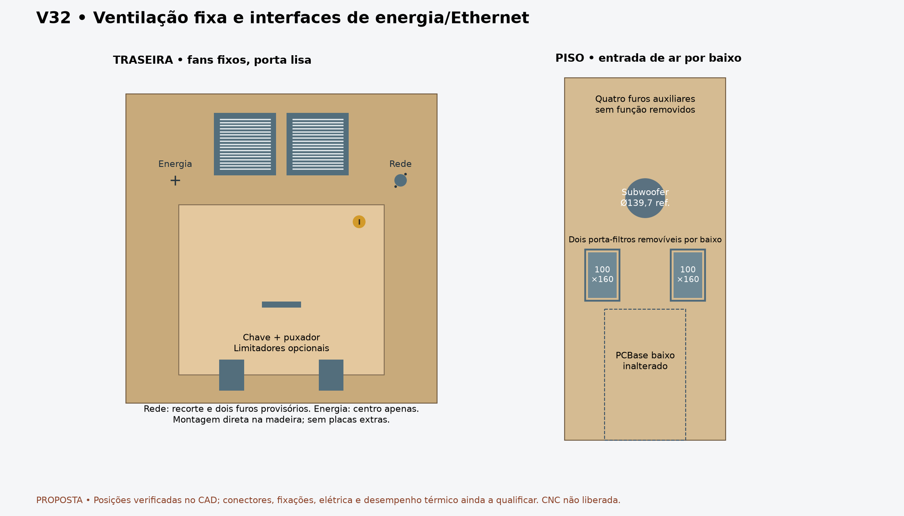

# V32 — ventoinhas fixas, energia, Ethernet e piso

**As duas ventoinhas cabem acima da porta.** O novo CAD as transfere para o painel fixo, com grades e parafusos. A porta passa a ser lisa, conservando chave, puxador e dobradiças. Não precisa mais carregar cabos das ventoinhas. PC baixo, laterais e prateleiras aprovadas permanecem inalterados.

## Ventoinhas e acesso

CentrosX230/370, Z500; molduras de referência120 ×120 ×25 e grades de1,5 mm. RecortesØ116 e padrão105 mm com passagensØ4,5 mantêm as referências anteriores. Tudo depende da correspondência com o fan/grade realmente escolhido.

A base das molduras fica emZ440, **57 mm acima da porta fechada**. O topo emZ560 deixa **18,9 mm até a face inferior do apoio do backbox**. Os corpos ficam emY1265,1..1290,1, atrás do painel fixo. Subir os centros mais20 mm produz colisão com esse apoio; esse caso é controle negativo, não uma opção de montagem.

O painel fixo tem18 mm, contra12 da porta. Por isso o estudo troca os parafusos candidatos dos fans de M4 ×50 para **M4 ×55**, mantendo as arruelas, porcas e grades nos lados correspondentes. Comprimento/rosca real e travamento continuam sujeitos à ferragem selecionada. Os corredores candidatos de ferramenta, externos e internos, foram conferidos; o soquete interno tem alívio central para a ponta do parafuso.

A porta continua com abertura amostrada0..110°. A rota excepcional do PC passa a110°. **A90° ainda há interferência com o corpo/lingueta da fechadura**, embora o obstáculo dos fans tenha desaparecido. Não afirmar que a retirada completa do PC passa a90°. Limitadores seguem opcionais; feltro no contato real do miolo continua a solução do proprietário. Repouso livre além do ângulo testado não foi avaliado.

## Energia e Ethernet: flange diretamente na madeira

**Correção aprovada pelo proprietário em 2026-09-30: sem placas intermediárias.** Usar conectores de painel com a própria flange aparafusada à madeira. Referências: acoplador RJ45 Cat6 fêmea/fêmea indicado no Mercado Livre e foto416182 do inlet tipo IEC com fusível, interruptor e duas orelhas de fixação. Link contextual em `library/references/links.txt`; foto preservada na biblioteca local, sem redistribuição.

Centros de planejamento mantidos: energia X95/Z430 e Ethernet X530/Z430, no painel fixo. São posições de referência, não confirmação do encaixe das peças. O desenho representa o centro de energia com cruz e os cortes provisórios do RJ45; não representa conectores em escala.

As placas, janelas grandes70×50/30×30 e seus oito furos anteriores foram retirados. Com a imagem cotada416185, o RJ45 agora recebe **rascunho de aberturaØ24 e dois furosØ3,2**, emX539,5/Z442 eX520,5/Z418. As chamadas do anúncio sãoØ23,6 e2×Ø3,1, passo diagonal19×24; as folgas do rascunho são decisões do projeto. Conversão da vista externa, limites de interpretação, ponte de madeira de aproximadamente1,705 mm e requisitos de fixação estão em [cotas dos conectores](DIRECT_CONNECTOR_DIMENSIONS_V32.md).

A foto de energia416183 mostra outro invólucro, sem orelhas aparentes, com chamadas50/30/24 mas sem recorte ou retenção definidos. Energia permanece sem corte, `footprint:null`. Não transformar dimensões externas em abertura de painel. Conferir montagem em18 mm, flange, acesso a terminais/cabos e retenção; não foi acrescentado rebaixo ou placa extra. O recorte e a furação devem chegar prontos da CNC depois dessa confirmação.

O invólucro interno candidato100×100×100 continua reservado emX45/Y1190,1/Z385 para proteger as conexões de energia. É uma proteção interna separada, **não uma placa de montagem externa**. Sua abertura de acesso não define o recorte da madeira. Fixação, material, saídas isoladas e especificação elétrica seguem pendentes; nenhum terminal deve ficar exposto à área de manutenção. A posição do módulo de energia deve preservar o acesso frontal ao fusível/interruptor.

## Piso e entrada de ar

O novo piso mantém dimensões/posição, abertura de referência do subwooferØ139,7 emX300/Y440 e a entrada100 ×160 emX400/Y630. Acrescenta uma entrada simétrica100 ×160 emX100/Y630. Os quatro furos auxiliaresØ28 emY90 foram omitidos porque não têm função definida; não produzir aberturas sem finalidade.

Dois porta-filtros candidatos120 ×180 ×8 ficam por baixo das entradas, emZ10..18. São molduras removíveis; meios filtrantes, fixações e folga ao chão ainda não estão definidos. As janelas do piso são contornos nominais; raios finais da ferramenta e instruções de acabamento aguardam CAM. Não há rodas integradas.

Área bruta de entrada32000 mm²; isso não é área livre após filtros nem vazão. A combinação de filtros/grades, caminhos internos, calor e ruído precisa de avaliação térmica. O estudo não qualifica a rigidez do piso após os recortes nem substitui a prova de carga.

## Lockdown: direção definida, furação provisória acrescentada

A [interface registrada](LOCKDOWN_INTERFACE_V32.md) continua baseada em barra personalizada para corpo600 mm e receptor WPC compatível. Neste CAD foram abertos **os dois furos externos candidatosØ7,14375**, X68,225/477,8 eZ365,096875. O centroX300 existente é compartilhado com a porta de moedas; não foi duplicado.

Escolha explícita deste rascunho: usarØ9/32 da figura do Pinscape, igual ao furo central existente. O texto do guia usaØ5/16; essa alternativa continua registrada e a ferragem real governa a dimensão de fabricação. A mudança não prova o encaixe do corpo do receptor, alavanca, linguetas ou barra.

A definição para fornecer/cotar a barra está em [LOCKDOWN_BUILD_BRIEF_V32.txt](LOCKDOWN_BUILD_BRIEF_V32.txt). **Não há desenho de fabricação completo da barra metálica**: perfil, linguetas e receptor real ainda não têm cotas suficientes. Finalizar esses detalhes com dados do conjunto evita entregar um DXF inventado. O fechamento funcional não é liberação de corte.

## Evidência e pacote atual

[CAD fechado](../exports/generated/fixed-rear-services-v32/closed.FCStd) · [Porta90°](../exports/generated/fixed-rear-services-v32/open90.FCStd) · [Porta110°](../exports/generated/fixed-rear-services-v32/open110.FCStd) · [Relatório](../exports/generated/fixed-rear-services-v32/validation.json).

`bash tools/run_fixed_rear_services_v32.sh` exige `FIXED_REAR_SERVICES_PASS`: **33 verificações,195 sólidos por posição**, incluindo envelopes. Validade e identidade após reabrir; fans/piso simétricos; montagem e ferramentas; folgas do backbox e porta; abertura amostrada; rota do PC; retirada dos furos auxiliares; preservação de laterais/prateleiras/PC e dos arquivos de entrada. Casos rejeitados: fans20 mm mais altos e saída do PC a90° bloqueada pela fechadura.

Mudam neste estudo Rear (fans e três cortes provisórios do RJ45; energia pendente), RearDoor, Floor, os dois furos externos de Front e a posição/fixações dos fans. Os arquivos anteriores permanecem intactos. Render: `uv run --with matplotlib python tools/render_fixed_rear_services_v32.py`.

O gabinete ainda não está integralmente finalizado para fabricar: receptor/barra reais, retenção das canaletas, dobradiça/escoras do playfield, fixações do PC/SSF/backbox, componentes elétricos, cargas e requisitos de CNC permanecem abertos. As medidas dependentes das peças importadas continuam podendo ser conferidas depois, como autorizado; não bloqueiam este avanço de disposição.

Original: CERN-OHL-S-2.0. Preservar LICENSE e NOTICE.md. Source Location: https://github.com/advpeterrobinson-hash/vpin-cabinet.
