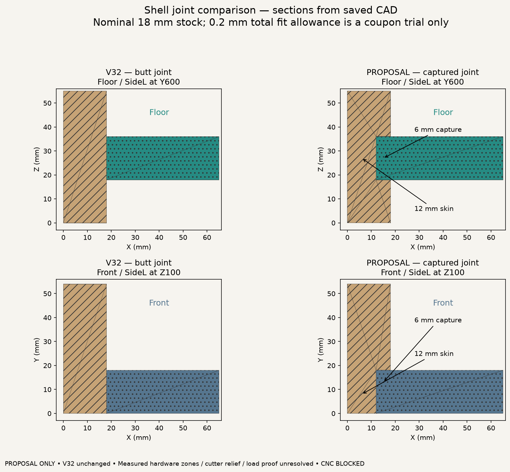
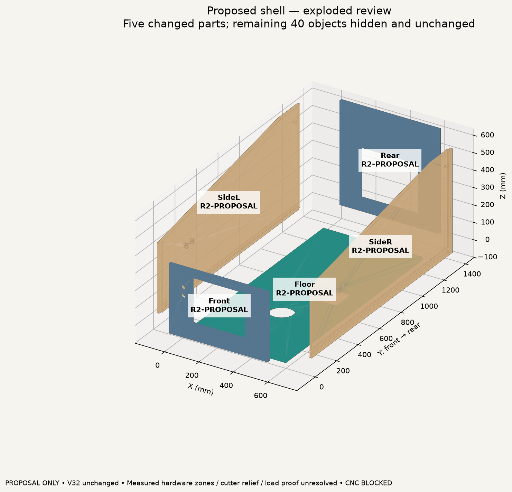
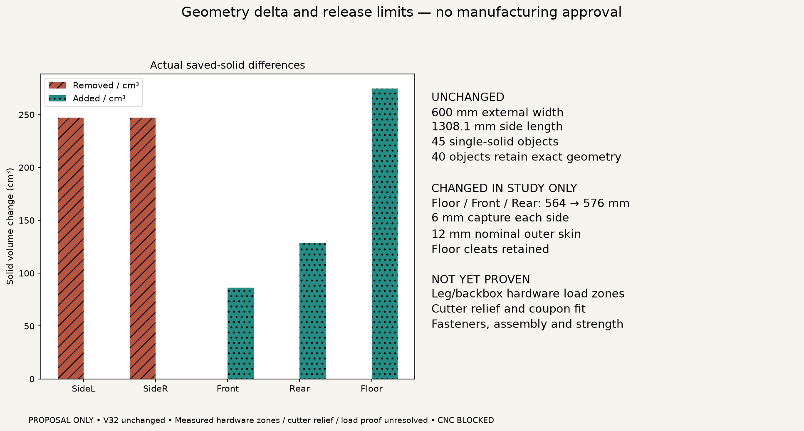

> Historical study retained. CURRENT captured-joint authority is [V33.5](STRUCTURAL_SIMPLIFICATION_V335.md): 4 mm nominal side capture, measured-stock/coupon fit hold, hardware-dependent underside pockets. Earlier proposal dimensions/status are not current manufacturing release.

# Captured lower-shell study — V32 comparison

[English](JOINERY_STUDY_V32.md) · [Português (Brasil)](pt-BR/JOINERY_STUDY_V32.md)

**PROPOSAL_NOT_ADOPTED — published V32 remains unchanged — CNC BLOCKED.**

This implements the first virtual experiment in the [joinery proposal](CABINET_JOINERY_PROPOSAL.md), not a new approved architecture or manufacturing revision. It tests whether the five shell panels can locate one another while retaining the current exterior and all internal packaging.

## Review images

The exploded view separates parts for identification; it does not prove the complete assembly motion or tool/hand access. The 40 unchanged objects are hidden only in that view, not removed from the study FCStd.

## Explicit geometry changes

| Part | V32 | Study candidate |
|---|---|---|
| SideL / SideR | Butt-joint shell | Inner 6 mm floor groove and open end rabbets; nominal 12 mm outer skin retained |
| Floor | 564 mm wide, X18..582 | 576 mm wide, X12..588; 6 mm engagement per side |
| Front | 564 mm wide, X18..582 | 576 mm wide, X12..588; original coin/control openings retained |
| Rear | 564 mm wide, X18..582 | 576 mm wide, X12..588; original access opening retained |
| Other 40 objects | Existing V32 | Exact saved-solid geometry retained |

External width remains 600 mm; side length remains 1308.1 mm. Front/rear outside heights, shelf positions, PCBase, fan locations, crossmembers, guides, display envelope and monitor supports are unchanged. Floor cleats remain; this experiment does not delete a load path merely because the groove exists.

The floor groove spans Y18..1290.1 and Z17.9..36.1: 18.2 mm trial width around an 18 mm panel. End-panel rabbets allow 0.1 mm inward clearance in Y. They are open at the cabinet ends/top profile; the front rabbet avoids a thin stopped lip above Front. These are ideal sharp-corner CAD cuts. Cutter-radius relief at intersecting grooves/rabbets is **not yet designed**, so these files are not toolpaths.

The five existing part identities are retained. `ProposedRevision=R2-PROPOSAL` distinguishes this experiment; it is not an accepted R2 and does not allocate new permanent codes. Nominal stock is deliberately fixed to the existing 18 mm V32 baseline; changing stock requires a complete parametric regeneration, not editing this experiment's stock field alone.

## Verification

`make review-joinery` reads the committed V32 FCStd, generates a separate study document, reopens it and checks actual solids. It never edits V32 or the owner's historical master.

- **45 valid single-solid objects**, same identities and bilingual names.
- Exactly five changed interfaces and **40 geometrically unchanged objects**.
- No positive-volume pairwise intersection above 0.01 mm³.
- Actual capture voids, mating engagement, retained outer skin and original panel holes checked geometrically.
- **28 checks pass**, plus four negative controls: thin skin, changed shelf, filled coin-door opening and missing capture groove.
- [Validation report](../exports/generated/joinery-study-v32/validation.json) lists exact removed/added volumes and before/after bounds for every changed part.

No strength claim follows from these checks. A 12 mm residual is the proposed nominal section, not a demonstrated capacity. Existing hardware reference bores are preserved; this does not establish clearance to real leg plates, washers, bolts or hinge load zones.

## Remaining gates and next sequence

1. Review the captured-joint direction visually; do not adopt it silently into V32.
2. Obtain measured leg/bracket and backbox mounting/load-zone envelopes before deciding whether these grooves may run continuously. That clearance is **BLOCKED_UNMEASURED**; no historical bracket envelope is substituted as proof.
3. Define cutter radius and local corner relief together with actual stock/coupon results. Do not deepen grooves to make a bad fit assemble.
4. Detail CNC-prelocated fastening and the dry-fit sequence, then verify strength and retention. Physical sessions remain paused; no test completion is implied.
5. Only after acceptance and validation, migrate the source geometry into the next approved architecture and retire superseded interfaces deliberately.

The lighting matrix remains a separate [owner intent](LIGHTING_INTENT_V32.md): exact panels, arrangement, power and service clearance are unresolved. No guessed LED envelope or gas strut was added to this study.

## Reproduce / download

- `make review-joinery` — build, saved-solid verification, negative controls and three English figures.
- [Study FCStd](../exports/generated/joinery-study-v32/captured-shell-proposal.FCStd).
- [Study parameters](../config/joinery_study_v32.json).
- [Source](../tools/joinery_study.py).

This package is engineering evidence, not CNC release. Original material: CERN-OHL-S-2.0. Preserve [LICENSE](../LICENSE), [NOTICE.md](../NOTICE.md) and the official Source Location: https://github.com/advpeterrobinson-hash/vpin-cabinet.

Current [corner-relief inventory](CORNER_RELIEF_V32.md) distinguishes the tested replaceable guides from this captured-shell proposal. This proposal still has no final cutter relief.
