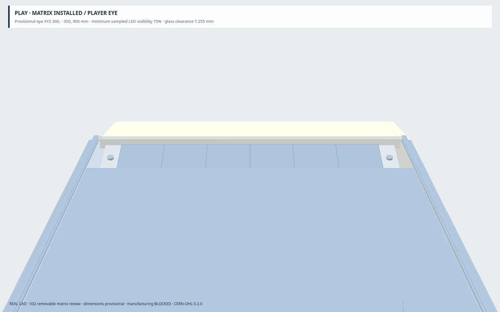
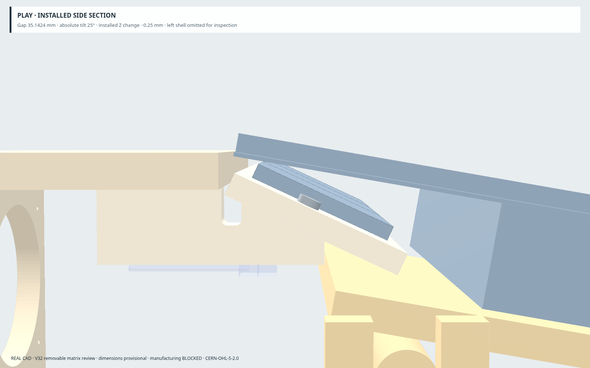
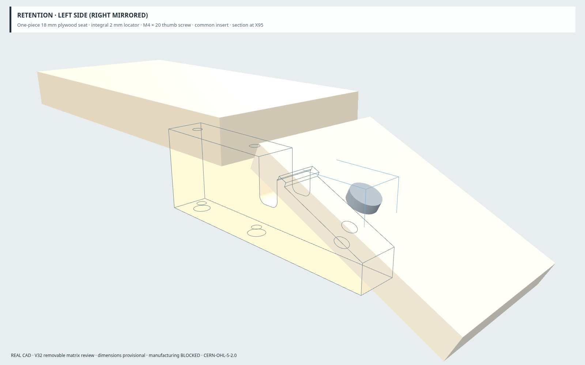
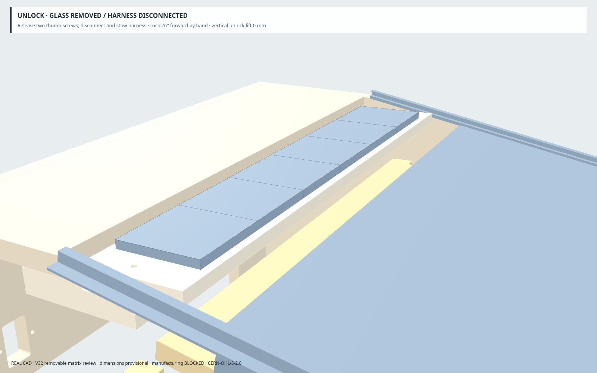
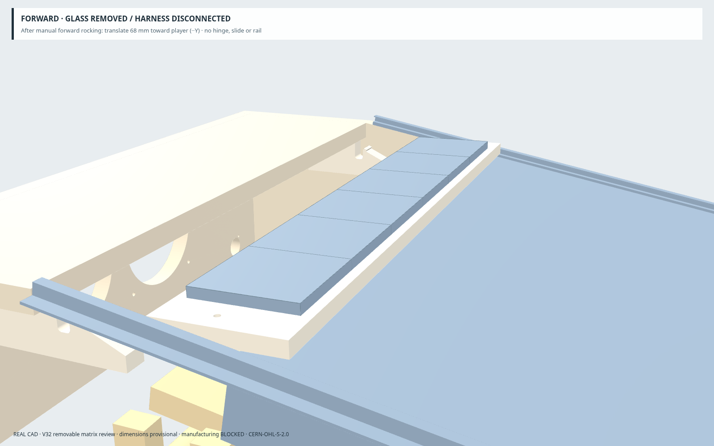
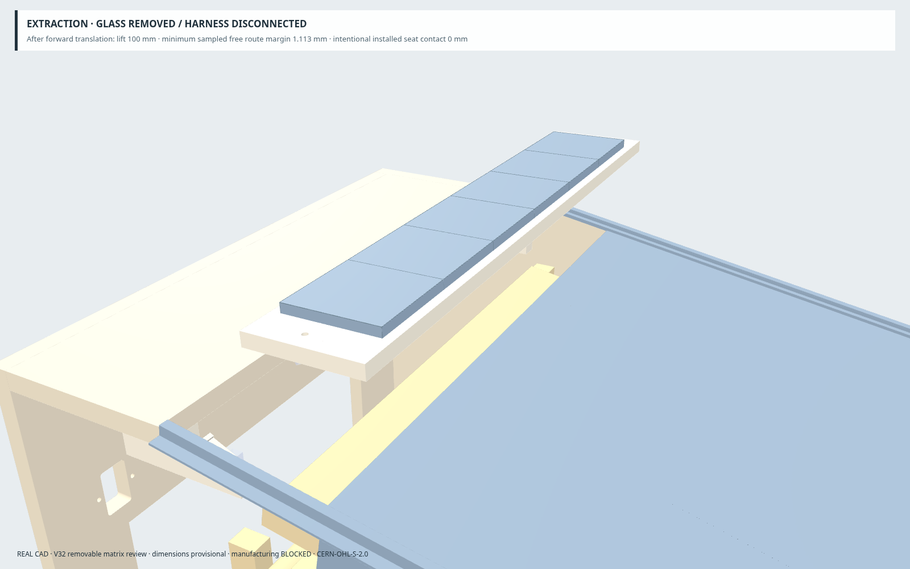
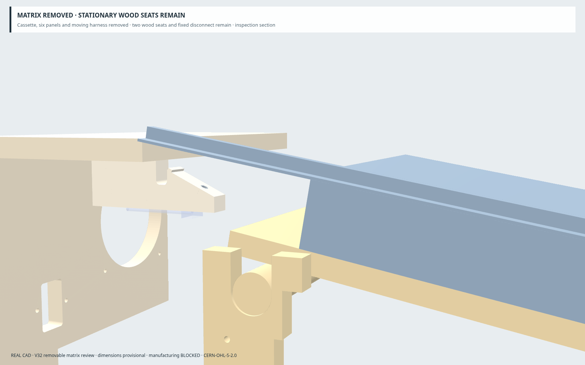
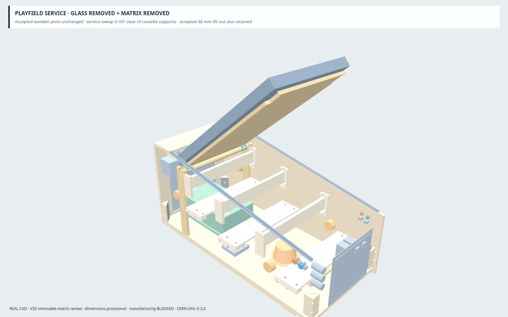
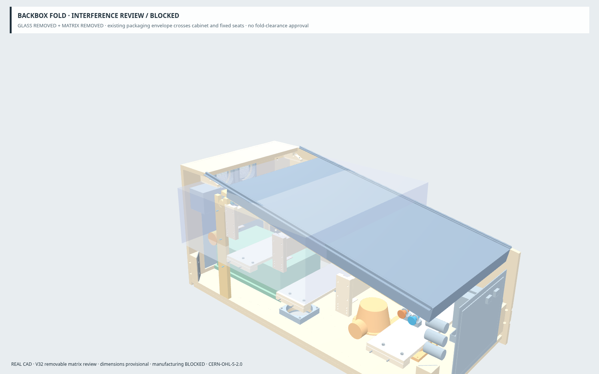
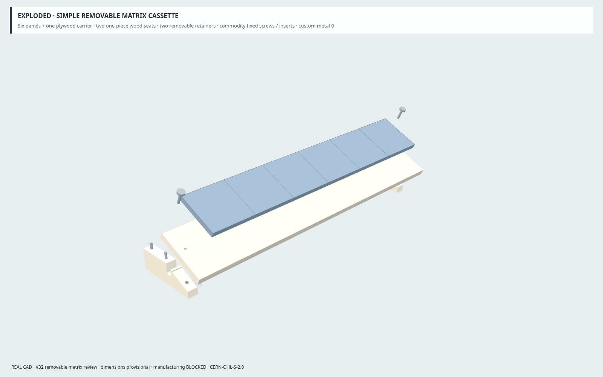

# CURRENT V32 — removable matrix cassette review

> Follow-on [route-margin / backbox audit](MATRIX_ROUTE_BACKBOX_AUDIT_V32.md): the accepted cassette remains unchanged. Small refinements do not achieve the later 3 mm route target. The source backbox floor intersects accepted glass channels at 0°, stopping fold validation. Earlier route results below are geometric review evidence, not manufacturing tolerance approval.

HEAD BEFORE: `80e0cfd1665fe6b476d069f6ef03a24cad804899`.

The matrix is installed for PLAY. The explicit maintenance sequence is **GLASS REMOVED → release two retainers and disconnect harness → MATRIX REMOVED → PLAYFIELD SERVICE / LIFT-OUT**. Matrix removal is also mandatory before considering backbox folding, but the current backbox envelope **does not pass** the fold screen even without the cassette. The fold pose is an interference review, not an approved transport state.

This follows the accepted positioning study without repeating its gap/tilt optimization. No accepted playfield, wooden pivot, button, fan, shelf layout, PCBase, SSF, rear-door or hinge architecture is redesigned. This is CAD review geometry, not manufacturing authority.

## Installed module

|Item|Current review value|
|---|---|
|Longitudinal playfield-to-carrier gap|35.142373 mm, unchanged definition from the previous study|
|Absolute carrier tilt|25°|
|Carrier front upper datum XYZ|300, 1033.614476, 546.327383 mm|
|Change from previous candidate|Z −0.25 mm only; X/Y/tilt unchanged|
|Carrier rearward bound|Y 1125.125 mm|
|Replaceable plywood carrier|540 × 95.375 × 12 mm|
|Panel reference|Six nominal 79.375 × 79.375 mm panels; 8 mm thickness is a provisional packaging reserve|
|Panel dimensional discrepancy|476.25 mm panel sum versus 469.9 mm stated overall; OPEN, no invented correction|
|Minimum sampled visibility|75% minimum; samples 75%, 75%, 81.25%, all unchanged from the previous candidate|
|Glass clearance|7.254856 mm|
|Manufacturing authority|None; confirm actual panels, thickness, connectors and attachment pattern|

The prior player-eye samples are retained: cabinet XYZ (220, −250, 750), (300, −350, 900), (380, −450, 1050) mm. The original provisional cabinet-bottom-to-ground assumption and 16-row × 6-panel sampling remain unchanged. Visibility is a CAD sampling result, not an optical certification. Panel-specific attachment holes belong on the replaceable carrier, not permanent cabinetry. Arnoz MX-DONNY electrical architecture is unchanged.

## Simple location and retention

Two one-piece CNC plywood seats, nominal 18 mm thick, support and locate the cassette. Each has an integral 2 mm locating tongue entering an open-ended underside groove in the carrier. Carrier grooves are 19 mm wide, 2.5 mm deep, and open through the rear edge; their closed ends use a design-provisional R3 cutter radius. The seat relief also has provisional R3 inside corners. No dogbones, rails, slides, hinges or custom metal mechanisms are added.

Seat stock occupies X36–54 and X546–564 mm. The profile extends Y1075–1190 mm; its lower datum is Z540 mm. Rear mounting lands meet the existing BACKBOX_BASE underside at Z578.9 mm. The shallowest forward solid wood height is approximately 12.4 mm before the sloping seat rises toward the rear. The carrier remains one plywood solid, each seat remains one plywood solid, and the six panels move with the carrier as one service module.

Two common **M4 × 20 thumb screws**, one per side, retain the cassette. Provisional head envelope Ø12 × 4 mm; two ordinary M4 threaded inserts in the wooden seats provide the mating threads. These are commodity hardware reservations, not a selected manufacturer's dimensions. Threaded insert body is provisionally Ø6 × 8 mm; actual purchase governs final pilot diameter. The retainer head-seat datums are approximately XYZ (45, 1083.461404, 569.571387) and (555, 1083.461404, 569.571387) mm. Their locations allow complete axial withdrawal before hand removal toward the player. The two retaining screws are the only fasteners released for cassette service.

The stationary seats use four common **4 × 50 mm countersunk wood screws**, two per seat, from inside/underneath. Head datums are X45/555, Y1140/1180, Z540 mm. The CNC support has Ø4.5 clearance holes and flush countersinks; BACKBOX_BASE receives only four new Ø3 × 12 mm blind pilots from its underside. Tips end at Z590 mm: 11.1 mm engagement and 6.9 mm remaining wood before the top surface. The blind pilot leaves 6 mm intact. No existing cabinet cut is moved and no hole breaks through the outer face. This is the sole change to an existing panel, required to attach the independent matrix module; the rear shelf outline, position and all previous machining remain unchanged.

Counts: **2 wood locating supports; 2 service retainers; 2 commodity threaded inserts; 4 fixed support screws; 0 custom metal parts.** Hardware dimensions and retention/load capacity remain purchase/freeze gates. No glue or friction-only retention is assumed.

## Actual removal route

1. Remove the glass; leave the backbox upright.
2. Unscrew the two accessible thumb screws. Each withdraws 20 mm along its own axis, then comes forward by hand. The complete screw-removal paths are checked; the axial endpoint has about 3.04 mm clearance to the backbox envelope. No access behind the matrix is required.
3. Disconnect the harness at the front-accessible zone below the left rear shelf. Pull the moving half 24 mm forward, raise 8 mm, return it 24 mm rearward, then raise another 8 mm to its moving stow envelope. The 1 mm sampled unplug/stow route is clear. Recollect the service loop with the carrier before moving it.
4. With the carrier supported by hand, rock it **26° forward** around its upper rear edge as a manual handling reference. There is no physical hinge. Initial vertical unlock lift is **0 mm**; the integral tongues leave the rear-open grooves during this motion. Absolute carrier angle becomes −1°.
5. Translate the cassette **68 mm forward (−Y)**.
6. Lift **100 mm vertically** to the extraction pose, then carry the complete module away. The reverse sequence reinstalls it.

The geometric forward threshold ahead of the backbox obstruction is **65.953581 mm** after rocking. A 65 mm translation fails the subsequent vertical lift; 66 mm clears with only about 0.046 mm rear-plane allowance. At the tested 1 mm resolution, **67 mm** is the first travel with at least 1 mm allowance. The selected **68 mm** gives 2.046419 mm at that rear plane. This allowance is distinct from the smaller route-wide clearance below. `removal-route-limits.json` records the actual-CAD extraction controls.

Priority A was explicitly tested at initial vertical lifts **5, 10, 15, 20 and 25 mm**, followed by 0–100 mm forward travel. Every candidate fails against the accepted playfield envelope; the higher lifts also encounter the backbox envelope. This supports the simpler manual rocking route rather than additional hardware.

The chosen cassette route has **no sampled solid interference**. Sampling is every **0.25°** while rocking and **1 mm** during forward/upward motion, 275 poses in total. The minimum unintended-obstacle clearance is **1.112788 mm**. Installed wood seating is intentional zero-distance contact and is reported separately. All contacts are still screened for positive-volume penetration; wood seats are not silently excluded from collision checks. This is a finely sampled CAD route, not an exact continuous swept-volume certification. Manufacturing allowances must be confirmed with actual material, finish and hardware.

## Harness zone

One deliberate disconnect is at nominal XYZ **(70, 1110, 536) mm**. Its complete provisional connector reservation is **18 × 20 × 12 mm**. The moving half stows at center **(70, 1110, 552) mm** before cassette motion. Reserve **200 mm service loop**, provisional cable OD4 mm and minimum bend radius15 mm. The modeled U-loop centerline is approximately197.1 mm plus termination allowance; it moves out with the cassette. Actual wire count, connector type and bend requirements remain unselected.

The stationary connector/cable remains below the rear shelf, behind the playfield sweep. Moving strain relief belongs on the replaceable carrier; stationary strain relief belongs on the fixed seat side. Final tie/strain-relief attachment details follow confirmed panel connectors. No harness is cut, permanently trapped or routed through the accepted lift-out sweep. Connector movement, stowed moving connector and the bend/loop envelope participate in collision checks. The route-wide ≥1.113 mm sampled free-obstacle margin includes the moving harness; intentional connector mating contact at the start is not presented as a clearance.

## Explicit CAD and viewer states

|State|Declared prerequisites / meaning|
|---|---|
|PLAY / MATRIX INSTALLED|Glass and cassette installed; two retainers engaged|
|MATRIX UNLOCK|GLASS_REMOVED + RETAINERS_RELEASED + HARNESS_DISCONNECTED; cassette rocked forward|
|MATRIX FORWARD|Same prerequisites; 68 mm forward position|
|MATRIX EXTRACTION|Same prerequisites; final 100 mm lift|
|MATRIX REMOVED|GLASS_REMOVED + MATRIX_REMOVED; stationary seats/harness remain|
|SERVICE / PLAYFIELD SERVICE|GLASS_REMOVED + MATRIX_REMOVED; accepted 50° endpoint|
|LIFT-OUT|GLASS_REMOVED + MATRIX_REMOVED; accepted 48 mm endpoint|
|BACKBOX FOLD|GLASS_REMOVED + MATRIX_REMOVED; 90° interference-review endpoint, BLOCKED|
|MATRIX EXPLODED|Review only; cassette/support components separated|
|EXPLODED|Original accepted wooden playfield mechanism review retained|

State prerequisites are stored in the saved FreeCAD documents and viewer metadata. CAD and browser negative controls reject SERVICE/LIFT/FOLD with MATRIX_REMOVED omitted. The viewer also requires GLASS_REMOVED. Selecting a service state displays the required sequence; absent matrix geometry is never silently treated as a valid installed configuration.

After cassette removal, the complete accepted playfield is screened through **0–50° SERVICE at 1°** and **0–48 mm unseat/lift-out at 1 mm**, with the stationary matrix seats, fasteners, fixed connector and cable retained. Current modeled physical obstacles are included. See `after-removal-motion.json` and `regression-validation.json`.

**Backbox fold clear: NO.** The unchanged coarse `PF_BackboxCheckEnvelope` is swept 0–90° in 1° steps about the accepted WPC reference datum. It already intersects accepted glass channels at 0° and cabinet sides/rear shelf at early angles without any matrix. Stationary matrix support hardware also enters that reserved sweep. `validation.json` separates baseline conflicts from added-support conflicts. The model lacks the detailed measured backbox lower structure/monitor carriage needed to resolve these packaging-volume overlaps. They are not evidence that a physical purchased hinge necessarily collides, but they prevent a clearance approval. Nothing is omitted or redesigned to produce a false pass.

## Preserved boundary and verification

All accepted baseline CAD/export files and the hinge config retain their accepted-HEAD hashes. Every accepted PLAY solid is geometrically identical in the new assembly except the four explicitly scoped blind matrix-support pilots. The playfield base/notches, button XYZ, Ø32 wooden dowel/live expression, cradles and screws, 48 mm lift, floor/rear120 mm fans, filters, S1/S2/S3, PCBase, rear door/power/RJ45 and SSF positions are unchanged. Negative translated-geometry controls prove the regression comparisons detect changes.

The 600 / 780 mm width datums, 59.8375 mm hinge inset and WPC reference axis are unchanged. No thermal analysis or unrelated architecture work is reopened.

Viewer remains one offline HTML, English/Original on every load, with the accepted PT-BR dictionary, Accessible palette and selection edge implementation retained. Only new matrix states, labels, camera presets and prerequisite checks are added. Existing translation entries and palette/selection/language implementations are checked against the accepted source. Palette/language changes are verified to preserve geometry bytes in old and new states.

Authoritative files: `config/matrix_cassette_v32.json`, `tools/matrix_cassette_v32_entry.py`; review CAD/meshes/results: `exports/generated/matrix-cassette-v32/`; current viewer: `exports/generated/viewer-v32/index.html`.

Rebuild in this order:

```sh
freecadcmd tools/matrix_cassette_v32_entry.py
freecadcmd tools/check_matrix_cassette_v32.py
python3 tools/build_review_viewer.py
python3 tools/check_matrix_cassette_viewer_v32.py --reviews
```

Require `MATRIX_CASSETTE_PASS`, `MATRIX_CASSETTE_REGRESSION_PASS`, `MATRIX_CASSETTE_VIEWER_PASS` and ten `MATRIX_REVIEW_IMAGE_PASS` markers; the FreeCAD wrapper may return zero even for a Python exception. The build checks validate solids, route, sequencing and preservation, while recording the fold blocker. They do not assert that every requested operation or manufacturing gate is clear.

**MANUFACTURING BLOCKED:** physical matrix panel/thickness/connector/hardware confirmation; physical WPC hinge measurement and detailed backbox fold resolution; CNC stock/tool/fit parameters; and remaining manufacturing freeze gates. No intermediate physical cabinet prototype is introduced.

## Ten real CAD review views











