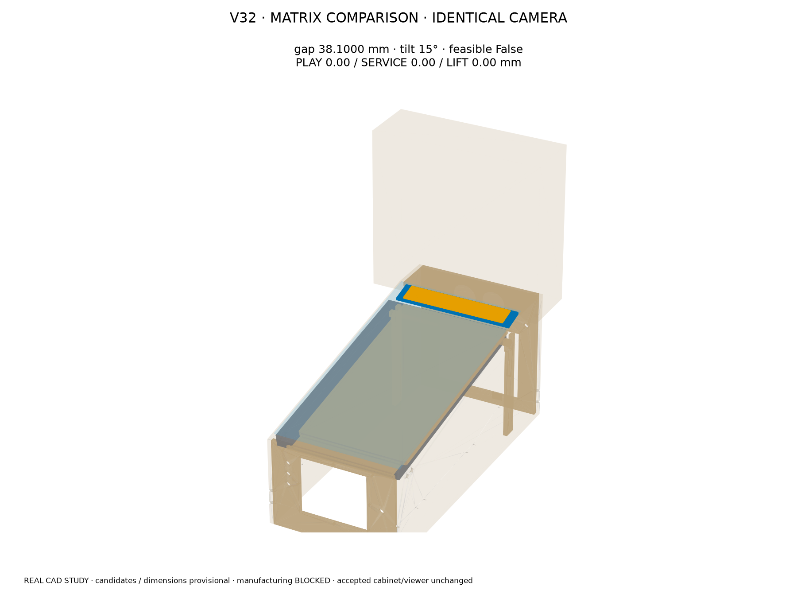
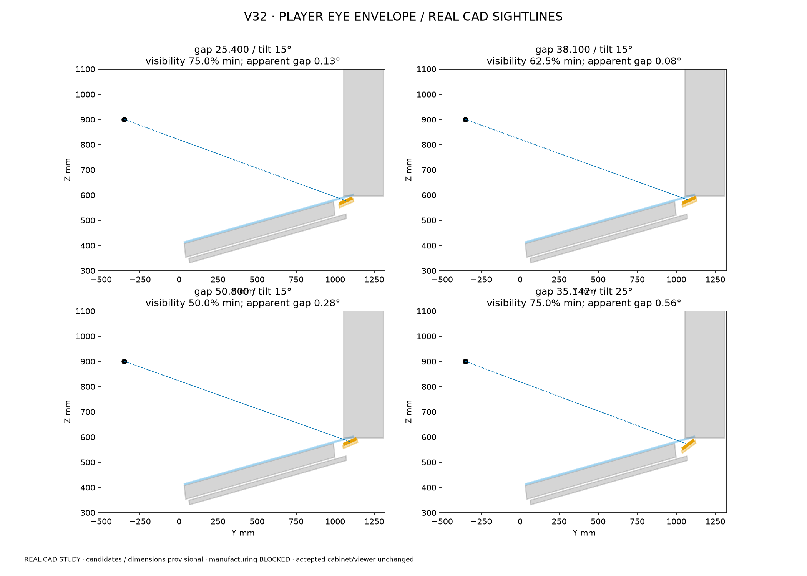
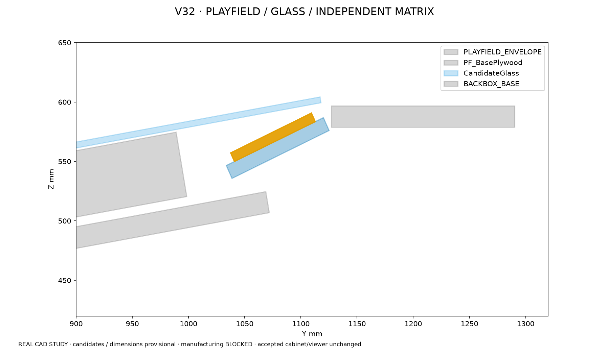
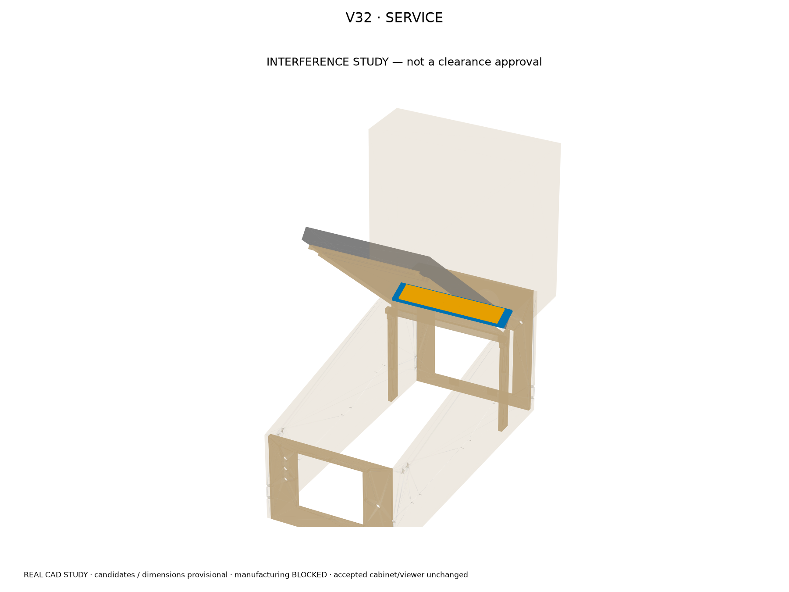
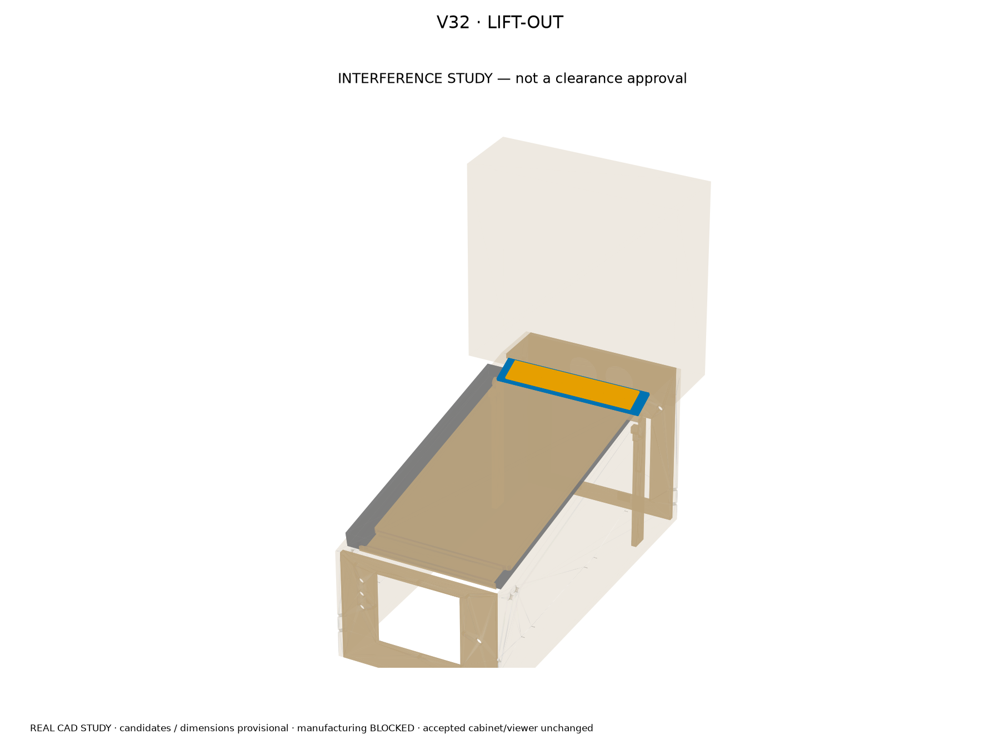
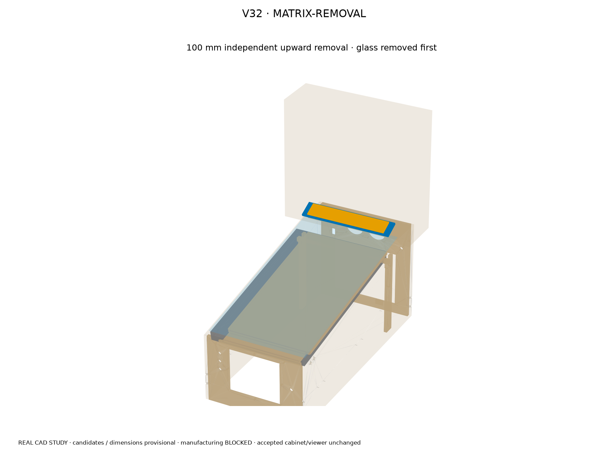
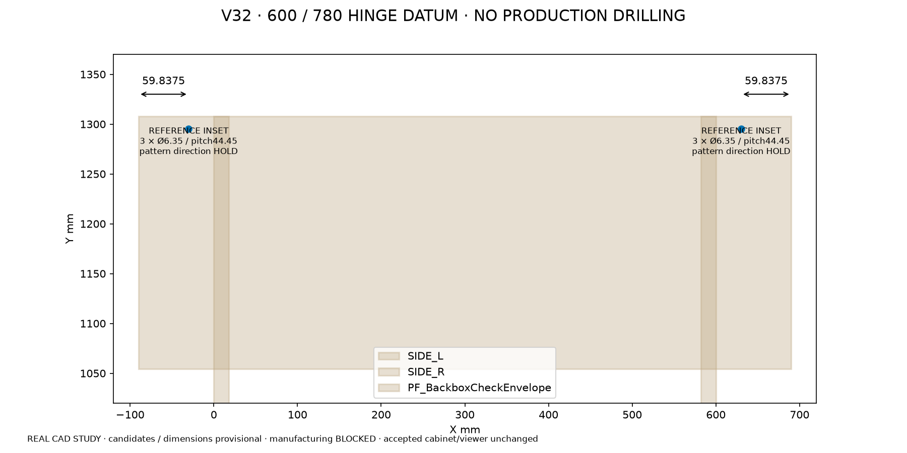

# CURRENT V32 — hinge datum cleanup and matrix positioning study

HEAD BEFORE: `80748804bf624d9a5c7c32d8d688da4b1318dccf`

Accepted cabinet CAD and viewer are immutable inputs. This is an isolated comparison, not a replacement CURRENT model or manufacturing selection. Rebuild with `freecadcmd tools/matrix_hinge_study_v32_entry.py`, require MATRIX_STUDY_PASS, then run `freecadcmd tools/check_matrix_hinge_regressions_v32.py` (require MATRIX_REGRESSION_PASS), `freecadcmd tools/save_matrix_review_poses_v32.py` (require MATRIX_POSES_PASS), and `uv run --with matplotlib python tools/render_matrix_hinge_study_v32.py`.

## Hinge reference

600 mm cabinet / 780 mm backbox; `(780−600−60.325)/2 = 59.8375 mm` from each OUTER backbox-floor side. Cabinet pivot reference Ø12.7, rear offset38.1, bottom height508.0. Floor reference 3 × Ø6.35 per side, pitch44.45, row approximately12.7 from rear. These are reference datums only; no CNC hole pattern is frozen or new metal made. WPC 01-9011-L/R, 2 ×02-4352 and 2 ×4322-01139-12B remain HF-006 early procurement. Physical assembly measurement is mandatory before CNC; conflicting 02-4352 listings cannot define body length, bracket bends or holes. No intermediate cabinet prototype.

## Matrix assumptions and measurements

Owner-provided Emil Jurica / Way of the Wrench feedback is experienced-builder guidance, not a mandatory inch dimension. Six unchanged 79.375 mm nominal panels sum476.25; vendor stated469.9 remains a6.35 discrepancy. 8 mm thickness is a provisional packaging reserve, not a vendor fact. One540 ×95.375 ×12 mm plywood carrier is independent of the playfield. Panel mounting slots/commodity attachment interface remain hardware-confirmation items; no permanent cabinet recuts. MX-DONNY electrical architecture is unchanged.

Gap means longitudinal Y separation from the actual TV envelope rear bound, not a misleading closest 3D distance. Tilt is absolute above horizontal; the historical extra15° render is not adopted. The playfield/glass slope is unchanged. Rearward limits use carrier rearY1125.125 (2 mm before the existing rear shelf front datum). Glass clearance is derived from actual CAD. No old render position or angle is adopted.

Provisional adult eyes: cabinet datum XYZ (220,−250,750), (300,−350,900), (380,−450,1050), corresponding to1,500–1,800 mm eyes above ground with a provisional750 mm cabinet-bottom elevation. Sampling checks all16 row centers in each of6 panels from each eye through actual opaque CAD, with transparent glass. Percentages are sampled row visibility, not an optical certification. Apparent gap is angular separation in the central sightline; a small angle can hide physical gap but is not proof of serviceability.

## Every combination — mm except degrees/visibility

|gap|tilt|visibility min %|apparent gap range °|PLAY|SERVICE|LIFT48|matrix removal100|fold envelope|wiring|feasible|
|---:|---:|---:|---:|---:|---:|---:|---:|---:|---:|:---:|
|25.4000|10|68.8|0.05–0.26|7.916|0.000|0.000|7.243|0.000|18.000|NO|
|25.4000|15|75.0|0.01–0.29|8.930|0.000|0.000|8.022|0.000|18.000|NO|
|25.4000|20|81.2|0.28–0.63|10.521|0.000|0.000|9.525|0.000|18.000|NO|
|25.4000|25|68.8|0.54–0.95|12.000|0.000|0.000|11.742|0.000|18.000|NO|
|38.1000|10|50.0|0.22–0.48|0.000|0.000|0.000|0.000|0.000|18.000|NO|
|38.1000|15|62.5|0.08–0.21|0.000|0.000|0.000|0.000|0.000|18.000|NO|
|38.1000|20|68.8|0.06–0.45|0.000|0.000|0.000|0.000|0.000|18.000|NO|
|38.1000|25|75.0|0.32–0.77|0.136|0.000|0.000|0.000|0.000|18.000|NO|
|50.8000|10|37.5|0.39–0.69|0.000|0.000|0.000|0.000|0.000|18.000|NO|
|50.8000|15|50.0|0.06–0.42|0.000|0.000|0.000|0.000|0.000|18.000|NO|
|50.8000|20|56.2|0.02–0.27|0.000|0.000|0.000|0.000|0.000|18.000|NO|
|50.8000|25|68.8|0.10–0.59|0.000|0.000|0.000|0.000|0.000|18.000|NO|
|30.6431|10|62.5|0.12–0.35|2.593|0.000|0.000|2.000|0.000|18.000|NO|
|31.4219|15|68.8|0.03–0.21|2.841|0.000|0.000|2.000|0.000|18.000|NO|
|32.9255|20|75.0|0.15–0.52|3.000|0.000|0.000|2.000|0.000|18.000|NO|
|35.1424|25|75.0|0.37–0.81|3.034|0.000|0.000|2.000|0.000|18.000|NO|

Zero distance with listed hits is a collision, not an acceptable tangent. Detailed per-candidate object hit lists are in validation.json. PLAY includes current shell/lockdown/side solids; glass plane checks include reserved panel thickness. SERVICE samples0–50° every2°; LIFT samples0–48 mm every2 mm; independent matrix removal samples0–100 mm every10 mm with glass removed. These are sampled motion screens, not continuous exact swept-volume certifications.

Backbox fold uses the real accepted PF_BackboxCheckEnvelope rotated0–90° every5° at the WPC reference pivot, not nonexistent detailed measured hardware. Cable opening/backglass interior and true bracket/bend offsets are absent from this accepted CAD, so their detailed clearances remain UNVERIFIED even if a packaging sample clears. Backbox must be upright and isolated during matrix removal. Full hardware fold verification remains blocked.

Wiring uses a provisional40 ×30 ×20 mm connector/bend reservation below the rear shelf, behind the moving playfield. Collision results must not be accepted as a valid harness route. The connector reservation is below the rear shelf and behind the moving playfield; each candidate also screens it against SERVICE/LIFT motion. A complete selected-harness bend/strain-relief route and removable keyed disconnect outside the lift-out corridor still require confirmation; no harness is cut or trapped by this study. Four Ø8 ×50 mm provisional top-driver probes check access on the carrier margins with glass removed. Mounting is not frozen before measured panels and lower-backbox interfaces. Rear airflow study is preserved without reopening thermal adequacy; no new duct or thermal claim.

Tool and unchanged-airflow-route clearance / hits for each combination are recorded in validation.json. Glass is removed for matrix access, but the accepted playfield remains installed. Candidate carrier attachment to the cabinet/lower backbox requires measured mating hardware; no permanent hinge or panel holes are generated.

## Best review candidate

Gap 35.1424 mm; tilt 25°; rearward offset relative to25.4-mm baseline 9.7424 mm. This is the most rearward of the PLAY-clear, independently removable comparison candidates with the best minimum sampled visibility across the eye envelope. Tool reserve is11.938 mm clear, connector reserve18.000 mm clear, glass7.009 mm clear and the unchanged diagnostic airflow path53.829 mm clear for this candidate. **No fully feasible installed candidate was found.** This is only the most rearward comparison candidate, not a solved/approved assembly. Its installed service/lift/fold failures cannot be hidden by rendering or cleared by moving accepted parts.

The independent upward removal comparison is included. Removing the matrix before playfield service/folding is a possible sequence to review, not an owner-approved substitute for the failed installed-clearance requirements. No rejected candidate is installed into the accepted viewer/current cabinet.

## Regression / manufacturing

297 CAD checks passed; reopened-output and negative controls are in regression-validation.json: every accepted CAD solid unchanged, source exports and exact bilingual/palette/selection viewer bytes unchanged. Notches, buttons, floor fans/filters, rear fans, wood dowel/cradles/screws, shelves, PCBase, rear door and SSF exciter coordinates all retain accepted geometry. Historical engineering records stay historical; targeted current hinge texts and current entry-point supersession notices are corrected.

MANUFACTURING BLOCKED: physical hinge assembly measurement, actual matrix panel-set/thickness/connector confirmation, CNC shop stock/tool/clearance parameters and remaining freeze gates. No physical cabinet prototype or thermal re-analysis is added.

Actual combined review CAD poses are `service.FCStd`, `lift-out.FCStd` and `matrix-removal.FCStd` in the study directory; accepted pivot cylinder expressions remain live in these pose exports. pose-validation.json confirms them. Candidate snapshots and all views are review-only, not a manufacturing model.

## Real CAD reviews

