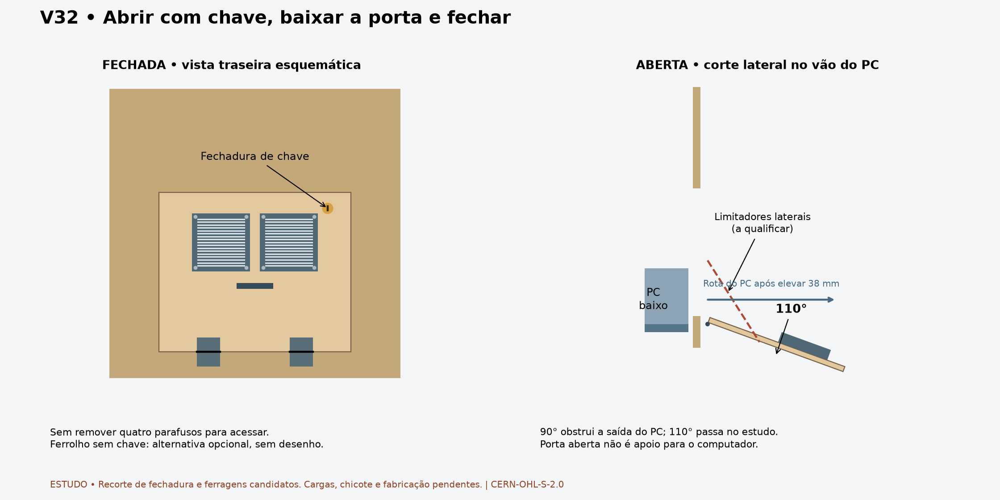

# V32 — porta traseira com chave, abertura para baixo

**Atualização:** [fans fixos acima da porta, energia/Ethernet, piso e furação candidata da lockdown](FIXED_REAR_SERVICES_V32.md). Fans não acompanham mais a porta nesta proposta.

A instrução do proprietário substitui a tampa removível por **uma porta com dobradiças e fechadura de chave**. A rotina passa a ser destravar, baixar, fazer a manutenção, subir e trancar. Não é necessário remover quatro parafusos nem desconectar as ventoinhas a cada abertura. O chicote deverá acompanhar o movimento.

## Direção funcional

**Desenho aprovado pelo proprietário em 2026-09-30. Limitadores opcionais.** A abertura para baixo foi verificada até **110° em relação à posição fechada**; esse ângulo é uma posição testada, não um batente obrigatório. A posição horizontal de90° foi comparada e rejeitada para retirada completa do PC: os fans e suas fixações ficam no caminho do conjunto baixo. A110°, a rota excepcional já estudada — levantar38 mm e deslocar500 mm para trás — passa com a porta aberta, sem removê-la. Isso é evidência geométrica, não prova de que todo reparo é acessível ou de que uma pessoa consegue manusear o PC nessa rota.

Mantidos PCBase baixo, prateleiras aprovadas, perfil das laterais e abertura traseira340 ×293 mm. A folha permanece396 ×329 ×12 mm. Duas ventoinhas com grades acompanham a porta. O puxador foi elevado deZ130 paraZ190; a fechadura fica à direita, X450/Z350, com acesso externo à chave.

O ferrolho simples sem chave fica como **alternativa opcional que o montador pode instalar por conta própria**, conforme pedido. Não há modelo, furos ou instruções de instalação de ferrolho neste pacote.

## Fechadura e recorte

O novo CAD contém o recorte candidato da fechadura: perfil circularØ19 limitado por duas faces planas a17 mm entre si, atravessando a folha12. Centro X450/Z350. Esse perfil evita representar uma montagem que depende apenas de atrito contra rotação. **É uma escolha de estudo, não o desenho de uma fechadura comprada:** modelo, comprimento útil do corpo, porca, perfil antirrotação, curso da chave e distância da lingueta deverão ser confirmados antes da CNC.

Corpo, eixo e lingueta são volumes separados. A lingueta candidata tem35 mm de alcance a partir do eixo, fica por trás de um batente metálico fixo quando trancada e gira90° para a esquerda, em direção ao centro do gabinete, ao destrancar. Não gira para dentro da borda direita da abertura. O teste com a lingueta trancada impede a abertura já a2°; destrancada, a passagem fica livre nas amostras verificadas.

O modelo não reproduz os segredos internos, a chave física, roscas helicoidais ou a fixação real do batente. São interfaces a qualificar, não alegação de segurança contra arrombamento.

## Dobradiças, limitadores e chicote

Eixo horizontal candidato: Y1324,1/Z54. Duas dobradiças com faixas X180..228 eX372..420. O deslocamento do eixo para fora acomoda a folha sobreposta e permite a rotação. O estudo representa folhas, articulações e pinos separados, com passagens candidatas nas folhas metálicas. Não é indicação para comprar qualquer dobradiça plana: montagem sobreposta, afastamento do eixo e capacidade precisam corresponder à ferragem escolhida.

Os pontos candidatos das passagens metálicas são X190/218 e382/410, emZ36 na folha fixa eZ72 na folha móvel fechada. Pilotos/fixações na madeira aguardam comprimento e ferragem reais. O conjunto deverá chegar pronto para montagem com ferramentas comuns, sem fabricar dobradiças em casa.

O proprietário tornou os limitadores opcionais e pediu para não investir tempo no detalhamento desse acessório. Não há furação, ancoragens ou cabos de limitador a fabricar no pacote atual. A porta será aberta raramente após a conclusão.

Para proteger a pintura, o proprietário pretende colar um feltro protetor de cadeira no contato real entre o miolo da fechadura e a parte inferior do gabinete. Ponto e ângulo desse contato serão conferidos na montagem; não foram medidos no CAD. O feltro é proteção superficial, não foi tratado como trava ou suporte estrutural. O movimento além de110° e a posição livre de repouso não foram validados. Isso não reabre a aprovação funcional da porta nem torna o acessório opcional um bloqueio de projeto.

O chicote de baixa tensão das ventoinhas deverá ter folga e alívio de tração junto à região da dobradiça. Manter conector para desmontagem eventual, mas **não exigir desconexão na abertura habitual**. Ainda não foram modelados cabo real, raio de curvatura, posição do conector ou seu ciclo de flexão. Rede elétrica permanece na parte fixa, protegida.

A porta a110° ultrapassa a base inferior do corpo do gabinete; folga ao chão, pernas reais e espaço atrás da máquina ainda dependem da montagem. A prova geométrica interna não certifica essa folga externa.

## Alterações e evidência

Os20 objetos de fechamento antigo — parafusos, arruelas, receptores e seus parafusos de montagem — foram retirados da nova cena. Rear foi recuperado do estudo anterior aos pilotos desses receptores. A folha foi reconstruída sem os quatro furos de fechamento e sem os furos antigos do puxador. Furos de fans foram preservados, acrescentando o novo puxador e a fechadura. Os arquivos antigos continuam como evidência histórica, sem sobrescrita.

[CAD fechado](../exports/generated/rear-door-v32/rear-door-closed.FCStd) · [CAD aberto](../exports/generated/rear-door-v32/rear-door-open.FCStd) · [Relatório](../exports/generated/rear-door-v32/validation.json) · [Parâmetros](../config/rear_door_v32.json).

`bash tools/run_rear_door_v32.sh` exige `REAR_DOOR_PASS`: **14 verificações,194 sólidos por posição**, incluindo envelopes herdados. Validade e identidade ao salvar/reabrir; simetria das dobradiças; sólidos instalados; giro da lingueta0..90° e abertura0..110°, ambos amostrados a cada2°; rota excepcional do PC com porta aberta; preservação de laterais/prateleiras/PC e dos bytes dos arquivos de entrada. Controles negativos: porta trancada não abre e porta a90° obstrui a retirada do PC.

As amostras não comprovam movimento contínuo entre elas. Chicote real, contato final com feltro, ferramenta/mão/chave, ferragens de fixação, cargas, proteção/ventilação e condições de fabricação seguem pendentes. **A direção funcional é porta com chave; fabricação ainda não liberada.**

Renderizar: `uv run --with matplotlib python tools/render_rear_door_v32.py`.

Original: CERN-OHL-S-2.0. Preservar LICENSE e NOTICE.md. Source Location: https://github.com/advpeterrobinson-hash/vpin-cabinet.
