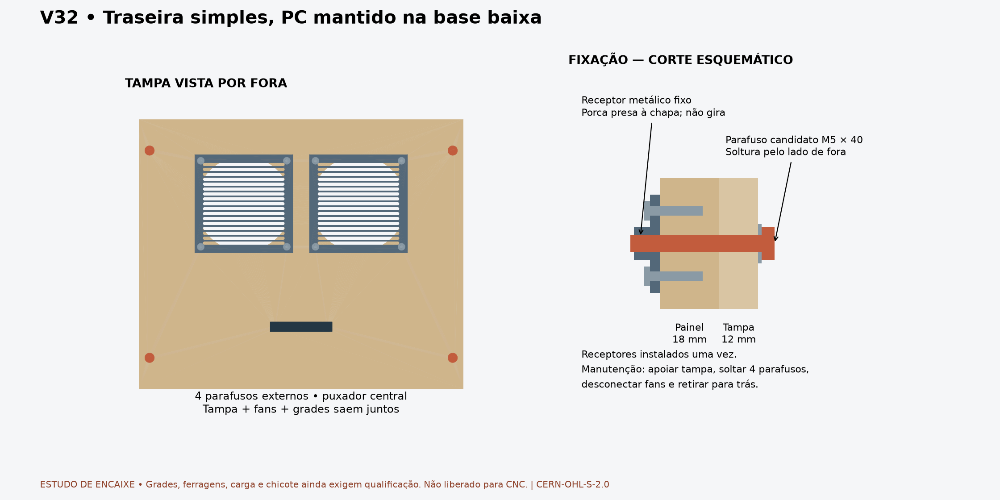

# V32 — fixação e manutenção da tampa traseira

**Fechamento anterior substituído em 2026-09-30:** o proprietário determinou [porta com chave e dobradiças, abertura para baixo](REAR_DOOR_V32.md). A tampa com quatro parafusos abaixo é histórica; não retomar como solução atual.

A tampa sobreposta ganha uma proposta completa de fixação geométrica: quatro parafusos externos, receptores metálicos que ficam no gabinete, puxador e grades dos dois lados das duas ventoinhas. O PC continua na base baixa aprovada. As prateleiras, laterais e abertura traseira permanecem nas posições existentes.

## Uso e montagem

Na montagem inicial, instalar os quatro receptores pela face interna do painel traseiro. Cada receptor é uma pequena chapa com porca presa e dois parafusos de montagem. Depois disso, a manutenção da tampa usa somente os quatro parafusos externos. Não há porcas soltas para segurar dentro do gabinete, corrediças ou dobradiça.

Sequência funcional proposta: desligar/isolar a alimentação; segurar a tampa pelo puxador antes de retirar o último parafuso; afastar apenas o necessário para acessar e desconectar o chicote de baixa tensão das ventoinhas; retirar o conjunto para trás e apoiá-lo. Não deixar a tampa pendurada nos cabos. A folga e a posição desse conector ainda precisam ser detalhadas: a trajetória de150 mm foi testada sem chicote conectado, não comprova que o cabo permite esse deslocamento.

O puxador serve para segurar a tampa; não é ponto de levantamento do gabinete. Os parafusos externos não foram representados como cativos: usar recipiente para não perdê-los. O desenho não inclui cabo de retenção. A capacidade de sustentação e o manuseio com uma mão ainda exigem prova física.

## Geometria candidata

Todas as dimensões abaixo são **decisões de estudo**, não especificações verificadas de ferragens compradas. Unidades mm; X transversal, Y para trás, Z para cima.

| Conjunto | Proposta |
|---|---|
| Tampa e abertura | Mantidas396 ×329 ×12 e340 ×293, respectivamente |
| Quatro parafusos da tampa | M5 ×40 nominal sob cabeça, arruelaØ12 ×1; eixosX115/485, Z92/345 |
| Receptores internos | Chapa20 ×30 ×3 com porca M5 presa; envelope externo da porcaØ10 ×5. O cilindro representa ocupação, não a forma real de uma porca hexagonal |
| Fixação de cada receptor | Dois parafusos candidatosØ3 ×16, aZ±10 do parafuso central; pilotoØ2 ×14 na madeira18, mantendo4 mm externos |
| Puxador | CentrosX268/332, Z130; afastamento32, seção12, barra externa10; dois parafusos candidatos M4 ×20 pela face interna da tampa |
| Ventoinhas | Referência120 ×120 ×25, centrosX230/370, Z280; entre-eixos de montagem105 |
| Grades | Quatro chapas120 ×120 ×1,5; rasgos oblongos100 ×4, passo6,17 rasgos por chapa |
| Fixação fan/grades/tampa | Quatro candidatos M4 ×50 por fan, arruelas externas/internas e porcas internas |

A chapa com porca presa deve chegar pronta do fornecedor/serralheria. Solda ou outra retenção permanente da porca, material, acabamento e resistência exigem qualificação; **o montador não deve soldar em casa**. Uma ferragem comercial equivalente pode substituir esse receptor depois de conferir o envelope e sua furação. Roscas helicoidais, travamento por vibração e torque não foram simulados. A interferência entre os oito parafusos para madeira e seus pilotos menores é intencional e excluída apenas na comparação com o painel receptor.

Há14 novas operações de madeira no relatório: quatro passagensØ5,5 no painel traseiro, oito pilotos cegos e duas passagensØ4,5 para o puxador na tampa. Os quatro furos da tampa e oito furos de montagem das ventoinhas já pertencem ao estudo anterior. A furação dos receptores e grades é separada, para fabricação/compra de ferragens. O planejamento não libera nenhuma dessas operações para CNC.

## Proteção e ventilação

As grades existem nos dois lados para evitar deixar a hélice diretamente exposta tanto fora quanto na área de serviço. A geometria de rasgos é original e serve para conferir montagem. **Não foi certificada contra acesso de dedos, deformação ou contato com pás.** Pode ser substituída por grade comercial qualificada, mantendo as verificações de profundidade e parafusos.

Área nominal dos rasgos: aproximadamente46,8% da chapa, antes de considerar a abertura circular da madeira, moldura/motor e segunda grade. Isso não é vazão nem prova de refrigeração: restrição, ruído, entrada de ar/filtro no piso e temperatura permanecem para a etapa térmica. Não inferir desempenho de duas ventoinhas apenas pelo tamanho120 mm.

Alimentação de rede elétrica permanece no gabinete fixo, em invólucro protegido. Apenas o chicote de baixa tensão das ventoinhas acompanha esta tampa. Entrada de rede/Ethernet, componentes escolhidos e conectores não foram recortados nesta etapa.

## Verificações e limites

[CAD separado](../exports/generated/rear-hardware-v32/rear-hardware-study.FCStd) · [Relatório](../exports/generated/rear-hardware-v32/validation.json) · [Parâmetros](../config/rear_hardware_v32.json).

`bash tools/run_rear_hardware_v32.sh` exige `REAR_HARDWARE_PASS`: **31 verificações,204 sólidos**, incluindo os envelopes herdados. Validade e identidade após salvar/reabrir; simetria dos receptores/grades/puxador; ausência de colisões instaladas fora dos pares declarados de rosca/madeira; engajamento axial nominal nas porcas; quatro corredores de ferramenta externos; retirada axial dos quatro parafusos/arruelas; translação contínua150 mm da tampa com fans, grades, puxador e fixações; preservação da rota excepcional do PC pelos receptores fixos. Controles negativos rejeitam piloto atravessante e movimento lateral da tampa com parafusos ainda presentes.

A simulação de translação não inclui mãos, flexibilidade de cabos ou soltura por rotação real de roscas. Não é prova de carga, vibração, dissipação térmica ou segurança da grade. Os parafusos auxiliares internos são de instalação, não fazem parte da rotina de abertura da tampa; o acesso humano inicial completo não foi validado.

Mudam somente Rear, RearDoor e os furos nos envelopes de fans **neste CAD novo**, além das ferragens candidatas. Os estudos anteriores permanecem byte a byte intactos. Render: `uv run --with matplotlib python tools/render_rear_hardware_v32.py`.

Próximas interfaces: conector/folga real do chicote; fixação do PC baixo; receptor da lockdown e retenção das canaletas; dobradiça/duas escoras cativas e SSF. Ferragens importadas continuam com conferência postergada pelo proprietário. Estoque, ferramentas, folgas, cupom, cargas e aprovação de fabricação permanecem necessários.

Original: CERN-OHL-S-2.0. Preservar LICENSE e NOTICE.md. Source Location: https://github.com/advpeterrobinson-hash/vpin-cabinet.
