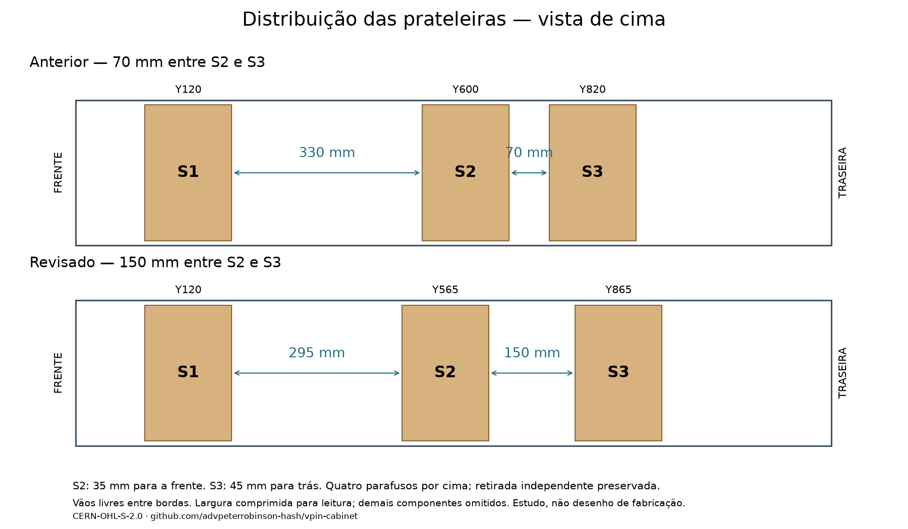
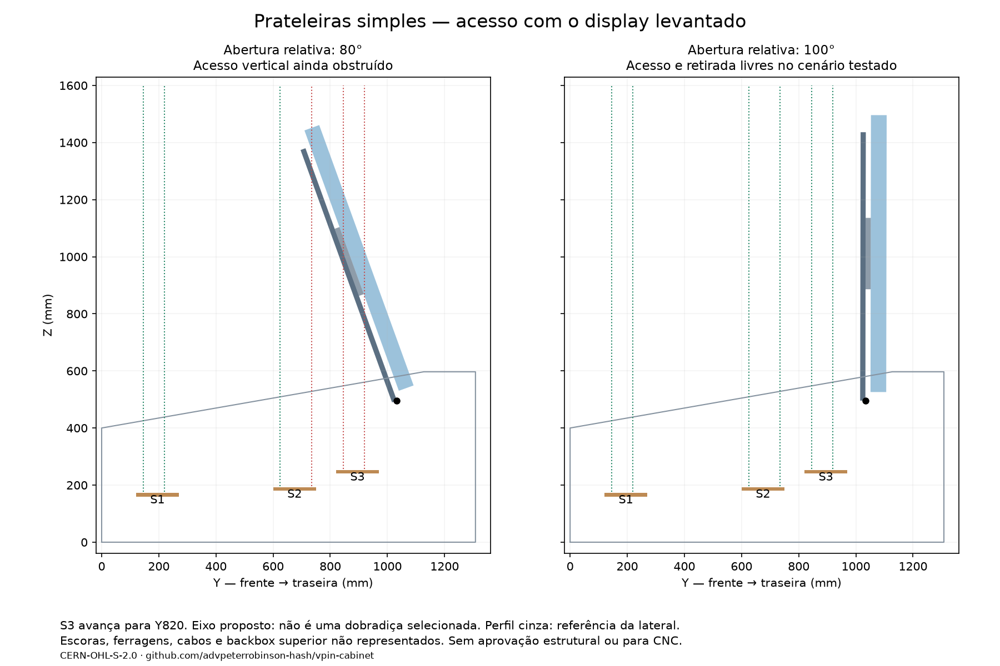
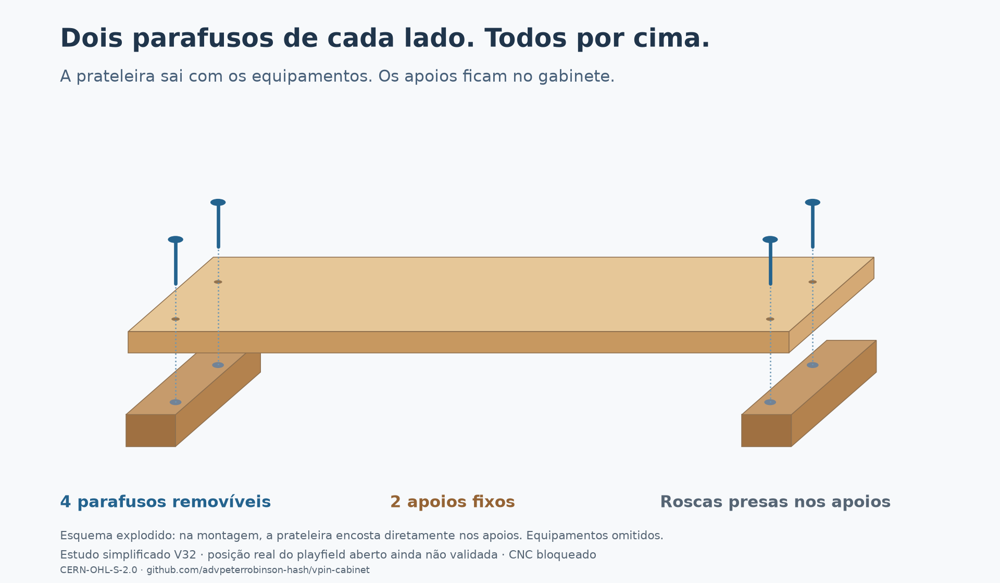
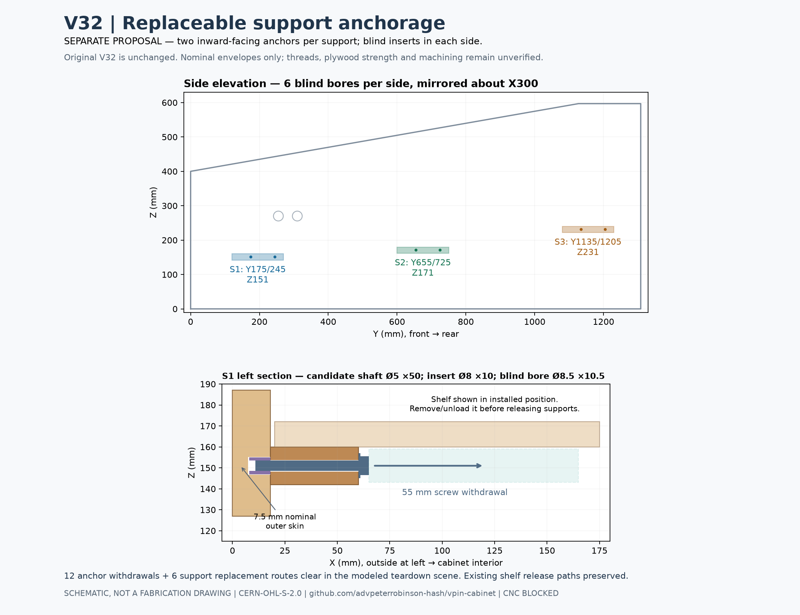
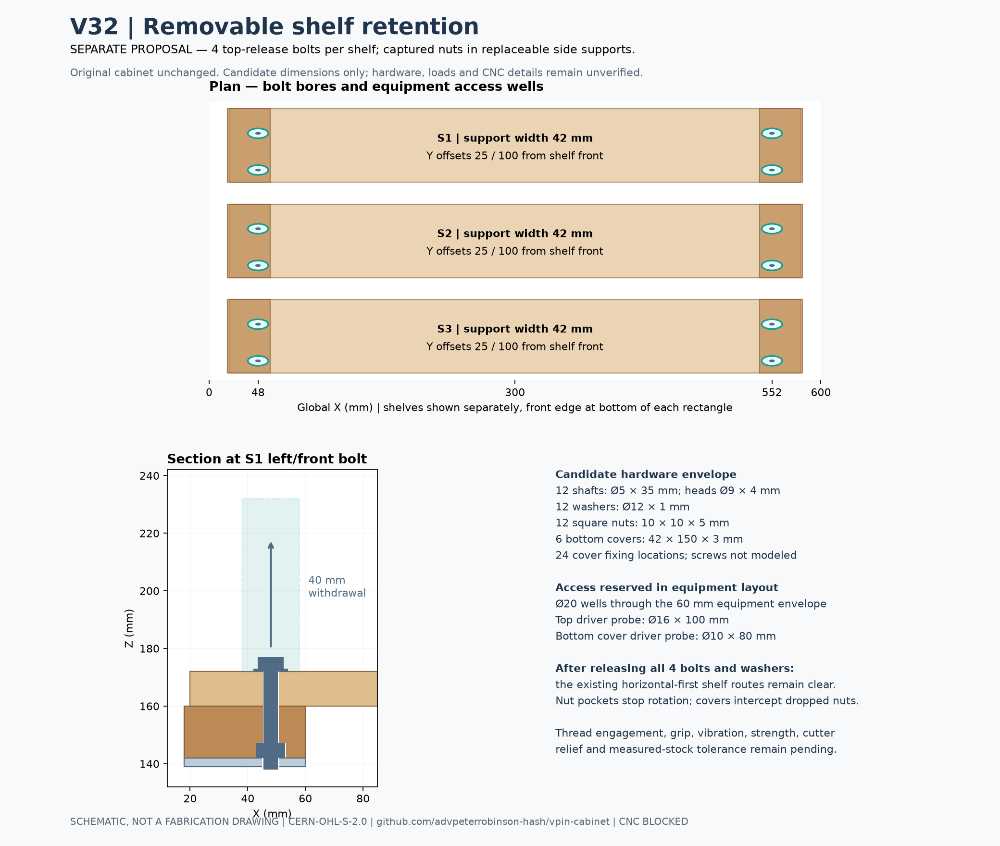
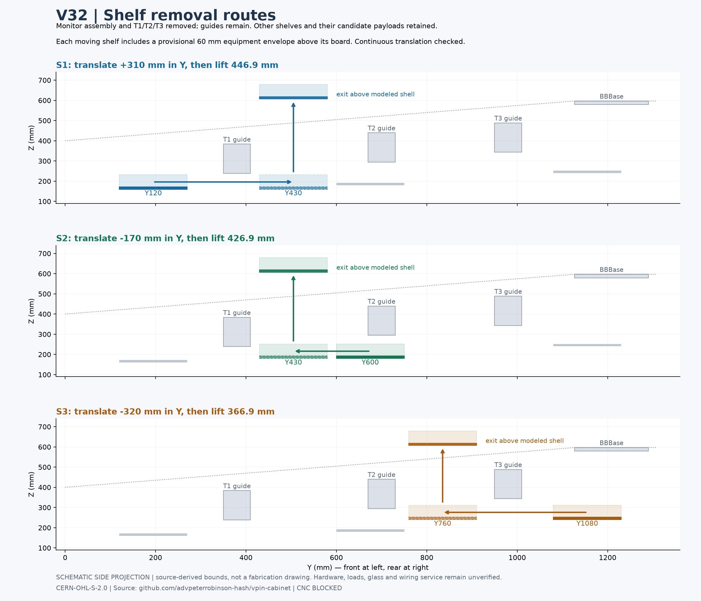
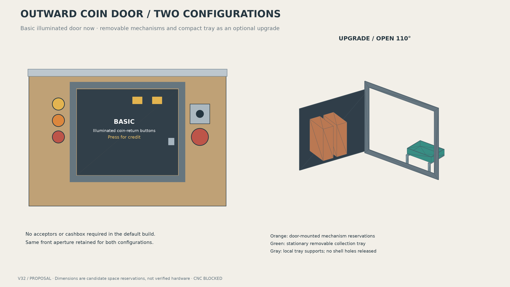

> Atualização 2026-09-30: energia/Ethernet com flange diretamente na madeira, sem placas extras. Janelas antigas retiradas; recortes/furos específicos aguardam cotas dos módulos. Ver [interface atual](FIXED_REAR_SERVICES_V32.md).

# Renders

**Atualização:** [fans fixos acima da porta, energia/Ethernet, piso e furação candidata da lockdown](FIXED_REAR_SERVICES_V32.md). Fans não acompanham mais a porta nesta proposta.

Avanço: [eixos de fixação da lockdown e furo compartilhado](LOCKDOWN_INTERFACE_V32.md). Porta traseira aprovada; limitadores opcionais e feltro previstos pelo proprietário.

**Atual:** [porta traseira com chave, abrindo para baixo](REAR_DOOR_V32.md), substituindo a tampa de quatro parafusos.

Continuação em 2026-09-30: [fixação da tampa traseira, puxador e grades](REAR_HARDWARE_V32.md). Estudo separado; PC baixo e prateleiras preservados.

Current continuation: [side/rear closure and standard lockdown interface](SIDE_REAR_CLOSURE_V32.md). Imported leg hardware confirmation is deferred by owner; owner confirmed the low fixed PC base, without a drawer or removable-tray mechanism.

[New: fixed shelf heights and leg-corner planning](SUPPORT_LEG_CNC_V32.md). [View drawing](../exports/generated/support-leg-v32/01-heights-and-leg-corner.png).

**Shelf layout frozen by owner on 2026-09-29:** current spacing and top-release arrangement approved; see `config/shelf_layout_freeze_v32.json`. Hardware/structural/manufacturing qualification remains open.

[English](RENDERS.md) · [Português (Brasil)](pt-BR/RENDERS.md)

> **Fast visual entry point to the current project state.**  
> Current owner-facing review: **V32** on `feat/cabinet-review-v32`.  
> **Not released for CNC or manufacturing.**

This page lets a new contributor understand the current cabinet direction without browsing the repository tree first. The complete technical package remains in [`exports/generated/cabinet-v32/`](../exports/generated/cabinet-v32/README.md).

## Current shelf direction — four screws from above

Two screws per side, fixed supports, mounted equipment retained on removal. Crossmembers remain in the stationary-scene checks; a new assumed-axis raised-display screen clears at 100 degrees relative opening; actual hinge/props remain open.

[Open the current simplified study](SIMPLE_SHELVES_V32.md).

## Historical support anchorage study — superseded

The accepted shelf-retention direction now has a separate side-anchorage study: inward-facing fasteners, blind insert reservations and checked support-replacement paths. Permanent side machining remains unapproved.

[Open the anchorage study and saved FreeCAD proposal](SHELF_ANCHORAGE_REVIEW_V32.md).

## Removable shelf retention

Separate proposal: top-release bolts and captured nuts in replaceable supports, with equipment access wells and preserved removal routes. Original V32 unchanged; hardware and structural performance unverified.

[Open the proposal and saved FreeCAD model](SHELF_RETENTION_REVIEW_V32.md).

## Shelf service routes

Continuous straight-motion checks establish candidate removal paths for all three shelves, including 60 mm equipment envelopes. Guides and permanent panels stay in place. Hardware and loads remain unverified.

[Open the motion study and saved FreeCAD service poses](SIDE_MOTION_REVIEW_V32.md).

## Outward coin-door study

Basic illuminated door, optional working mechanisms and removable compact tray. These are separate candidate configurations; original V32 geometry is unchanged. Actual hardware fit remains **UNVERIFIED**.

[Open the front-panel review and motion checks](FRONT_PANEL_REVIEW_V32.md).

## Separate joinery proposal

Three new views compare captured joints, an exploded shell and exact changes. **This is a separate proposal; the accepted V32 views below are unchanged.**

**[Open the three-view study](JOINERY_STUDY_V32.md)**

## V32 — main cabinet

### R01 — Interior

Shows the transverse shelves, low PC position and internal structure. Some panels are hidden only to improve visual readability.

### R02 — Crossmembers

Shows T1, T2 and T3, their replaceable guides and the monitor-support arrangement.

### R03 — Plan

Shows S1, S2 and S3 and the wiring-access corridors.

### R04 — Rear

Rear service door and two reference 120 mm exhaust fans.

### R05 — Replaceable guide

Detail of the removable crossmember interface. The groove is in the replaceable guide, not in the structural cabinet side.

### R06 — Front

Coin-door reference, front controls and the still-provisional plunger reserve.

## Current review status

- V32 consolidates V29–V31.
- 45 valid solids in the current model.
- No positive-volume intersection above 0.01 mm³ in the current validation.
- This validates CAD packaging/interference only; it does **not** validate structural strength.
- Physical sessions remain paused.
- CNC/manufacturing release remains blocked.

## Part identity

Permanent part codes and provisional names are controlled in [`PART_CODES.md`](PART_CODES.md).

Visual rule:

- `T1`, `S2`, `S1SupR` = permanent identity already assigned.
- `**provisional name**` = concept that does not yet have a permanent code.
- A permanent code is never reused for another function.
- Later geometry changes preserve the code and add a revision when necessary.

## Technical files

- [V32 technical package](../exports/generated/cabinet-v32/README.md)
- [Parts list](../exports/generated/cabinet-v32/PECAS-PARTS.md)
- [FreeCAD](../exports/generated/cabinet-v32/vpin-central-v32.FCStd)
- [STEP](../exports/generated/cabinet-v32/vpin-central-v32.step)
- [Validation](../exports/generated/cabinet-v32/validation.json)

## Next visual update

The next design iteration may incorporate the captured CNC joinery proposal documented in [`CABINET_JOINERY_PROPOSAL.md`](CABINET_JOINERY_PROPOSAL.md). Until accepted and validated, no render should imply that those grooves are part of released V32 geometry.

## Reproduce the current review

Run `make review-v32`. Geometry is compared with committed V32 evidence before renders are accepted. See [local validation](V32_LOCAL_AUDIT.md). Manufacturing remains blocked.
