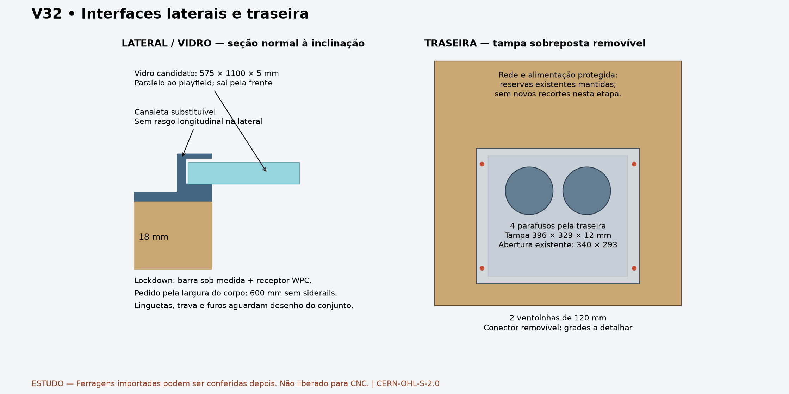

# V32 — laterais, traseira e lockdown

O proprietário aprovou o desenho e determinou que a conferência das ferragens importadas pode ficar para depois. Ela deixa de bloquear o avanço funcional; continua sendo uma condição dos furos que dependem dessas peças. As prateleiras e suas alturas permanecem congeladas. Este estudo não declara os painéis liberados para fabricação.

## Pernas: a referência já existe

O Pinscape enviado (`library/references/local/pinscape-build-guide.mht`, versão 2.1.0) identifica a perna **Williams/Bally A-19514**, bracket **01-11400-1** e parafusos **3/8-16**, comprimento 2½ ou 2¾ polegadas. A seção 2.19.10 explica que as quatro pernas são iguais; a montagem em alturas diferentes no gabinete produz a inclinação. Não é necessário ter as peças em mãos para continuar o desenho.

A [listagem A-19514 da Marco](https://www.marcospecialties.com/pinball-parts/A-19514) confirma comprimento nominal **28½ polegadas = 723,9 mm**. Esse é o comprimento da perna, não a altura da lockdown em relação ao chão: esta também depende da posição dos furos, geometria da perna e niveladores.

| Referência do Pinscape, apêndice J.44 | Em polegadas | Conversão exata mm |
|---|---:|---:|
| Furos dianteiros acima da base | 4 / 6¼ | 101,6 / 158,75 |
| Furos traseiros acima da base | 2 / 4¼ | 50,8 / 107,95 |
| Entre-eixos | 2¼ | 57,15 |

O PDF de dimensões do gabinete tem 21 páginas de painéis e detalhes; não foi encontrada cota do comprimento das pernas. O STL enviado mede aproximadamente57 mm entre centros; o outro link anuncia58 mm. O estudo anterior usou58 mm e alturas96/154 dianteiras e64/122 traseiras por escolhas de acomodação. **Essas três referências não foram fundidas em um falso padrão exato.** Os furos do estudo anterior permanecem provisórios, sem nova alteração. A chegada das peças resolve somente essa interface e sua conferência de carga.

## Lockdown: conjunto convencional com largura personalizada

Direção adotada para desenvolvimento: **barra customizada para o corpo de600 mm, usando receptor Williams/WPC compatível**. O Pinscape cita A-16673-1 / A-9174-4. A [VirtuaPin Custom Lockdown Bar](https://virtuapin.net/index.php?main_page=product_info&products_id=34) informa compatibilidade WMS por padrão e aceita largura personalizada.

Para a opção desse fornecedor, informar a largura externa da madeira **sem siderails:600 mm, equivalente a23,62205 polegadas nominalmente**. O fornecedor acrescenta¼ polegada para o encaixe. Não pedir606,35 mm como largura do gabinete e não interpretar a soma como desenho completo da barra pronta. A medida do gabinete acabado deve governar o pedido. Nenhuma compra foi feita.

A trava deve ser acessível pela porta frontal, liberar a barra para cima e permitir deslizar o vidro para a frente antes de levantar o playfield. Furos do receptor, posição das linguetas, curso da alavanca e envelope real ainda precisam de desenho dimensional. A faixa Z380..400,05 do estudo frontal era apenas uma reserva estreita; **não foi certificada como suficiente para o receptor WPC**. Não desenhar uma barra genérica como se fosse o produto comercial. Fabricação local continua possível, desde que copie apenas as interfaces dimensionadas autorizadas do conjunto escolhido, não uma silhueta estimada.

## Laterais: interface superior separada da madeira estrutural

Mantidos perfil1308,1 mm, corpo600 mm, espessura nominal18 mm, posições dos botões e todos os apoios congelados. Leaf pinball é a opção principal; arcade continua uma variante de furação anterior ao corte. Não se ampliam os furos existentes nesta etapa.

O novo CAD acrescenta um **estudo de vidro575 ×1100 ×5 mm** e duas canaletas superficiais substituíveis. A dimensão segue a reserva anterior em `docs/requirements.md`; não é ordem de compra de vidro temperado. O comprimento1100 é medido no plano inclinado, não na projeção Y.

Seção local: base da canaleta sobre a borda superior da lateral; vidro com face inferior4 mm acima desse plano, espessura5; teto do canal a10 mm, deixando1 mm de folga superior. Folga lateral0,5 mm e engajamento5,5 mm por lado. Canaleta sem novos rasgos longitudinais nas laterais. Material, fixação, acabamento das arestas e execução do perfil continuam a detalhar; a geometria não equivale a um perfil comercial selecionado.

Abertura do display e retirada das prateleiras são verificadas **depois de tirar vidro e lockdown**. Fixações de dobradiça/duas escoras cativas e suas cargas permanecem pendentes; o ensaio usa somente o eixo assumido do estudo anterior. Ele não libera a operação de um playfield real. SSF, suportes do backbox e cabeamento real não foram qualificados nesta etapa.

## Traseira: tampa simples e remoção para fora

Abertura existente preservada: **340 ×293 mm**, X130..470/Z72..365. A tampa passa a ser **sobreposta396 ×329 ×12 mm**, X102..498/Z54..383, assentada na face externa Y1308,1. Quatro passagens candidatasØ5,5 em X115/485 eZ92/345; todos os comandos de soltura ficam do lado de fora. Não há dobradiça para regular ou arco que atrapalhe a retirada.

Os receptores roscados retidos no painel fixo não foram escolhidos; por isso não foram abertos pilotos cegos. O montador não deverá precisar segurar porcas internas para tirar a tampa. Arestas, vedação, pega e prevenção de queda durante a última soltura ainda exigem detalhe de execução.

Duas ventoinhas de referência120 ×120 ×25, centrosX230/370/Z280, vão com a tampa. RecortesØ116 e entre-eixos105 seguem a referência V32, não uma alegação de compatibilidade universal. Grades de proteção nos dois lados e conector de baixa tensão desconectável são requisitos ainda não modelados. Sem colocar alimentação de rede elétrica ou terminais expostos na tampa removível. As reservas fixas de entrada protegida de alimentação e Ethernet permanecem; não acrescentar HDMI/USB permanente.

**Decisão do proprietário, 2026-09-29: base baixa, sem gaveta e sem mecanismo de tray removível.** A escolha resolve a divergência com o AGENTS.md enviado anteriormente. Mantém-se PCBase285 ×460 ×18 emX157,5/Y830/Z36, diretamente sobre o piso, sem elevar o PC ou adicionar corrediças. O gabinete aberto do PC deve ficar aparafusado à base, com retenção positiva dos componentes pesados; os padrões reais de fixação ainda precisam ser detalhados.

Na manutenção habitual o PC permanece instalado. A tampa traseira dá acesso; trabalhos que precisem de acesso superior podem exigir abrir o playfield. Substituir a placa de apoio ou retirar o conjunto completo é desmontagem excepcional, não uma rotina de tray.

O teste anterior continua útil para eventual substituição: a baseZ36 não sai horizontalmente porque bate na borda inferior de Rear. Após levantar38 mm, base emZ74 e topo do envelope do PC emZ220, o conjunto modelado passa pela abertura em uma translação traseira de500 mm, conservando S3. Isso não muda a altura instalada nem comprova pega, cabos ou liberação dos parafusos. A escolha da base baixa encerra a decisão de arquitetura do PC; não transforma esse teste numa instrução de manuseio validada.

## Evidência e reprodução

[CAD separado](../exports/generated/panel-closure-v32/panel-closure-study.FCStd) · [Relatório](../exports/generated/panel-closure-v32/validation.json) · [Parâmetros](../config/panel_closure_v32.json).

`bash tools/run_panel_closure_v32.sh` exige `PANEL_CLOSURE_PASS`: **16 verificações,143 sólidos**, incluindo envelopes herdados. Conferidos validade e identidade após reabrir o CAD, simetria das canaletas, vidro instalado/retirada contínua1150 mm, prateleiras, abertura do display amostrada a cada2°, tampa instalada/retirada contínua150 mm, permanência do shell e hashes dos arquivos de entrada. Controles negativos rejeitam vidro5 mm mais baixo e saída reta do PC atual. A extrusão do vidro e da tampa testa apenas os movimentos declarados.

A peça RearDoor e as posições das ventoinhas mudam somente neste CAD separado. O V32 original, o CAD de apoios/pernas e as prateleiras congeladas não foram sobrescritos. Renderizar: `uv run --with matplotlib python tools/render_panel_closure_v32.py`.

**Faltam para encerrar esta etapa:** fixações/acesso real do PC, conjunto real da lockdown/receptor, retenção das canaletas/tampa, grades/chicote, dobradiças/escoras e interfaces SSF/backbox. As ferragens importadas podem ser conferidas depois, como solicitado; a fabricação espera somente as evidências aplicáveis a cada corte, além de material medido, ferramenta, folgas, cupom e aprovação de fabricação.

Original: CERN-OHL-S-2.0. Preservar LICENSE e NOTICE.md. Source Location: https://github.com/advpeterrobinson-hash/vpin-cabinet.
