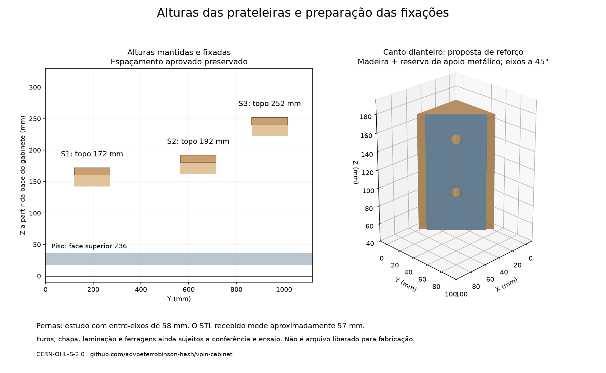

# V32 — alturas, fixação dos apoios e pernas

As alturas das prateleiras ficam definidas sem alterar o posicionamento aprovado. A furação dos apoios e os reforços das pernas entram em **um CAD separado de planejamento**, com operações identificadas para consulta à CNC. **Fabricação bloqueada:** dimensões de ferragens e pilotos provisórios não são instruções liberadas de corte.

## Alturas congeladas

Datum Z0: base externa inferior do gabinete. Piso nominal: face superior Z36. Prateleiras de 12 mm; apoios de 18 mm.

| Prateleira | Y inicial aprovado | Face inferior Z | Superfície superior Z | Superfície acima do piso | Apoio: base / topo Z |
|---|---:|---:|---:|---:|---:|
| S1 | 120 | 160 | 172 | 136 | 142 / 160 |
| S2 | 565 | 180 | 192 | 156 | 162 / 180 |
| S3 | 865 | 240 | 252 | 216 | 222 / 240 |

Medidas em mm. Mantêm-se os vãos295/150, os quatro parafusos superiores e as rotas independentes já verificadas. Registro explícito de altura: `config/shelf_layout_freeze_v32.json`. São alturas funcionais do projeto, não capacidade de carga. O envelope de equipamentos continua com 60 mm acima da prateleira; não equivale a espaço livre universal para ventilação/conectores.

## Apoios fixos, manutenção por cima

Dois parafusos de montagem por apoio, apontados da face interna do apoio para a parede. Eles são instalados na montagem do gabinete; a retirada cotidiana da prateleira continua soltando apenas seus quatro parafusos superiores.

| Par de apoios | Y dos parafusos de fixação | Z do eixo |
|---|---|---:|
| S1SupL/R | 175 /245 | 151 |
| S2SupL/R | 620 /690 | 171 |
| S3SupL/R | 920 /990 | 231 |

Proposta de volume: parafuso para madeira Ø4 ×55 sob cabeça, arruela1 mm, passagem Ø4,5 no apoio de42 mm; penetração nominal12 mm na parede. Piloto candidato Ø2,5 ×13 deixa5 mm de pele externa em parede18. **Diâmetro de piloto, rosca, comprimento útil, torque e capacidade não estão qualificados**; dependem do parafuso comprado e cupom do compensado. A interferência entre a rosca e o piloto menor é intencional e excluída apenas da auditoria geométrica desse parafuso contra sua parede receptora.

Os alojamentos superiores herdados Ø8,5 ×10,5 e alívio Ø5,5 ×12,5 continuam **placeholders**, não especificações para comprar insertos ou furar madeira. A referência [Inventables M5](https://www.inventables.com/products/threaded-inserts) exemplifica por que o SKU importa: anuncia corpo9,5, comprimento10, piloto6 e profundidade11 mm. Esse produto não foi adotado no CAD nem comprado.

## Pernas: madeira e apoio metálico

Quatro blocos triangulares compactos junto às faces internas dos cantos: catetos54 mm, altura126 mm. O estudo representa um bloco colado de sete camadas nominais18 mm; são28 lâminas ao todo, não28 blocos. A oficina deve fornecer o conjunto laminado, alinhado e furado, ou cotar madeira maciça equivalente como proposta separada. Resistência da laminação, colagem ao canto, esmagamento e carga dinâmica permanecem sem ensaio.

Há uma reserva de apoio metálico de60 ×126 ×3 mm na face diagonal de cada bloco. **Não é um desenho validado de chapa substituta da ferragem Williams/Bally.** A chapa interna real, retenção das porcas/roscas e fixações auxiliares precisam ser selecionadas e detalhadas. Parafusos das pernas devem transmitir carga a ferragem metálica apropriada; não devem depender de rosca aberta no compensado.

| Canto | Bloco: Z inferior/superior | Eixos candidatos Z | Entre-eixos |
|---|---|---|---:|
| Dianteiros L/R | 54 /180 | 96 /154 | 58 |
| Traseiros L/R | 36 /162 | 64 /122 | 58 |

Essas alturas de perna são **escolhas explícitas de estudo**, não medidas do gabarito e não estão congeladas. Devem ser conferidas com pernas, niveladores, chapa e altura/inclinação de jogo desejadas. O primeiro reforço dianteiro,18 mm mais alto, colidia com o corpo candidato do botão Launch; a configuração atual elimina essa colisão e conserva o caso rejeitado como controle negativo.

Os oito eixos seguem a bissetriz horizontal do canto,45° em planta; diâmetro11 mm é candidato. Para os cantos dianteiros, origens (0,0,Z)/(600,0,Z); traseiros (0,1308,1,Z)/(600,1308,1,Z), com direções normalizadas para dentro indicadas no CSV. O comprimento120 mm no arquivo é a extensão do volume de furação atravessante do estudo, **não uma profundidade final de máquina**.

## Gabaritos: diferença de 1 mm

O [STL arquivado para impressão](../library/references/3d-print/piant/Pinball_Leg_Hole_Guide.stl), fornecido pelo proprietário e associado a [PiAnt, Thingiverse4802189](https://www.thingiverse.com/thing:4802189), foi preservado sem modificação, com [atribuição CC BY4.0](../library/references/3d-print/piant/ATTRIBUTION.txt). Sua seção em Z22 fornece aproximadamente **57,000 mm entre centros e furos de10 mm**, assumindo unidades mm; o STL em si não declara unidades. Dimensões externas40 ×80 ×30 unidades;18756 triângulos. [Medição reproduzível](../library/references/3d-print/piant/measurement.json).

O segundo link resolve para [Jeff13850, Thingiverse7346262](https://www.thingiverse.com/thing:7346262), que anuncia58 mm e credita o conceito original de55 mm a Stef26; metadados da página indicam CC BY-SA4.0. Desse segundo modelo temos somente o link, não o STL. **Não são gabaritos intercambiáveis automaticamente.** Não ampliar furos para esconder a diferença; casar a perna, chapa e gabarito reais. Para impressão futura, manter escala nominal100% e conferir o exemplar impresso antes de furar.

## Entrega à CNC: operações separadas

O [CSV de planejamento](../exports/generated/support-leg-v32/machining-plan-review.csv) contém68 operações com peça, origem XYZ, vetor do eixo, diâmetro, extensão e pendência:

- 12 passagens na borda dos apoios e12 pilotos cegos nas faces internas das laterais;
- 12 passagens superiores das prateleiras,12 alojamentos de insertos e12 alívios de ponta;
- 8 eixos diagonais de canto, atravessando o conjunto de painéis, bloco e apoio metálico.

Faces superiores e internas são operações acessíveis com preparação adequada. As passagens na borda estreita dos apoios exigem fixação/reposicionamento ou cabeçote de furação. Os eixos das pernas exigem montagem/dispositivo a45°, cabeçote apropriado ou operação secundária de oficina. **Não converter os eixos diagonais em círculos normais de um DXF2D.** Cotar essas operações com a CNC para entregar os furos prontos ao montador. O gabarito impresso é recurso opcional de conferência/manutenção, não uma obrigação de furar à mão em casa.

## Evidência e limites

[CAD de planejamento](../exports/generated/support-leg-v32/support-leg-planning.FCStd) · [Relatório](../exports/generated/support-leg-v32/validation.json).68 verificações: alturas, simetria, sólidos reabertos, colisões instaladas, ferramenta candidata, acesso superior, retirada das prateleiras e abertura amostrada do display contra as peças acrescentadas.140 sólidos incluindo os envelopes herdados; não é contagem de peças a comprar. Mantidos o V32 original e o estudo de prateleiras congelado, sem sobrescrita.

Reproduzir: `bash tools/run_support_leg_v32.sh`; medir STL: `python3 tools/measure_leg_jig_v32.py`; renderizar: `uv run --with matplotlib python tools/render_support_leg_v32.py`. Exigir o sentinela `SUPPORT_LEG_PLAN_PASS`; FreeCAD pode retornar zero após exceção.

Faltam ferragens reais, travamento/retensão das pernas, dimensionamento e ensaios de carga/vibração, ferramenta de produção, estoque medido e cupom. Dobradiças, escoras, chicotes e backbox superior reais continuam fora do estudo de abertura. Nenhuma dessas lacunas é aprovada pelo congelamento das alturas.

Material original: CERN-OHL-S-2.0. Preservar LICENSE e NOTICE.md. Source Location: https://github.com/advpeterrobinson-hash/vpin-cabinet. O STL externo mantém sua própria licença indicada na atribuição.
