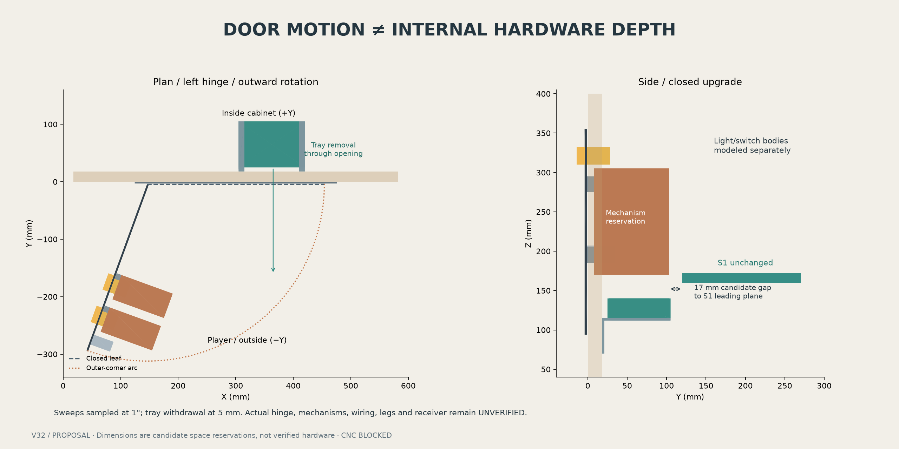

# Painel frontal: porta iluminada e moedas funcionais opcionais

[English](../FRONT_PANEL_REVIEW_V32.md) · [Português (Brasil)](FRONT_PANEL_REVIEW_V32.md)

**Estudo implementado; encaixe da ferragem real UNVERIFIED; CNC BLOCKED.** Direção aprovada: porta iluminada abrindo para fora, botões de devolução gerando créditos e dois mecanismos funcionais opcionais com coletor compacto removível. Não se exige caixa de moedas arcade completa. É a primeira etapa de frente → laterais → traseira → piso; não libera usinagem permanente.

## Modelo espacial corrigido

A extrusão anterior de 140 mm para dentro, cobrindo a porta inteira, foi **retirada**. Não representava movimento nem ferragem medida. Suas interseções com S1/display/StarTech deixam de ser evidência de colisão real. Esses componentes e toda a V32 original permanecem inalterados.

Agora moldura, folha, botões iluminados, corpos internos de luz/interruptor, fechadura, mecanismos/suportes opcionais, bandeja e dois suportes locais são separados. Verificamos ocupação fechada, movimento para fora da folha **com seus componentes** e retirada da bandeja/acesso através da abertura.

A configuração básica não possui mecanismos, abas, bandeja ou suportes da bandeja. O upgrade acrescenta componentes removíveis na porta e bandeja sustentada pela frente, mantendo o mesmo recorte permanente. É proposta de arquitetura de expansão, não garantia para qualquer mecanismo. Fixações/retenção não estão qualificadas; não são liberados novos furos.

## Dimensões candidatas explícitas

Valores abaixo são decisões do estudo, **não medidas de fabricante ou ferragens reais**. X cresce da esquerda para a direita olhando a frente; Y para trás; Z para cima desde o fundo. Unidades mm.

| Elemento | Definição candidata |
|---|---|
| Abertura existente | X144.425..455.575, Z92.840625..357.159375; 311.15 × 264.31875; fixações de referência mantidas |
| Moldura | Margem externa 20; espessura frontal 3; não é um bloco profundo |
| Folha | X146, Y−4, Z94; 308 × 3 × 261 |
| Dobradiça/movimento | Esquerda vista de frente; eixo vertical X146/Y−4; abertura externa de 110°, amostras a cada 1° |
| Luz/interruptores | Dois volumes 30 × 29 × 22; separados dos mecanismos |
| Fechadura | Volume 18 × 36 × 22; lingueta e operação da chave ainda não verificadas |
| Reservas de mecanismos | Duas caixas 45 × 95 × 135 em X310/370, Y8, Z170; ligadas à porta por abas removíveis conceituais |
| Bandeja | Externa 115 × 80 × 25; paredes candidatas 2; X305/Y25/Z115; removível; sem caixa arcade completa |
| Suportes da bandeja | Duas pequenas cantoneiras conceituais com apoio em Z115 e fixação na região frontal inferior; furos/retenção positiva pendentes |
| Retirada | 180 para o jogador, amostras a cada 5 com porta aberta |
| Sonda de acesso | 80 × 180 × 65 em X210/Y−100/Z210; comprova somente esse corredor candidato, não acesso humano irrestrito |

Reservas terminam em Y103; S1 começa em Y120: **17 mm até seu plano frontal neste candidato**. Não comprova espaço para cabos ou mãos. Dois corredores candidatos de queda terminam dentro da bandeja; saídas reais de aceitação/devolução e trajetórias dependem das ferragens. O guia Pinscape fornecido embasa mecanismos opcionais, crédito pelo botão de devolução e coletor compacto; não fornece as dimensões deste estudo.

Nenhum desenho atual comprova o encaixe da porta/mecanismos selecionados. O PDF SUZOHAPP `40-0696-30 B` localizado não pôde ser obtido por timeout; nenhuma dimensão foi adotada e nenhum arquivo do fornecedor foi importado. O MHTML Pinscape fornecido foi lido e seu hash registrado na configuração. Desenhos proprietários e arte das fotos não foram copiados.

## Controles preservados

Proposta: Start X90/Z310; Extra Ball X90/Z260; Exit/Back X90/Z210; plunger X520/Z280; Launch Ball X520/Z210. Funções/legendas esquerdas continuam propostas. Furos nominais 25.4 e faces visuais não especificam ferragem final. Plunger segue sem recorte. Z300 foi rejeitado com corpo provisório; Z280 limpa os vizinhos testados. Crédito nos botões da porta; power/reset, calibração, volume e desabilitação independente do feedback no acesso interno.

Lockdown personalizado no topo frontal. Receptor real, brackets de pernas, dobradiça/fechadura, curso/cabos do plunger, porcas/ferramentas e fixações medidas permanecem interfaces compartilhadas pendentes. Corpo 600 e Front nominal 564 × 400.05 × 18 preservados. Encaixes capturados seguem proposta separada.

## Evidência e reprodução

Executar `bash tools/run_front_panel_v32.sh`. Gera/reabre CAD, exige sentinelas de sucesso (FreeCAD pode retornar zero após exceções) e renderiza. Fonte: [V32](../../exports/generated/cabinet-v32/README.md); parâmetros em `config/front_panel_v32.json`.

- [Frente-base](../../exports/generated/front-panel-v32/front-layout-proposal.FCStd): 20 verificações e quatro controles negativos originais.
- [Básica fechada](../../exports/generated/front-panel-v32/coin-basic-closed.FCStd), [upgrade fechado](../../exports/generated/front-panel-v32/coin-upgrade-closed.FCStd), [upgrade aberto](../../exports/generated/front-panel-v32/coin-upgrade-open.FCStd): sólidos válidos, conjunto/geometria exatos, preservação dos 45 objetos originais e colisões de componentes verificados após reabertura.
- [Evidência da porta](../../exports/generated/front-panel-v32/coin-door-validation.json): movimento externo amostrado nas duas versões, retirada da bandeja, acesso e queda candidatos. Mais quatro controles negativos rejeitam abertura interna, mecanismo interferente, retirada bloqueada e folha salva aberta para dentro.
- Renders usam malhas dos **sólidos salvos**, sem modelo de ferragem desenhado à parte. [Vista frontal](../../exports/generated/front-panel-v32/01-front-review.png).

Checks candidatos reportam PASS/FAIL. Encaixe real, cabos, pernas/receptor reais, resistência/retenção, trajetórias reais de moedas, acesso humano e movimento entre amostras permanecem **UNVERIFIED**. Aprovação do candidato não substitui evidência ausente. Sessões físicas pausadas.

## Continuidade

Frente e arquitetura de upgrade implementadas para revisão; usinagem permanente aberta. Propagar limites para [laterais → traseira → piso](PANEL_CLOSURE_V32.md). Não mover S1, recortar estrutura nem reservar caixa arcade com base no prisma retirado. Ferragem maior exige conflito específico e proposta localizada em interface substituível antes de mudar estrutura permanente.

Material original: CERN-OHL-S-2.0. Preservar LICENSE e NOTICE.md. Source Location: https://github.com/advpeterrobinson-hash/vpin-cabinet.

## Fichas opcionais como recompensa

O proprietário poderá encomendar moedas personalizadas para os sobrinhos e futuros filhos. A opção de mecanismos funcionais permanece disponível, além da porta iluminada básica. Diâmetro, espessura, material e mecanismo ainda não foram escolhidos. Testar uma amostra no mecanismo e verificar os trajetos de aceitação e rejeição antes da encomenda do lote ou liberação das fixações. Nenhuma dimensão do gabinete muda nesta etapa.
