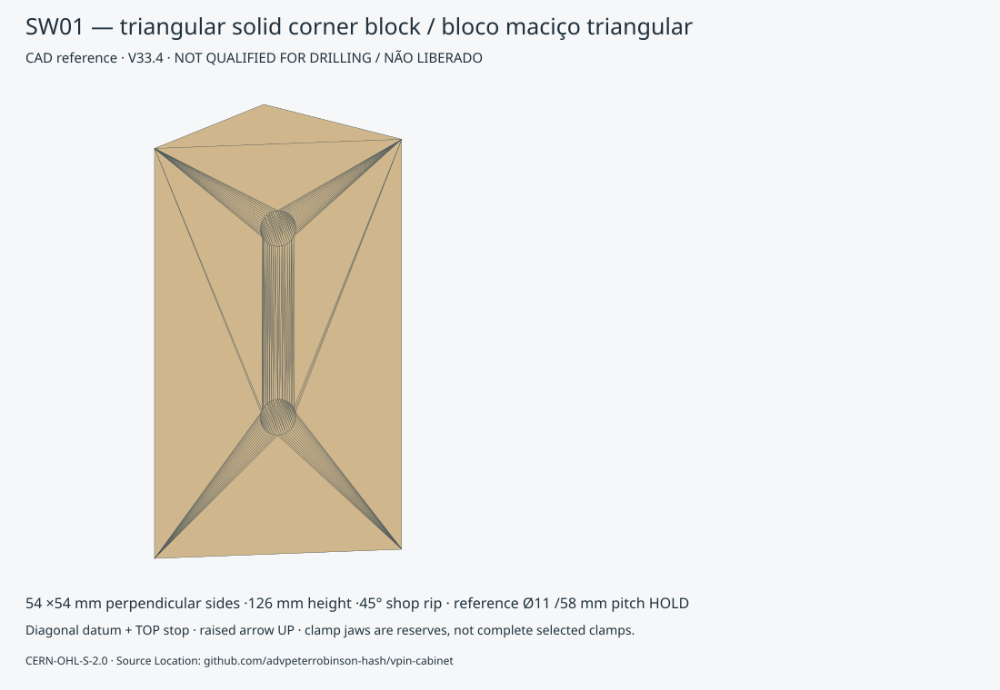
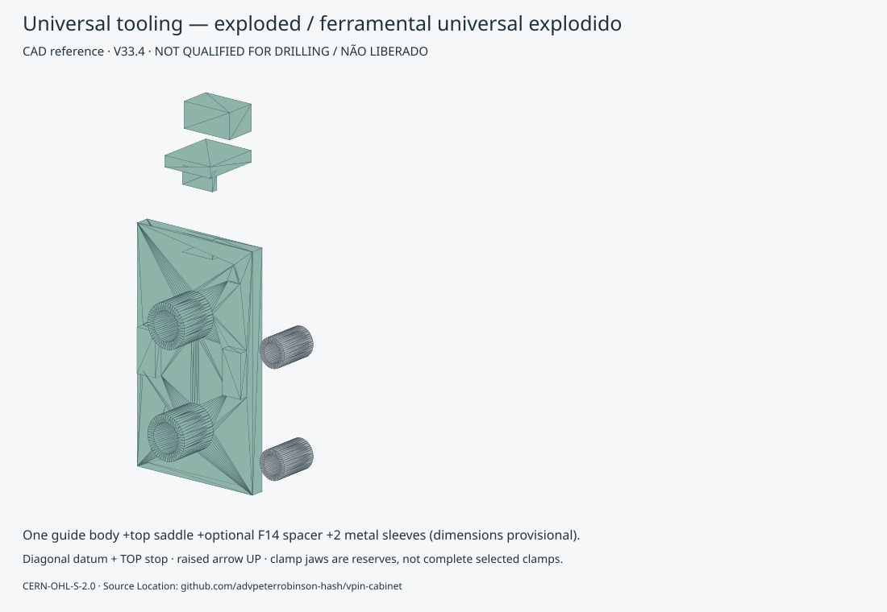
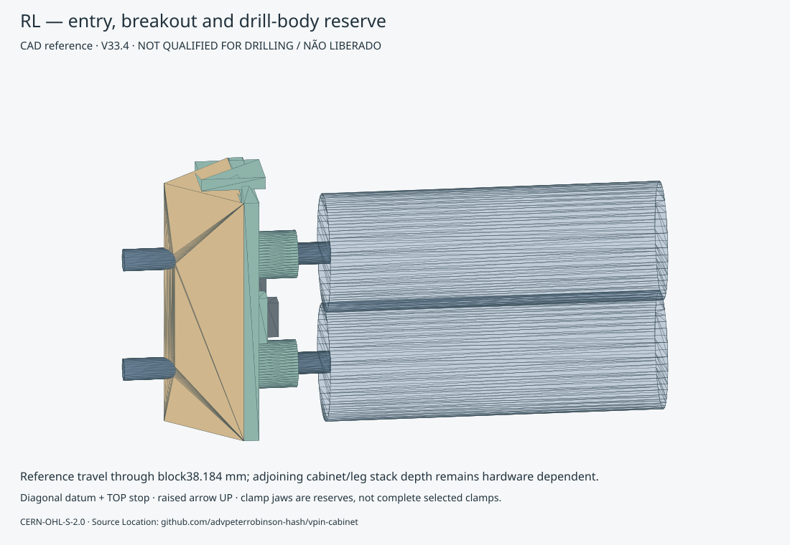

# V33.4 — solid leg blocks and universal drilling jig

HEAD BEFORE: `f989d6cc9540247571a28e7f99f1499aacbfdd10`

CURRENT functional geometry is unchanged. CNC release and final drilling remain **BLOCKED**. This package supersedes only P029–P032 /M019–M023 lamination manufacturing authority. Other V33.1 members and V33 hardware quantities remain unchanged.

## Shop specification

**SW01 ×4: right-isosceles triangular prism, perpendicular sides54×54mm, length126mm.** The accepted diagonal backing face is a45°shop rip. A full square54×54×126mm block is NOT equivalent: it adds183,708mm³ per block across the backing interface. The shop supplies the rip; the apartment builder does not need a saw/router. Same blank at all four corners; handedness comes from placement and front/rear drilling setup.

Dry, straight, stable, knot-free structurally suitable solid wood. Species, moisture, density and structural qualification are late-bound. Grain runs along126mm. Dimensions are CAD reference; production measurement/tolerance and hardware qualification still required. Not plywood; no sheet-stock thickness assigned.

## Exact reconstruction

| Corner | P ID | Bottom XYZ mm | Bore heights from bottom mm | Top offsets mm | Symmetric difference mm³ |
|---|---|---|---|---|---:|
| FL | P029 | [18.0, 18.0, 54.0] | [42.0, 100.0] | [84.0, 26.0] | 0.000000000 |
| FR | P030 | [582.0, 18.0, 54.0] | [42.0, 100.0] | [84.0, 26.0] | 0.000000000 |
| RL | P031 | [18.0, 1290.1, 36.0] | [28.0, 86.0] | [98.0, 40.0] | 0.000000000 |
| RR | P032 | [582.0, 1290.1, 36.0] | [28.0, 86.0] | [98.0, 40.0] | 0.000000000 |

The blank is undrilled shipping stock. Reconstructed reference bores produce the same original solid and seven-layer union. **0mm³ difference**, all8 reference axes unchanged. [Exact metrology/entry/exit](metrology.json). Each diagonal entry is mid-face; nominal travel to the corner is38.183766mm, then the bit continues through the cabinet/leg interface as selected hardware requires. No automatic depth setting is released.

## Jig / gabarito — tooling, not a cabinet part

[Tooling BOM](tooling-bom.json): one universal guide-body variant, one removable top saddle, one14mm front spacer. Rear uses bare stop; front adds the spacer. Diagonal face and top are registration datums; the plate spans the corner with0.2mm clearance per end. This centering fit requires print trial and clamping. Raised triangle means UP. A flat top spacer cannot be mistaken for a drilling guide. Identify FL/FR/RL/RR before drilling.

- [Parametric source](../../../tools/solid_leg_v334.py) + [parameter config](../../../config/solid_leg_blocks_v334.json). Parameters drive original FreeCAD geometry; regenerate after editing JSON. The saved spreadsheet is a parameter record, not a live expression-driven rebuild.
- [FreeCAD reference](leg-drill-jig-REFERENCE.FCStd) · [STEP reference](leg-drill-jig-REFERENCE.step).
- Guide body: [STL](GuideBody-REFERENCE.stl) / [3MF](GuideBody-REFERENCE.3mf).
- Top saddle: [STL](TopSaddle-REFERENCE.stl) / [3MF](TopSaddle-REFERENCE.3mf).
- Front spacer: [STL](FrontStop14-REFERENCE.stl) / [3MF](FrontStop14-REFERENCE.3mf).
- Optional PRINTED_SACRIFICIAL_GUIDE, print2: [STL](Sacrificial1-REFERENCE.stl) / [3MF](Sacrificial1-REFERENCE.3mf).

Preferred interface:2 replaceable metal guide sleeves. OD16/ID11/length24mm and0.3mm printed seat allowance are **provisional examples**, not a sourced sleeve selection. An axial shoulder in the guide body resists the sleeve being pushed toward the wood. Withdrawal retention, drill fit and wear require the selected-sleeve trial. Printed sacrificial sleeves are optional low-use test tooling, not precision authority. Replace when worn; qualify a test bore. Guide/body prints flat with bores upright; top saddle prints on its side (local support under the projecting tongue may be needed); spacer flat. No assembled print is misleadingly supplied as a printable solid. Slicer support/bridging, material, shrinkage and wall strength remain physical qualification items.

## Procedure / sequência

MAKE BLOCK → CHECK DIMENSIONS → REGISTER/INSTALL → FIT JIG → CLAMP → DRILL WITH MEASURED PARAMETERS → TEST REAL PLATE/BOLTS → ACCEPT.

FABRICAR BLOCO → CONFERIR DIMENSÕES → POSICIONAR → ENCAIXAR GABARITO → PRENDER → FURAR COM PARÂMETROS MEDIDOS → TESTAR CHAPA/PARAFUSOS REAIS → ACEITAR.

Do this during shell dry assembly **before FLOOR, PC_BASE and SHELF_1**. The original stage16 glue-up is retired; stage02.0 now carries this HOLD checkpoint. Use independent cabinet support and a square fixture; do not load the legs before qualification. Clamp on the two broad lands (jaw pads are illustrated). Full clamp bar/handle envelopes and secure stop/spacer retention require selected-clamp trial. Keep hands out of the breakthrough path. Support the exit with a sacrificial backer, check the full stack thickness, select a depth stop where applicable; do not drill blindly into installed components.

Fazer durante montagem provisória da caixa **antes de FLOOR, PC_BASE e SHELF_1**. Use apoio independente e gabarito de esquadro. Prenda nas áreas largas ilustradas; barras/cabos dos grampos e retenção do batente/espaçador exigem teste real. Proteja a saída com apoio sacrificial; confira a espessura total e o limitador. Não fure às cegas.

| View / Vista | Setup |
|---|---|
| [FL](02-FL-jig.svg) | F +14mm spacer |
| [FR](03-FR-jig.svg) | F +14mm spacer |
| [RL](04-RL-jig.svg) | R bare top stop |
| [RR](05-RR-jig.svg) | R bare top stop |

## Virtual access result

Jig reference axes match all8CURRENT bores to numerical zero. Guide/cap/spacer do not penetrate block or surrounding wood. The R30×180mm drill-body reserve conflicts with SHELF_1 at the front, and FLOOR/PC_BASE at the rear. Removing these later-stage parts leaves no modeled wood collision for that reserve. This is an assembly-order screen, **not a physical hand-drill PASS**. Actual drill, bit length, grip/hand clearance, full clamp, material breakout and purchased backing plate remain HOLD. The existing B13 backing-plate reference is shown for test-fit; its purchased form is still unmeasured. [Every collision and prerequisite](jig-validation.json).

**58mm CURRENT candidate vs57.15mm historical WPC reference remains unresolved.** Measure the selected leg/backing/bolt set, sleeve and drill, regenerate and print a sample, test registration and bores before production use. Changing the pitch would require review against the unchanged cabinet interface; do not silently update accepted holes.

## Revised manufacturing and material

28 CNC laminations removed;4 solid blocks added. **106 pieces /62 families =102 CNC plywood pieces /61 families +SW01 ×4**. M019–M023 are historical only. [Current register](manufacturing-register.json) · [BOM EN](manufacturing-bom.md) · [BOM PT-BR](manufacturing-bom.pt-BR.md) · [CSV](manufacturing-bom.csv).

18mm finished contour area saved: **0.040824m²**. Rectangle-allocation area removed0.081648m². No full-sheet reduction in this preliminary heuristic. No production nesting generated.

| Stock mm | CNC pieces | Full-sheet assumption | Net utilization |
|---:|---:|---:|---:|
| 18 | 60 | 2 | 54.83% |
| 12 | 25 | 1 | 27.81% |
| 8 | 2 | 1 | 0.89% |
| 6 | 13 | 1 | 4.64% |
| 4 | 2 | 1 | 0.01% |

4/6/8mm retain small-stock/offcut purchase strategy. Supplier dimensions unchanged; solid blocks are outside CNC sheet nesting.

Wood shipping mass LOW/NOMINAL/HIGH: 51.287 / 60.655 / 70.060kg. Installed finished wood: 51.273 / 60.638 / 70.037kg. Plywood density550/650/750; solid wood500/650/850kg/m³ illustrative sensitivity, not species authority. Shipping includes undrilled triangular blanks; installed mass subtracts reference bores. Rough square purchase-stock offcut mass is a shop concern, excluded from shipped kit.

## Packaging — PRELIMINARY

Preferred25kg target retains4 bundles. Solid blocks are padded in a126mm-deep layer, not7flat layers; actual packing geometry reflects this. Hardware separate; no glass/electronics. Reweigh selected wood and qualify compression/handling.

| Package | L × W × H mm | Wood kg | Packaging kg | Gross nominal kg | High density kg |
|---|---|---:|---:|---:|---:|
| P25-01 | 1353.1 × 641.9 × 88.0 | 19.805 | 2.146 | 21.950 | 24.997 |
| P25-02 | 1317.1 × 609.0 × 88.0 | 19.920 | 2.011 | 21.931 | 24.996 |
| P25-03 | 825.0 × 768.9 × 197.8 | 19.523 | 2.469 | 21.992 | 24.996 |
| P25-04 | 1197.1 × 240.0 × 188.0 | 1.407 | 1.143 | 2.550 | 2.840 |

[20/25/30kg contents, CG and layers](packaging.json) · [Mass uncertainty](mass-budget.json) · [Material accounting](material-utilization.json). Existing known minimum160Fxx fasteners plus formula/TBD quantities unchanged. Jig tooling is excluded from cabinet hardware quantities.

## Offline inspection / animation

[CURRENT viewer](../viewer-v32/index.html) now shows4 solid blocks. Select SW01/P029–P032 for SHOP_MADE_SOLID_WOOD_PART and jig link. Five additional tooling animations: [placement](../viewer-v32/index.html?animation=jig-place), [jig](../viewer-v32/index.html?animation=jig-fit), [clamp lands](../viewer-v32/index.html?animation=jig-clamp), [schematic drilling](../viewer-v32/index.html?animation=jig-drill), [real-hardware test checkpoint](../viewer-v32/index.html?animation=jig-test). Test-fit animation uses the existing B13 backing-plate envelope and translucent axis probes; these are reference geometry, not selected leg bolts. Real leg/plate/bolt qualification remains HOLD.

Manufacturing release BLOCKED: selected leg/backing/bolts and sleeve dimensions; actual solid wood/plywood, printed fit and drill/clamp qualification; production-lot coupon, selected fit clearance and remaining structural/CNC gates.

CERN-OHL-S-2.0 · Source Location: https://github.com/advpeterrobinson-hash/vpin-cabinet
