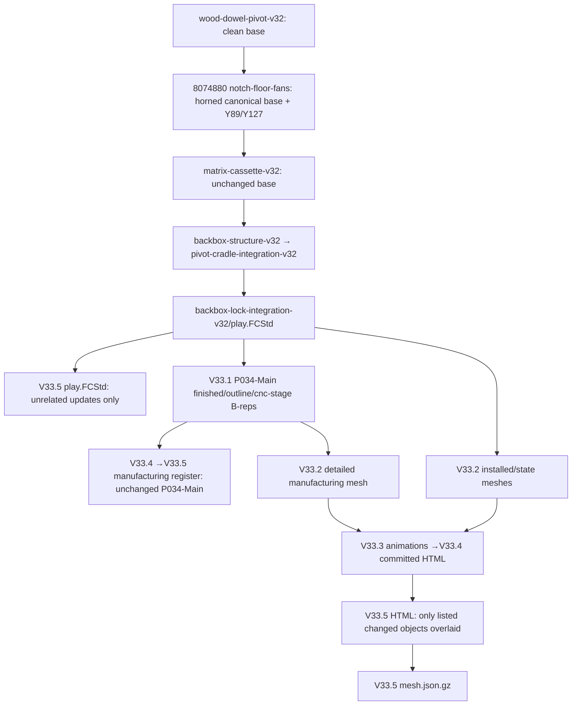

# V33.6 contour and button authority audit

Original project material: CERN-OHL-S-2.0. Source Location: https://github.com/advpeterrobinson-hash/vpin-cabinet

Read-only audit at HEAD `7b84181f5c48c1a1e4a78f87319eec5512318492`, in the designated `cabinet-v32` worktree. This document records history and candidate authority; it does not promote geometry or release machining. The V33.6 owner request controls the new decision.

## Finding

The current M025 horn is present in canonical wood, manufacturing B-reps, and the viewer. It is not a viewer-only corruption. Exact OpenCascade comparison gives **0 mm³ symmetric difference** between the V33.5 `PF_BasePlywood`, the original notch-study part, and the backbox-lock-integration part from which CURRENT inherited it. The unexpected appearance is an inherited contour/authority issue: later checks protected the shape without judging its suitability.

The closest clean prior basis is the simple **500 × 1020 × 18 mm** wooden-dowel base at `cd416fea61ed031c59af8df93014ae7c9ba200bf`. No later horn-free playfield-base edit was found in the reachable history. Its local bounds are X50..550, Y20..1040, Z−14..4. It preserves the wooden dowel, four straps, eight screws, TV/VESA and pivot relationships. Its old front-button wire access was the reason for the later notch; it must be revalidated with the newly requested Y255/Y310 Z270 buttons before restoration.

## Historical candidates and authority

| Commit | Geometry / decision | Use in V33.6 |
|---|---|---|
| `b6cd06c` and successive side-review commits | Saved side geometry documented at Y255/Y310 Z270, 55 mm pitch; bore/recess dimensions were historical reference geometry, not selected hardware | Positional candidate expressly restored by the latest owner request; no bore authority |
| `334f173` | Records owner preference for traditional pinball leaf buttons with separate arcade alternative | Keep leaf architecture; physical hardware still unselected |
| `87d63825e09f5ebbe85a89a7e705a49f1b0c320b` | Explicitly filled Y255/Y310 holes and created Y89/Y127 at local top−65 mm. Config calls this an owner correction gate; report gives old/new comparison | Historical positional change, not a coordinate conversion. Latest owner request now takes precedence |
| `2110902` | Introduced flat plywood base and wooden-dowel mechanism | Earliest relevant clean rectangular base |
| `cd416fea61ed031c59af8df93014ae7c9ba200bf` | Latest pre-notch cleanup, limited to fixed cradle/exciter geometry. Base remains rectangle; 50° service and 48 mm lift-out retained | Preferred clean prior basis, subject to current restored-button validation |
| `80748804bf624d9a5c7c32d8d688da4b1318dccf` | Two mirrored 22 mm-deep front edge reliefs, four R8 mouth/root arcs per side with short straight bridges | Direct origin of current horn-like outline |
| V33.1 through V33.5 | Manufacturing and viewer layers inherit the notch; later approved changes explicitly preserve unrelated playfield geometry | Preservation alone is not new owner approval of the silhouette |

The audit found repository statements attributing Y89/Y127 to an earlier owner correction, but not an independent raw conversation transcript. The current explicit owner request is sufficient authority to reopen that choice and supplies an unambiguous restoration candidate.

## Exact contour evidence

Read-only metrology: [history_probe.py](history_probe.py), [history-metrology.json](history-metrology.json). The probe opens FCStd documents without saving them.

| Shape | Volume mm³ | Symmetric difference from V33.5 mm³ |
|---|---:|---:|
| Clean pre-notch base | 9,180,000.000000 | 68,873.354029 |
| Notch-floor-fans base | 9,111,126.645971 | 0 |
| Backbox-lock-integration base | 9,111,126.645971 | 0 |
| V33.5 base | 9,111,126.645971 | 0 |

The notch constructor in `tools/notch_floor_fans_v32_entry.py` lines 39–45 creates the actual curved front corner projection. Bounds: left X50..72/right X528..550, local Y20..122.961306; all radii R8. The short bridge between arcs is 6 mm long. A clean rectangle restores 68,873.354029 mm³ before any new service openings (0.044768 kg at the planning 650 kg/m³ density).

`docs/NOTCH_FLOOR_FANS_V32.md` claimed “no isolated tongue or narrow strip.” That textual conclusion does not override the current owner's explicit visual rejection. Likewise `buttons_moved=false` in its validation means unchanged **relative to cd416fe**, already using Y89/Y127; it never proved equality with Y255/Y310.

## Button source evidence

- `docs/SIDE_PANEL_REVIEW_V32.md`: Y255/Y310 Z270, candidate inward R18 ×80 mm screening reserve, existing old double recess leaves a 5.3 mm annular web. That web and Ø15.875/Ø28.575 data are historical, **not final manufacturing authority**.
- `docs/SIDE_INTERFACE_PLAN_V32.md`: rear button at Y310.
- `docs/SIDE_MOTION_REVIEW_V32.md`: candidate side buttons at Y255.
- `docs/OWNER_CORRECTION_REVIEW_V32.md`: explicit table 255/270 →89/350.594 and310/270 →127/357.230.
- `config/service_correction_v32.json#ergonomics`: Y89/Y127,65 below local top; source of actual current centers.
- `tools/service_correction_v32_entry.py` lines61–96: extracts actual side top, refills the old holes, makes the new centers and simplified leaf hardware. This is an intentional geometric relocation, not a transformed datum.
- `tools/validate_service_correction_v32.py`: old upper-Y negative controls would reject the owner's newly requested candidate. They belong to the superseded historical replay, not the new CURRENT regression gate.

Existing useful simplified envelopes: `LeafButton_{primary,secondary}_{L,R}`, `LeafNut_*`, `LeafBracket_*`, `LeafContacts_*`, plus `ButtonBodyServiceReserve_*`, `ButtonLeafServiceReserve_*`, `ButtonWireServiceReserve_*`, `ButtonToolServiceReserve_*`. Mirror plane X300. These remain provisional package reserves; they are not purchased-hardware dimensions.

## Geometry authority and stale-cache chain

Native chain is explicit in `config/matrix_cassette_v32.json`, `tools/backbox_structure_review_v32_entry.py`, `config/pivot_cradle_integration_v32.json`, `config/backbox_lock_integration_v32.json`, and `config/structural_simplification_v335.json`.

V33.5 `config/current_v32.json` points to its native CAD, but the V33.5 manufacturing row for M025 still deliberately points to `exports/generated/flatpack-v331/brep/P034-Main-{finished,outline,cnc_stage,cnc_outline}.brep`. Its source remains `backbox-lock-integration-v32/play.FCStd`. This was legitimate reuse while geometry was unchanged; after the authorized V33.6 correction it would be stale unless explicitly replaced.

`tools/build_viewer_v335.py` reads the committed prior viewer HTML at ca4e23e and replaces only members in `changes-mesh.json.gz` and `manufacturing-mesh.json.gz`. It does not obtain every component afresh from CURRENT CAD. `tools/structural_v335_states.py` similarly starts with historical named states and overlays only known changed parts. The compact current mesh is then generated from the viewer's installed/state dictionary. Therefore a new playfield correction must replace **both native and presentation sources**, not only mesh bytes.

Three presentation representations need independent authority checks:

1. installed PLAY geometry plus every SERVICE/LIFT-OUT/named-state variant;
2. detailed P034-Main/M025 manufacturing geometry used by assembly animations;
3. packing representation, which normally derives from detailed geometry but allows a separate `packing_mesh` override. V33.5 copies any existing overrides forward, so new authority must verify or remove stale overrides.

Current object metadata primarily records object names, not per-object CAD file/hash authority. V33.6 should attach native CAD/part/family sources and hashes, and validate transformed equivalence for every current pose/animation route. Unchanged objects may retain historical inputs with an explicit equivalence certificate. Historical snapshots must remain untouched.

## Actionable promotion gates

- Use the exact clean pre-notch rectangle as the preferred starting candidate; derive any new edge relief from the restored button reserves, not the old notch footprint.
- Validate Y255/Y310 Z270 with current supports, shelves, front hardware and actual playfield motions. Do not silently fall back to Y89/Y127 on failure.
- Promote positions separately from hardware bore/recess. Retire active Y89/Y127 authority explicitly; preserve old replay configs with superseded labels.
- Regenerate M025 native shape, manufacturing B-reps, operations, volume, register, every named pose, installed/detail/packing meshes and review outputs from the same source.
- Add horn-absence and exact center regression guards. Do not reuse the obsolete Y≤110/150 ergonomic constraint as a CURRENT gate.
- All physical button hardware, display hardware, production stock and coupon release gates remain pending.
